# TÀI LIỆU KIẾN TRÚC HỆ THỐNG TỔNG THỂ (SYSTEM ARCHITECTURE SPECIFICATION)
**Hệ thống:** Website Đặt Lịch Sân Thể Thao Trực Tuyến (SportHubAI)  
**Mã Task:** 01.06.01 (Final Corrected Specification)  
**Trạng thái:** Standardized Architecture Specification  
**Tham chiếu nguồn:**  
- [01-actors-and-permissions.md](file:///e:/SportHubAI/docs/requirements/01-actors-and-permissions.md) (APPROVED)  
- [02-use-cases-and-user-flows.md](file:///e:/SportHubAI/docs/requirements/02-use-cases-and-user-flows.md) (APPROVED)  
- [03-functional-requirements.md](file:///e:/SportHubAI/docs/requirements/03-functional-requirements.md) (APPROVED)  
- [04-business-rules.md](file:///e:/SportHubAI/docs/requirements/04-business-rules.md) (APPROVED)  
- [05-data-model.md](file:///e:/SportHubAI/docs/requirements/05-data-model.md) (APPROVED)  
**Ngày cập nhật:** 2026-08-08  

---

## 1. PURPOSE (MỤC TIÊU TÀI LIỆU)

Tài liệu này xác định Kiến trúc Tổng thể (High-Level Logical Architecture) và ranh giới trách nhiệm (System Boundaries) cho hệ thống Website Đặt Lịch Sân Thể Thao Trực Tuyến SportHubAI. Tài liệu đóng vai trò làm khung kiến trúc tiêu chuẩn kết nối giữa nhóm tài liệu Phân tích Nghiệp vụ (Requirements) và việc Thiết kế Chi tiết Kỹ thuật ở các bước tiếp theo.

Mục tiêu chính:
1. Xác định ranh giới hệ thống (System Boundary) và ranh giới ứng dụng (Application Boundaries).
2. Phân định rõ ràng trách nhiệm giữa Frontend, Backend, Database và các Dịch vụ Bên ngoài (External Services).
3. Đảm bảo Backend sở hữu toàn bộ Business Rules, quy trình xác thực thanh toán, điều phối AI và kiểm soát giao dịch đặt sân.
4. Đảm bảo tính nhất quán hoàn toàn với Mô hình Dữ liệu Logical (13 Core MVP Entities) và tập 8 trạng thái đặt sân đã được phê duyệt ở Task 01.05.

---

## 2. SCOPE (PHẠM VI KIẾN TRÚC)

- **Phạm vi Ứng dụng:** Hệ thống ứng dụng Web hoàn chỉnh (Web-based System) bao gồm 3 phân hệ giao diện người dùng:
  - **Customer Website:** Phục vụ Khách hàng tìm kiếm, đặt sân, thanh toán và quản lý đơn hàng.
  - **Owner Portal:** Phục vụ Chủ sân quản lý cơ sở, chi nhánh, sân con, lịch vận hành, đặt sân thủ công và báo cáo.
  - **Admin Portal:** Phục vụ Quản trị viên hệ thống kiểm duyệt đối tác, phê duyệt Venue, quản lý tài khoản và giám sát toàn sàn.
- **Giới hạn Hệ thống:** 
  - Chỉ tập trung vào phân hệ **WEBSITE ONLY**. Không thiết kế hoặc phát triển ứng dụng di động (Mobile App) trong phạm vi task này.
  - Không bao gồm thiết kế API Endpoint chi tiết, mã nguồn triển khai, Physical Database Schema, SQL scripts hoặc các chi tiết hạ tầng vật lý.

---

## 3. SYSTEM CONTEXT (BỐI CẢNH HỆ THỐNG)

Hệ thống SportHubAI vận hành trong bối cảnh kết nối giữa 4 Actor con người (`GUEST`, `CUSTOMER`, `OWNER`, `ADMIN`), 1 System Actor ngầm (`SYSTEM`), và các Dịch vụ Bên ngoài (External Services):

```text
┌────────────────────────────────────────────────────────────────────────────────────────┐
│                                   EXTERNAL ACTORS                                      │
│                                                                                        │
│   ┌───────────┐         ┌──────────────┐         ┌───────────┐         ┌───────────┐   │
│   │   GUEST   │         │   CUSTOMER   │         │   OWNER   │         │   ADMIN   │   │
│   └─────┬─────┘         └──────┬───────┘         └─────┬─────┘         └─────┬─────┘   │
└─────────┼──────────────────────┼───────────────────────┼─────────────────────┼─────────┘
          │                      │                       │                     │
          ▼                      ▼                       ▼                     ▼
┌────────────────────────────────────────────────────────────────────────────────────────┐
│                                   SYSTEM BOUNDARY                                      │
│                                                                                        │
│ ┌───────────────────┐    ┌───────────────────┐    ┌──────────────────────────────────┐ │
│ │ Customer Website  │    │   Owner Portal    │    │           Admin Portal           │ │
│ └─────────┬─────────┘    └─────────┬─────────┘    └────────────────┬─────────────────┘ │
│           │                        │                               │                   │
│           └────────────────────────┼───────────────────────────────┘                   │
│                                    │ HTTPS / REST API                                  │
│                                    ▼                                                   │
│ ┌────────────────────────────────────────────────────────────────────────────────────┐ │
│ │                                  BACKEND SYSTEM                                    │ │
│ │                               (Modular Monolith)                                   │ │
│ └──────────────────────────────────┬─────────────────────────────────────────────────┘ │
│                                    │                                                   │
│                                    ▼                                                   │
│ ┌────────────────────────────────────────────────────────────────────────────────────┐ │
│ │                                 DATABASE LAYER                                     │ │
│ │                            (MySQL Relational DB)                                   │ │
│ └────────────────────────────────────────────────────────────────────────────────────┘ │
└────────────────────────────────────┬───────────────────────────────────────────────────┘
                                     │
                                     ▼
┌────────────────────────────────────────────────────────────────────────────────────────┐
│                               EXTERNAL SERVICES BOUNDARY                               │
│                                                                                        │
│   ┌─────────────────────┐   ┌─────────────────────┐   ┌────────────────────────────┐   │
│   │ MoMo Payment Server │   │ Real Email Provider │   │ AI Recommendation Service  │   │
│   └─────────────────────┘   └─────────────────────┘   └────────────────────────────┘   │
│                                                                                        │
│   * Presentation Exception:                                                            │
│   ┌────────────────────────────────────────────────────────────────────────────────┐   │
│   │ Google Maps SDK (UI Map Rendering only - Direct Presentation Integration)      │   │
│   └────────────────────────────────────────────────────────────────────────────────┘   │
└────────────────────────────────────────────────────────────────────────────────────────┘
```

---

## 4. ARCHITECTURE STYLE (PHONG CÁCH KIẾN TRÚC)

Hệ thống được thiết kế theo phong cách kiến trúc **Modular Monolith (Monolith phân rã theo Domain Module)**.

### Lý Do Lựa Chọn Modular Monolith:
1. **Phù hợp quy mô dự án MVP:** Đảm bảo tốc độ phát triển, đơn giản hóa công tác triển khai, kiểm thử và vận hành ban đầu mà không bị quá tải bởi chi phí quản lý của kiến trúc Microservices (Network latency, distributed transactions, service discovery).
2. **Đảm bảo tính toàn vẹn giao dịch (Transaction Integrity):** Luồng đặt sân và giữ chỗ 10 phút (`Double Booking Prevention`) yêu cầu nhất quán dữ liệu cao, xử lý ACID dễ dàng trên một cơ sở dữ liệu quan hệ tập trung.
3. **Sẵn sàng mở rộng (Microservices-ready):** Các domain nghiệp vụ (Identity, Booking, Payment, Venue, Review) được phân rã ranh giới logic rõ ràng, sẵn sàng cho việc tách thành các Service riêng biệt trong tương lai khi lưu lượng người dùng tăng cao.

---

## 5. SYSTEM BOUNDARY (RANH GIỚI HỆ THỐNG TỔNG THỂ)

Hệ thống phân định rõ Ranh giới Bên trong (Internal System Boundary) và Ranh giới Bên ngoài (External Boundary):

- **Bên trong Ranh giới Hệ thống (Internal System):**
  - Giao diện 3 phân hệ Website (Customer Website, Owner Portal, Admin Portal).
  - Backend API Core xử lý logic nghiệp vụ, điều phối AI và phân quyền.
  - Relational Database (MySQL) lưu trữ 13 Core MVP Entities.
- **Bên ngoài Ranh giới Hệ thống (External Systems):**
  - **MoMo Payment Gateway:** Cổng xử lý thanh toán trực tuyến và phát tín hiệu Server Callback ngầm (IPN) tới Backend.
  - **Email Service Provider:** Dịch vụ phát thư điện tử thực tế chứa mã xác thực OTP và thông báo (Do Backend kích hoạt).
  - **AI Service (TBD):** Dịch vụ trí tuệ nhân tạo hỗ trợ tìm kiếm/gợi ý sân. Được điều phối hoàn toàn qua Backend.
  - **Google Maps Service (Presentation Exception):** Dịch vụ bản đồ cung cấp hiển thị tọa độ vị trí cơ sở thể thao trên giao diện UI Frontend.

---

## 6. FRONTEND BOUNDARY (RANH GIỚI PHÂN HỆ FRONTEND)

Frontend bao gồm 3 ứng dụng Web hiển thị giao diện người dùng, giao tiếp với Backend thông qua HTTPS / REST API.

### Trách Nhiệm Của Frontend:
- **UI Rendering & Dynamic Layout:** Hiển thị giao diện người dùng theo thiết kế hiện đại, responsive.
- **User Interaction Handling:** Ghi nhận các thao tác click, chọn slot, nhập form của người dùng.
- **Client-side State Management:** Quản lý trạng thái transient của giao diện (danh sách slot chọn tạm, bộ lọc tìm kiếm, tab hiển thị).
- **Client-side Form Validation:** Kiểm tra định dạng dữ liệu đầu vào (email đúng cấu trúc, số điện thoại, độ dài mật khẩu) nhằm cải thiện UX trước khi gửi API.
- **API Communication:** Khởi tạo yêu cầu HTTP/HTTPS REST API tới Backend và nhận dữ liệu phản hồi.
- **Authentication State Display:** Lưu trữ token phiên làm việc an toàn và chuyển đổi trạng thái giao diện theo thông tin đăng nhập của User.
- **Navigation & Routing:** Điều hướng các trang trong phân hệ tương ứng (Customer, Owner, Admin).
- **Loading & Error State Display:** Hiển thị hiệu ứng chờ (spinner/skeleton) và thông báo lỗi mượt mà từ Backend phản hồi.
- **Map Rendering Exception:** Nhúng trực tiếp Google Maps SDK cho mục đích hiển thị hình ảnh bản đồ và vị trí marker (`FR-GUEST-003`).

### Giới Hạn Nghiệp Vụ (Frontend KHÔNG ĐƯỢC Phép Thực Hiện):
- ❌ **Không được truy cập trực tiếp vào Database:** Mọi thao tác đọc/ghi dữ liệu đều phải thông qua API của Backend.
- ❌ **Không được gọi trực tiếp dịch vụ AI Service:** Yêu cầu gợi ý AI phải gửi lên Backend điều phối.
- ❌ **Không được sở hữu hoặc tự quyết định Business Rules:** Không tự xác nhận đặt sân thành công, không tự đổi trạng thái đơn sang `CONFIRMED`.
- ❌ **Không được tự xác nhận trạng thái thanh toán:** Không tự chuyển đơn hàng sang `CONFIRMED` chỉ dựa trên việc trình duyệt chuyển hướng (Frontend Redirect).
- ❌ **Không được tự xác thực mật khẩu hoặc mã OTP:** Không kiểm tra OTP dưới Client.
- ❌ **Không được tự quyết định quyền truy cập (Authorization Ownership):** Không tự ẩn/mở tính năng bảo mật mà không có xác minh Token từ Backend.

---

## 7. BACKEND BOUNDARY (RANH GIỚI PHÂN HỆ BACKEND)

Backend là trung tâm xử lý dữ liệu và điều phối nghiệp vụ của toàn bộ hệ thống.

### Trách Nhiệm Của Backend:
- **Authentication & Authorization:** Xác thực danh tính người dùng (Email/Password, Email OTP) và phân quyền chặt chẽ theo Role (`GUEST`, `CUSTOMER`, `OWNER`, `ADMIN`).
- **Business Rules Enforcement:** Thực thi 100% các quy tắc nghiệp vụ đã phê duyệt tại Task 01.04 (`BR-AUTH`, `BR-USER`, `BR-BOOK`, `BR-PAY`, `BR-VENUE`, `BR-COURT`, `BR-ADMIN`).
- **Slot Availability & Double Booking Prevention:** Kiểm tra tính khả dụng của slot giờ chơi và ngăn chặn tuyệt đối các yêu cầu đặt trùng sân đồng thời.
- **Booking Hold & State Machine Management:** Quản lý đếm ngược 10 phút trạng thái `HOLDING` và chịu trách nhiệm điều hướng chính xác tập 8 trạng thái đơn đặt sân.
- **Payment Verification:** Đóng vai trò là nguồn xác thực duy nhất (Source of Truth) xử lý Server Callback ngầm (IPN) từ MoMo để chuyển trạng thái đơn sang `CONFIRMED`.
- **AI Service Orchestration:** Tiếp nhận yêu cầu gợi ý từ Frontend, điều phối gọi AI Service lấy đề xuất, kiểm minh quy tắc nghiệp vụ trước khi phản hồi Frontend.
- **Tenant Data Isolation:** Đảm bảo cô lập dữ liệu theo Owner (`Owner -> Venue -> Branch -> Court -> Booking`).
- **Data Validation & Sanitization:** Kiểm tra toàn bộ dữ liệu nghiệp vụ đầu vào trước khi lưu trữ vào Database.
- **Transaction Handling:** Quản lý giao dịch dữ liệu đảm bảo tính toàn vẹn ACID.

---

## 8. CORE DOMAIN BOUNDARY (RANH GIỚI CÁC DOMAIN NGHIỆP VỤ)

Backend được tổ chức thành các Domain / Module nghiệp vụ dựa trên các capability nghiệp vụ và các thực thể Core MVP Entities. 

*Lưu ý kiến trúc:* Các Domain/Module không bắt buộc phải mapping `1:1` với từng Entity. Một Domain có thể quản lý nhiều Entity có liên quan về mặt nghiệp vụ (Ví dụ: `Venue & Branch Domain` quản lý cả thực thể `Venue` và `Branch`; `Court & Schedule Domain` quản lý `Court`, `OperatingSchedule` và `SlotBlocking`).

```text
┌────────────────────────────────────────────────────────────────────────────────────────┐
│                                BACKEND DOMAIN MODULES                                  │
│                                                                                        │
│ ┌───────────────────────┐ ┌───────────────────────┐ ┌────────────────────────────────┐ │
│ │ Identity & Access     │ │ User & Owner App      │ │ Venue & Branch Domain          │ │
│ │ (User Entity)         │ │ (OwnerApp Entity)     │ │ (Venue, Branch Entities)       │ │
│ └───────────────────────┘ └───────────────────────┘ └────────────────────────────────┘ │
│ ┌───────────────────────┐ ┌───────────────────────┐ ┌────────────────────────────────┐ │
│ │ Court & Schedule      │ │ BOOKING CORE DOMAIN   │ │ Payment Domain                 │ │
│ │ (Court, Schedule, Slot│ │ (Booking Entity)      │ │ (Payment Entity)               │ │
│ │  Blocking Entities)   │ │                       │ │                                │ │
│ └───────────────────────┘ └───────────────────────┘ └────────────────────────────────┘ │
│ ┌───────────────────────┐ ┌───────────────────────┐ ┌────────────────────────────────┐ │
│ │ Review Domain         │ │ Notification Domain   │ │ Favorite Domain                │ │
│ │ (Review Entity)       │ │ (Notification Entity) │ │ (FavoriteVenue Entity)         │ │
│ └───────────────────────┘ └───────────────────────┘ └────────────────────────────────┘ │
│ ┌───────────────────────┐                                                              │
│ │ Audit & Governance    │                                                              │
│ │ (AuditLog Entity)     │                                                              │
│ └───────────────────────┘                                                              │
└────────────────────────────────────────────────────────────────────────────────────────┘
```

---

## 9. BOOKING DOMAIN BOUNDARY (RANH GIỚI DOMAIN ĐẶT SÂN CỐT LÕI)

Booking Domain là miền nghiệp vụ quan trọng nhất của hệ thống Backend, có ranh giới trách nhiệm bao phủ toàn bộ luồng vận hành giao dịch đặt sân.

### Trách Nhiệm Của Booking Domain:
1. **Kiểm tra khả dụng của Slot:** Đối chiếu lịch vận hành (`OperatingSchedule`), lịch bảo trì sân (`Court Status`) và lịch khóa thủ công (`SlotBlocking`).
2. **Khởi tạo Hold Đếm Ngược 10 Phút:** Khóa tạm thời slot từ `AVAILABLE` sang `HOLDING` trong thời gian đúng 10 phút.
3. **Ngăn Chặn Đặt Trùng Sân (Double Booking Prevention):** Xử lý các yêu cầu tranh chấp slot đồng thời, đảm bảo chỉ có 1 request thành công.
4. **Quản lý Vòng Đời Trạng Thái Đơn Hàng:** Chịu trách nhiệm chuyển trạng thái đơn đặt sân tuân thủ đúng **tập 8 trạng thái**:
   - `AVAILABLE -> HOLDING` (Customer khởi tạo đơn hold 10m).
   - `HOLDING -> PAYMENT_PENDING` (Customer chuyển sang thanh toán MoMo).
   - `PAYMENT_PENDING -> CONFIRMED` (Nhận MoMo Server Callback thành công).
   - `CONFIRMED -> COMPLETED` (Thời gian khung giờ chơi kết thúc).
   - `CONFIRMED -> CANCELLED` (Hủy đơn thành công theo chính sách).
   - `HOLDING / PAYMENT_PENDING -> EXPIRED` (Quá 10 phút không hoàn tất thanh toán).
   - `HOLDING / PAYMENT_PENDING -> PAYMENT_FAILED` (Giao dịch MoMo bị hủy/lỗi).
5. **Khởi tạo Đặt Tại Sân (Manual Offline Booking):** Cho phép Owner đặt sân trực tiếp với nguồn đơn `MANUAL_OFFLINE` và trạng thái `CONFIRMED`.

---

## 10. PAYMENT BOUNDARY (RANH GIỚI THANH TOÁN)

- Cổng thanh toán **MoMo Payment Gateway** là dịch vụ bên ngoài ranh giới hệ thống (External Service).
- **Quy Trình Tương Tác:**
  1. Frontend gửi yêu cầu thanh toán tới Backend.
  2. Backend khởi tạo phiên thanh toán với MoMo Server và trả link thanh toán cho Frontend.
  3. Customer thực hiện thanh toán trên ứng dụng/giao diện MoMo.
  4. MoMo Server gửi tín hiệu **MoMo Server Callback (IPN)** ngầm trực tiếp tới Backend.
  5. Backend xác minh chữ ký số, số tiền và cập nhật trạng thái `Payment` thành `PAID`, chuyển trạng thái `Booking` thành `CONFIRMED`.
- **Ranh Giới Bảo Mật:** Frontend Redirect chỉ phục vụ hiển thị thông báo màn hình kết quả cho người dùng và tuyệt đối không được dùng làm căn cứ tự chuyển đơn sang `CONFIRMED`.

---

## 11. AUTHENTICATION & AUTHORIZATION BOUNDARY (RANH GIỚI XÁC THỰC & PHÂN QUYỀN)

- **Authentication Boundary:** 
  - Toàn bộ việc kiểm tra Email/Password và tạo/xác thực mã OTP Email thuộc trách nhiệm Backend.
  - Tài khoản mới đăng ký phải xác thực OTP Email thành công để đổi trạng thái từ `UNVERIFIED` sang `ACTIVE` mới được phép đăng nhập (`BR-AUTH-001`, `BR-AUTH-003`).
- **Authorization Boundary:**
  - Phân quyền theo vai trò (`Role-based Access Control`) và theo quyền sở hữu tài nguyên (`Owner Data Isolation`) do Backend độc quyền thực thi trên mọi request API.
  - Phân định rõ 4 Actor: `GUEST`, `CUSTOMER`, `OWNER`, `ADMIN`. Frontend chỉ hiển thị UI tương ứng nhưng Backend sẽ từ chối truy cập nếu User không đủ quyền.

---

## 12. EMAIL / OTP BOUNDARY (RANH GIỚI DỊCH VỤ EMAIL & OTP)

- **Real Email Provider:** Là dịch vụ bên ngoài (External Service) chịu trách nhiệm vận chuyển thư điện tử tới hộp thư thực tế của người dùng.
- **Trách Nhiệm Của Backend:**
  - Tạo mã OTP ngẫu nhiên an toàn.
  - Quản lý trạng thái và thời gian hết hạn của OTP trong bộ nhớ/dữ liệu Backend.
  - Kích hoạt yêu cầu gửi Email tới Email Provider.
  - Kiểm tra và xác thực OTP do người dùng nhập lên.
- **Quy Tắc Bảo Mật:** Tuyệt đối không giả lập mã OTP, không in OTP ra console/log, không gửi OTP về Client trong phản hồi API đăng ký.

---

## 13. GOOGLE MAPS / LOCATION BOUNDARY (RANH GIỚI DỊCH VỤ BẢN ĐỒ - PRESENTATION EXCEPTION)

- **External Service & Presentation Exception:** Google Maps SDK / API là dịch vụ bản đồ bên ngoài phục vụ duy nhất mục đích hiển thị hình ảnh bản đồ và vị trí marker trên giao diện UI.
- **Ranh giới tương tác:**
  - **Frontend:** Nhúng trực tiếp Google Maps SDK chỉ để render bản đồ trực quan trên trang tìm kiếm và chi tiết Venue (`FR-GUEST-003`).
  - **Backend:** Quản lý lưu trữ địa chỉ văn bản và Tọa độ địa lý (Vĩ độ, Kinh độ) trong thực thể `Branch` (`FR-VENUE-005`).
- Google Maps tuyệt đối **không có quyền truy cập cơ sở dữ liệu**, **không xử lý Business Rules**, và **không tham gia vào giao dịch đặt chỗ**.

---

## 14. AI BOUNDARY (RANH GIỚI DỊCH VỤ TRÍ TUỆ NHÂN TẠO - TBD)

- **Phạm Vi Kiến Trúc & Luồng Kết Nối:** Trường hợp hệ thống tích hợp năng lực AI (gợi ý sân thông minh, hỗ trợ tìm kiếm ngữ nghĩa), AI Service phải được gọi thông qua Backend API. Frontend tuyệt đối không được kết nối trực tiếp với AI Service.
- **Ranh giới điều phối:**
  - **Flow:** `Frontend -> Backend API -> AI Service -> Backend API -> Frontend`.
  - AI Service chỉ đóng vai trò hỗ trợ đọc/phân tích (Read-only recommendation / Matching assistance).
  - AI Service **TUYỆT ĐỐI KHÔNG ĐƯỢC PHEP** trực tiếp kết nối Database, không khởi tạo Booking, không tự thay đổi trạng thái đơn hàng và không xác nhận thanh toán.
  - Mọi đề xuất từ AI nếu muốn chuyển thành hành vi đặt sân phải đi qua quy trình kiểm tra Business Rules tiêu chuẩn của Backend.
- *Trạng thái:* Các tính năng AI nâng cao được đánh dấu `TBD — Business & Architecture Clarification Required`.

---

## 15. DATA BOUNDARY (RANH GIỚI DỮ LIỆU CƠ SỞ DỮ LIỆU)

- **Database Engine:** MySQL Relational Database đóng vai trò lưu trữ tập trung dữ liệu đã được cấu trúc.
- **Ranh Giới Truy Cập:** 
  - **Backend Layer** là thành phần duy nhất có quyền kết nối và thao tác đọc/ghi trên Database.
  - **Frontend** hoàn toàn bị chặn truy cập trực tiếp vào Database.
  - **External Services** (MoMo, Email Provider, Google Maps, AI) hoàn toàn bị chặn truy cập trực tiếp vào Database.
- **Source of Truth:** Mô hình Dữ liệu Logical tại [05-data-model.md](file:///e:/SportHubAI/docs/requirements/05-data-model.md) với **đúng 13 Core MVP Entities** là Nguồn sự thật duy nhất cho Data Boundary. Tuyệt đối không thêm hoặc xóa thực thể cốt lõi.

---

## 16. ARCHITECTURE DIAGRAM (SƠ ĐỒ KIẾN TRÚC LOGICAL CHI TIẾT)

Dưới đây là sơ đồ Mermaid biểu diễn Kiến trúc Tổng thể và Ranh giới các Phân hệ Hệ thống (Đã chuẩn hóa toàn bộ kết nối AI thông qua Backend và giữ Google Maps là Presentation Exception):

```mermaid
graph TB
    subgraph EXTERNAL_ACTORS["TÁC NHÂN BÊN NGOÀI (HUMAN ACTORS)"]
        Guest["GUEST (Khách vãng lai)"]
        Customer["CUSTOMER (Khách đặt sân)"]
        Owner["OWNER (Chủ sân)"]
        Admin["ADMIN (Quản trị viên)"]
    end

    subgraph SYSTEM_BOUNDARY["RANH GIỚI HỆ THỐNG INTERNAL (SYSTEM BOUNDARY)"]
        
        subgraph FRONTEND_LAYER["PHÂN HỆ FRONTEND (PRESENTATION LAYER - WEBSITE ONLY)"]
            CustWeb["Customer Website<br/>(Browsing, Booking, Payment UI)"]
            OwnerPort["Owner Portal<br/>(Venues, Courts, Manual Booking UI)"]
            AdminPort["Admin Portal<br/>(Approvals, Moderation, Audit UI)"]
        end

        subgraph BACKEND_LAYER["PHÂN HỆ BACKEND CORE (MODULAR MONOLITH)"]
            AuthModule["Auth & Identity Module"]
            UserModule["User & Owner App Module"]
            VenueModule["Venue & Branch Module"]
            CourtModule["Court & Schedule Module"]
            BookingModule["BOOKING CORE DOMAIN<br/>(Hold 10m, Double Booking Guard, 8 States)"]
            PayModule["Payment Module<br/>(MoMo IPN Verification)"]
            ReviewModule["Review Module"]
            NotiModule["Notification Module"]
            AuditModule["Audit & Governance Module"]
            AIOrchestrator["AI Orchestrator Module<br/>(Backend Relay & Validation)"]
        end

        subgraph DATA_LAYER["PHÂN HỆ DỮ LIỆU (DATA BOUNDARY)"]
            MySQLDB[("MySQL Database<br/>(13 Core MVP Entities)")]
        end
    end

    subgraph EXTERNAL_SERVICES["RANH GIỚI DỊCH VỤ BÊN NGOÀI (EXTERNAL SERVICES BOUNDARY)"]
        MoMoService["MoMo Payment Gateway<br/>(Server-to-Server IPN)"]
        EmailService["Real Email Provider<br/>(OTP & Notification Mail)"]
        AIService["AI Recommendation Service<br/>(Read-Only Assistance - TBD)"]
        
        subgraph PRESENTATION_EXCEPTIONS["PRESENTATION ONLY EXCEPTION"]
            MapsService["Google Maps SDK<br/>(UI Map Marker Display Only)"]
        end
    end

    %% Human Interactions
    Guest --> CustWeb
    Customer --> CustWeb
    Owner --> OwnerPort
    Admin --> AdminPort

    %% Frontend to Backend API Connections
    CustWeb -- "HTTPS / REST API" --> AuthModule
    CustWeb -- "HTTPS / REST API" --> BookingModule
    CustWeb -- "HTTPS / REST API" --> PayModule
    CustWeb -- "HTTPS / REST API (Search Assist)" --> AIOrchestrator
    OwnerPort -- "HTTPS / REST API" --> VenueModule
    OwnerPort -- "HTTPS / REST API" --> CourtModule
    OwnerPort -- "HTTPS / REST API" --> BookingModule
    AdminPort -- "HTTPS / REST API" --> UserModule
    AdminPort -- "HTTPS / REST API" --> AuditModule

    %% Backend Internal Inter-Module Flow
    BookingModule --> CourtModule
    BookingModule --> PayModule
    PayModule --> BookingModule

    %% Backend to Database Access
    AuthModule --> MySQLDB
    UserModule --> MySQLDB
    VenueModule --> MySQLDB
    CourtModule --> MySQLDB
    BookingModule --> MySQLDB
    PayModule --> MySQLDB
    ReviewModule --> MySQLDB
    NotiModule --> MySQLDB
    AuditModule --> MySQLDB

    %% Backend to External Services Integration
    PayModule <== "Server Callback (IPN)" ==> MoMoService
    AuthModule -- "Trigger Send Email" --> EmailService
    NotiModule -- "Trigger Send Email" --> EmailService
    AIOrchestrator -- "Backend API Request" --> AIService

    %% Presentation Exception (Maps Direct to Frontend UI)
    CustWeb -. "Render Maps UI Only" .- MapsService
```



---

## 17. RESPONSIBILITY MATRIX (MA TRẬN PHÂN CHIA TRÁCH NHIỆM)

| Trách Nhiệm Nghiệp Vụ / Kỹ Thuật | Frontend Layer | Backend Layer | Database Layer | External Service | Nguồn Tham Chiếu |
|---|---|---|---|---|---|
| **Render UI & Layout** | **YES** | NO | NO | NO | `Task 01.02` |
| **Client Form Validation** | **YES** (Format) | **YES** (Business) | NO | NO | `FR-AUTH-001` |
| **Authentication (Login/OTP)** | Display UI | **YES** (Verify) | Support Data | Email Provider (Send) | `BR-AUTH-001..004` |
| **Authorization (RBAC & Tenant)**| Display UI | **YES** (Enforce) | Support Data | NO | `BR-USER-001..003`, `BR-VENUE-002` |
| **Slot Availability Check** | Display UI | **YES** (Calculate) | Support Data | NO | `FR-BOOK-002`, `BR-BOOK-003` |
| **Double Booking Prevention** | NO | **YES** (Enforce Lock)| Support Transaction| NO | `BR-BOOK-003`, `FR-BOOK-004` |
| **Booking Hold 10m Countdown** | UI Timer | **YES** (State & Expire)| Support Data | NO | `BR-BOOK-002`, `FR-BOOK-003` |
| **Payment Status Verification** | Display Status | **YES** (Source of Truth)| Support Data | MoMo Server (IPN Callback) | `BR-PAY-002`, `FR-PAY-002` |
| **Send OTP / Event Email** | NO | Trigger Request | NO | **YES** (Delivery) | `BR-AUTH-001`, `FR-NOTI-001` |
| **Store Domain Persistence** | NO | Data Access Code | **YES** (Store 13 Entities)| NO | `Task 01.05` |
| **Location Map Display** | Render Maps UI | Provide Coordinates | Support Data | Google Maps SDK (Presentation) | `FR-GUEST-003`, `FR-VENUE-005` |
| **AI Search/Recommendation (TBD)**| Render Result | **YES** (Orchestrate & Validate)| Support Data | AI Service (Read-Only) | `TBD Scope` |

---

## 18. ARCHITECTURAL PRINCIPLES (CÁC NGUYÊN TẮC KIẾN TRÚC TỐI CAO)

Tất cả các quyết định thiết kế kỹ thuật ở các bước tiếp theo bắt buộc phải tuân thủ 7 Nguyên tắc Kiến trúc cốt lõi dưới đây:

### Principle 1: Database Access Isolation
> *"Frontend và các External Services tuyệt đối không được phép truy cập trực tiếp vào Database. Backend API là cổng duy nhất quản lý đọc/ghi dữ liệu."*

### Principle 2: Backend Business Rule Ownership
> *"Backend sở hữu và chịu trách nhiệm độc quyền thực thi 100% các Quy tắc Nghiệp vụ (Business Rules). Frontend chỉ phản ánh kết quả nghiệp vụ từ Backend."*

### Principle 3: External Service Boundary Isolation & Presentation Exception
> *"Các Dịch vụ Bên ngoài (MoMo, Email Provider, AI Service) phải nằm ngoài Ranh giới Hệ thống cốt lõi và được điều phối thông qua Backend API. Các dịch vụ phục vụ riêng cho hiển thị giao diện (Presentation-only) như Google Maps SDK có thể được Frontend tích hợp trực tiếp cho mục đích render hình ảnh bản đồ, với điều kiện không làm lộ dữ liệu nghiệp vụ hoặc truy cập Database."*

### Principle 4: Controlled Booking Transaction Ownership
> *"Giao dịch Đặt sân và chuyển trạng thái đơn hàng là quy trình giao dịch kiểm soát hoàn toàn bởi Backend, đảm bảo chống đặt trùng sân và giữ chỗ 10 phút an toàn tuyệt đối."*

### Principle 5: Backend-enforced Authentication & Authorization
> *"Xác thực danh tính và Phân quyền truy cập (RBAC, Tenant Isolation) là trách nhiệm bắt buộc của Backend trên mọi endpoint API."*

### Principle 6: Logical Data Model Fidelity
> *"Mô hình Dữ liệu Logical tại Task 01.05 (gồm đúng 13 Core MVP Entities) là Nguồn sự thật duy nhất cho cấu trúc dữ liệu lưu trữ."*

### Principle 7: Modular Monolith Simplicity
> *"Ưu tiên thiết kế theo mô hình Modular Monolith đơn giản, hiệu quả cho giai đoạn MVP. Không phức tạp hóa hệ thống bằng Microservices khi chưa có yêu cầu từ nghiệp vụ."*

---

## 19. TRACEABILITY MATRIX (MA TRẬN TRUY VẾT KIẾN TRÚC)

| Phân Hệ / Module Kiến Trúc | Functional Requirement | Business Rule | Use Case | Data Model Entities |
|---|---|---|---|---|
| **Presentation Layer (Frontend)** | FR-GUEST-001..004, FR-CUST-001..004 | N/A (Display only) | UC-G-001..008, UC-C-001..021 | N/A |
| **Auth & Identity Module** | FR-AUTH-001..006 | BR-AUTH-001..004, BR-USER-001..003 | UC-C-001..003, UC-C-007 | User |
| **User & Owner App Module** | FR-CUST-006, FR-ADMIN-001 | BR-USER-002 | UC-O-001, UC-A-002 | OwnerApplication |
| **Venue & Branch Module** | FR-VENUE-001..005 | BR-VENUE-001..002 | UC-O-003..004, UC-A-003 | Venue, Branch |
| **Court & Schedule Module** | FR-COURT-001..003, FR-SCHED-001..003 | BR-COURT-001, BR-SCHED-001, BR-PRICE-001 | UC-O-005..009 | Court, OperatingSchedule, SlotBlocking |
| **Booking Core Domain** | FR-BOOK-001..009, FR-SYS-001 | BR-BOOK-001..014 | UC-C-014..017, UC-O-011, UC-S-001..006 | Booking |
| **Payment Module** | FR-PAY-001..002 | BR-PAY-001..003 | UC-C-015, UC-S-003..004 | Payment |
| **Review Module** | FR-REVIEW-001 | BR-REVIEW-001..002 | UC-C-019 | Review |
| **Notification Module** | FR-NOTI-001 | BR-NOTI-001..002 | UC-S-005 | Notification |
| **Favorite Module** | FR-CUST-002 | N/A | UC-C-010 | FavoriteVenue |
| **Audit & Governance Module** | FR-ADMIN-001..009 | BR-ADMIN-001 | UC-A-001..010, UC-O-010 | AuditLog |
| **MoMo Payment Boundary** | FR-PAY-001..002 | BR-PAY-001..003 | UC-C-015, UC-S-003 | Payment |
| **Real Email OTP Boundary** | FR-AUTH-002, FR-NOTI-001 | BR-AUTH-001, BR-NOTI-002 | UC-C-002, UC-S-005 | User, Notification |

---

## 20. OPEN QUESTIONS / TBD PRESERVATION (BẢO LƯU CÁC MỤC CHƯA CHỐT)

Hệ thống kiến trúc tôn trọng và giữ nguyên 100% các mục chưa chốt (`TBD`) từ các tài liệu trước:

1. **ARCH-TBD-001: Email Provider Selection:** Chưa chốt đơn vị cung cấp dịch vụ Email cụ thể (Giữ ranh giới ở mức `External Real Email Provider`).
2. **ARCH-TBD-002: Notification Delivery Channels Representation:** Kênh phát thông báo chi tiết (Email vs SMS vs Push Notification) giữ nguyên `TBD — Refer to OQ-006`.
3. **ARCH-TBD-003: Cancellation Refund Automation:** Cơ chế hoàn tiền tự động hay thủ công khi hủy đơn giữ nguyên `TBD — Refer to OQ-001`.
4. **ARCH-TBD-004: Review Target Scope & Frequency:** Cấu trúc gắn đánh giá (Venue vs Court) và tần suất đánh giá giữ nguyên `TBD — Refer to OQ-003`.
5. **ARCH-TBD-005: Operating Schedule Scope:** Phạm vi gắn lịch vận hành (Venue vs Branch vs Court) giữ nguyên `TBD — Refer to TBD-DM-006`.
6. **ARCH-TBD-006: AI Search Assistance Integration:** Mức độ tích hợp dịch vụ AI giữ ranh giới hỗ trợ đọc `Read-Only` thông qua Backend điều phối và giữ nguyên `TBD`.

---

## 21. VALIDATION CHECKLIST (KIỂM TRA TÍNH HỢP LỆ)

- [x] Ranh giới hệ thống phân định rõ phân hệ **WEBSITE ONLY** (Customer Website, Owner Portal, Admin Portal). Không đề cập Mobile App.
- [x] Ranh giới Frontend: Đóng vai trò hiển thị UI, không truy cập DB, không sở hữu Business Rules.
- [x] Ranh giới Backend: Sở hữu 100% Business Rules, kiểm soát trạng thái đơn hàng, xác thực thanh toán và điều phối AI.
- [x] Ranh giới Data Layer: Backend giao tiếp trực tiếp với MySQL, duy trì **đúng 13 Core MVP Entities** từ Task 01.05.
- [x] Ranh giới Booking Domain: Quản lý đầy đủ **tập 8 trạng thái đặt sân chuẩn**.
- [x] Ranh giới Payment Domain: MoMo Payment Gateway là External Service; MoMo Server Callback (IPN) là Source of Truth.
- [x] Ranh giới Email/OTP Domain: Real Email Provider là External Service; Backend tạo và xác thực OTP.
- [x] Ranh giới AI: AI Service kết nối thông qua Backend điều phối, không kết nối trực tiếp với Frontend.
- [x] Ranh giới Google Maps: Nhúng trực tiếp trên Frontend dưới dạng Presentation-only Exception.
- [x] Không vi phạm thiết kế hạ tầng vật lý: Không tự chốt ngôn ngữ lập trình, framework, ORM, cloud provider, physical database scripts.
- [x] Bảo lưu tuyệt đối các tài liệu `01.01`, `01.02`, `01.03`, `01.04`, `01.05`.

---

## 22. DEFINITION OF DONE (DoD) - TASK 01.06.01

```text
System Boundary       = Defined (Web-Only Scope: Customer, Owner, Admin)
Frontend Boundary     = Defined (Presentation Layer, Zero DB Access)
Backend Boundary      = Defined (Business Rules Owner, Auth, AI Relay & Transaction Control)
Data Boundary         = Defined (MySQL Relational DB, Exact 13 Core MVP Entities)
External Boundary     = Defined (MoMo Gateway, Real Email, Google Maps UI, AI Orchestrated)
Booking Boundary      = Defined (8 Approved Booking States, Hold 10m, Double Booking Guard)
Auth Boundary         = Defined (Backend-enforced Authentication & Authorization)
Architecture Diagram  = Complete (Sơ đồ Mermaid Logical Architecture Chi Tiết)
Responsibility Matrix = Complete (Bảng Phân Chia Trách Nhiệm Chi Tiết 12 Tiêu Chí)
Traceability          = Complete (Ma Trận Truy Vết Kiến Trúc 3 Tầng)
TBD Preservation      = PASS (Bảo Lưu 100% Open Questions & TBDs)
No Implementation     = PASS (Không SQL, Không Code, Không Physical Schema)
```

---
*Tài liệu Kiến trúc Hệ thống được cập nhật bởi Antigravity AI Assistant cho dự án SportHubAI.*
