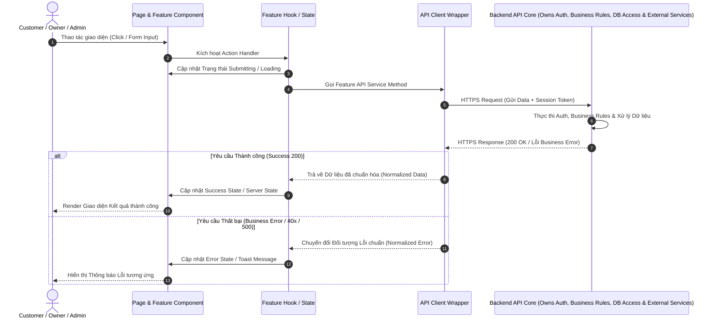
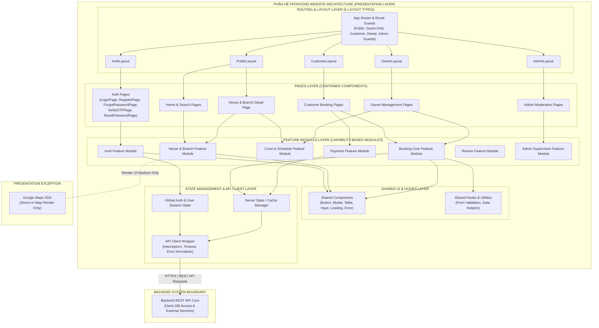

# TÀI LIỆU KIẾN TRÚC PHÂN HỆ FRONTEND WEBSITE (FRONTEND WEBSITE ARCHITECTURE)
**Hệ thống:** Website Đặt Lịch Sân Thể Thao Trực Tuyến (SportHubAI)  
**Mã Task:** 01.06.02 (Final Corrected Revision)  
**Trạng thái:** Standardized Architecture Specification  
**Tham chiếu nguồn:**  
- [01-actors-and-permissions.md](file:///e:/SportHubAI/docs/requirements/01-actors-and-permissions.md) (APPROVED)  
- [02-use-cases-and-user-flows.md](file:///e:/SportHubAI/docs/requirements/02-use-cases-and-user-flows.md) (APPROVED)  
- [03-functional-requirements.md](file:///e:/SportHubAI/docs/requirements/03-functional-requirements.md) (APPROVED)  
- [04-business-rules.md](file:///e:/SportHubAI/docs/requirements/04-business-rules.md) (APPROVED)  
- [05-data-model.md](file:///e:/SportHubAI/docs/requirements/05-data-model.md) (APPROVED)  
- [06-system-architecture.md](file:///e:/SportHubAI/docs/architecture/06-system-architecture.md) (APPROVED)  
**Ngày cập nhật:** 2026-08-08  

---

## 1. PURPOSE (MỤC TIÊU TÀI LIỆU)

Tài liệu này xác định **Kiến trúc Phân hệ Frontend (Frontend Website Architecture)** cho hệ thống Website Đặt Lịch Sân Thể Thao Trực Tuyến SportHubAI. 

Mục tiêu chính:
1. Xác định ranh giới và cấu trúc kiến trúc Frontend của 3 phân hệ giao diện Website (Customer Website, Owner Portal, Admin Portal).
2. Phân định ranh giới trách nhiệm giữa Router, Layout, Page, Feature Module, Shared Component, State Management và API Client.
3. Đảm bảo Frontend tuân thủ nghiêm ngặt nguyên tắc **Zero Business Rule Ownership**: Frontend không trực tiếp truy cập Database, không sở hữu quy tắc nghiệp vụ, không tự quyết định trạng thái đặt sân hay xác nhận thanh toán.
4. Đảm bảo toàn bộ tương tác thanh toán, xác thực OTP và tích hợp AI Service đều đi qua ranh giới xử lý của Backend API.

---

## 2. SCOPE (PHẠM VI KIẾN TRÚC FRONTEND)

- **Phạm vi Ứng dụng:** Hệ thống Web đa phân hệ (**WEBSITE ONLY**), bao gồm:
  - **Public Area:** Trang chủ, Tìm kiếm, Chi tiết Venue, Đăng ký, Đăng nhập, Quên mật khẩu, Xác thực OTP Email, Đặt lại mật khẩu.
  - **Customer Area:** Quản lý Hồ sơ cá nhân, Lịch sử đặt sân, Chi tiết đơn đặt, Danh sách sân yêu thích, Thông báo, Gửi đánh giá.
  - **Owner Area:** Owner Dashboard, Nộp đơn làm Owner, Quản lý Cơ sở (`Venue`), Chi nhánh (`Branch`), Sân con (`Court`), Bảng giá/Lịch vận hành (`Schedule`), Khóa slot thủ công (`Slot Blocking`), Quản lý Đơn đặt sân & Đặt tại sân (`Manual Offline Booking`).
  - **Admin Area:** Admin Dashboard, Quản lý Người dùng, Kiểm duyệt Đơn Owner, Kiểm duyệt Venue, Quản lý Tất cả Đơn đặt sân & Nhật ký thanh toán, Moderation Đánh giá, Nhật ký hệ thống (`Audit Logs`).
- **Giới hạn Ranh giới:**
  - **WEBSITE ONLY:** Chỉ thiết kế kiến trúc ứng dụng Web. Tuyệt đối không thiết kế hoặc phát triển ứng dụng di động (Mobile App) trong phạm vi task này.
  - **Zero UI/Code Implementation:** Không viết mã nguồn UI, không viết CSS/Tailwind code, không vẽ Figma, không viết API Endpoint hoặc code Database.

---

## 3. FRONTEND ARCHITECTURE PRINCIPLES (NGUYÊN TẮC KIẾN TRÚC FRONTEND)

Kiến trúc Frontend vận hành theo mô hình luồng dữ liệu 6 tầng tiêu chuẩn:

```text
Pages (Route Elements)
   ↓
Features (User-Facing Capability Modules & Application Logic)
   ↓
Shared Components (Reusable Dumb UI Elements)
   ↓
State / Hooks (Local UI, Server & Global State)
   ↓
API Client (Axios/Fetch Wrapper & Error Normalizer)
   ↓
Backend API Core
```

### Các Giới Hạn Nghiệp Vụ Của Frontend:
- ❌ **Zero Database Access:** Frontend không truy cập trực tiếp Database dưới bất kỳ hình thức nào.
- ❌ **Zero Business Rule Ownership:** Frontend không tự tính toán hợp lệ booking, không tự quyết định slot trống hay bùng đơn. Business Rules thuộc về Backend.
- ❌ **Zero Payment Confirmation Ownership:** Frontend không tự cập nhật trạng thái `Payment = PAID` hoặc `Booking = CONFIRMED`.
- ❌ **Zero OTP/Password Verification:** Frontend không tự xác minh mã OTP Email hoặc mật khẩu.
- ❌ **Zero Authorization Security Ownership:** Frontend Route Guard chỉ phục vụ điều hướng UX; phân quyền an toàn thực tế thuộc về Backend.
- ❌ **Zero Direct AI Service Calling:** Frontend không gọi trực tiếp AI Service mà gửi yêu cầu qua Backend điều phối.

---

## 4. WEBSITE AREAS (CÁC KHU VỰC CHỨC NĂNG WEBSITE)

Hệ thống Frontend được chia thành 4 Khu vực chức năng (User Areas) phục vụ các tập Actor tương ứng:

```text
┌────────────────────────────────────────────────────────────────────────────────────────┐
│                                   WEBSITE USER AREAS                                   │
│                                                                                        │
│ ┌────────────────────────┐  ┌────────────────────────┐  ┌────────────────────────────┐ │
│ │      PUBLIC AREA       │  │     CUSTOMER AREA      │  │        OWNER AREA          │ │
│ │ (Guest & All Users)    │  │   (Customer Role Only) │  │   (Approved Owner Role)    │ │
│ └────────────────────────┘  └────────────────────────┘  └────────────────────────────┘ │
│                                                         ┌────────────────────────────┐ │
│                                                         │         ADMIN AREA         │ │
│                                                         │   (System Administrator)   │ │
│                                                         └────────────────────────────┘ │
└────────────────────────────────────────────────────────────────────────────────────────┘
```

1. **Public Area:** Dành cho người dùng chưa đăng nhập (`GUEST`) hoặc tất cả người dùng thông thường để tra cứu thông tin cơ sở thể thao, tìm kiếm sân trống và thực hiện đăng ký/đăng nhập/xác thực tài khoản.
2. **Customer Area:** Dành riêng cho `CUSTOMER` đã đăng nhập để quản lý lịch sử đặt sân, thông báo cá nhân, danh sách yêu thích và viết đánh giá sau khi chơi.
3. **Owner Area:** Dành cho `OWNER` (đã được Admin phê duyệt) để quản trị toàn bộ hoạt động kinh doanh sân, lịch vận hành, đặt tại sân và báo cáo doanh thu.
4. **Admin Area:** Dành riêng cho `ADMIN` hệ thống để thực thi quyền giám sát toàn sàn, duyệt đối tác, phê duyệt Venue và kiểm duyệt nội dung.

---

## 5. ROUTE ARCHITECTURE (CẤU TRÚC ĐIỀU HƯỚNG LOGICAL)

Dưới đây là cấu trúc tuyến đường (Logical Route Hierarchy) tổ chức cho toàn bộ Website:

```text
/                                    (Home Page - Public)
├── /search                          (Search & Filter Venues - Public)
├── /venues/:venueId                 (Venue & Branch Detail - Public)
├── /login                           (Login Page - Guest-Only)
├── /register                        (Register Page - Guest-Only)
├── /forgot-password                 (Forgot Password Page - Guest-Only)
├── /verify-otp                      (Email OTP Verification Page - Guest-Only / Pending Auth)
├── /reset-password                  (Reset Password Page - Guest-Only / Token Auth)
│
├── /customer                        (Customer Layout - Protected: CUSTOMER)
│   ├── /profile                     (Customer Profile - Protected)
│   ├── /bookings                    (Booking History - Protected)
│   ├── /bookings/:bookingId         (Booking Detail & Payment Action - Protected)
│   ├── /favorites                   (Favorite Venues List - Protected)
│   └── /notifications               (Personal Notifications - Protected)
│
├── /owner                           (Owner Layout - Protected: OWNER)
│   ├── /dashboard                   (Owner Utilization & Revenue Dashboard - Protected)
│   ├── /application                 (Owner Application Status - Protected: CUSTOMER)
│   ├── /venues                      (Manage Venues List - Protected)
│   ├── /branches                    (Manage Branches List - Protected)
│   ├── /courts                      (Manage Courts & Maintenance - Protected)
│   ├── /schedules                   (Manage Operating Hours & Pricing - Protected)
│   ├── /slot-blocking               (Manual Slot Blocking Management - Protected)
│   └── /bookings                    (Manage Bookings & Manual Offline Booking - Protected)
│
└── /admin                           (Admin Layout - Protected: ADMIN)
    ├── /dashboard                   (System Platform Overview Dashboard - Protected)
    ├── /users                       (User Status Management - Protected)
    ├── /owner-applications          (Review Owner Applications - Protected)
    ├── /venues                      (Review & Suspend Venues - Protected)
    ├── /bookings                    (All System Bookings & Payment Logs - Protected)
    ├── /reviews                     (Review Moderation - Protected)
    └── /audit-logs                  (System Audit Logs Inspection - Protected)
```

---

## 6. ROUTE ACCESS MATRIX (MA TRẬN QUYỀN TRUY CẬP ROUTE ĐẦY ĐỦ)

| Route Path | Authentication Required? | Allowed Actor / Role | Route Guard Type | Target UX Behavior |
|---|---|---|---|---|
| `/`, `/search`, `/venues/*` | **No** | Any (`GUEST`, `CUSTOMER`, `OWNER`, `ADMIN`) | Public Route | Truy cập tự do |
| `/login` | **No** | `GUEST` (Unauthenticated) | Guest-Only Guard | Chuyển hướng về trang chủ nếu đã đăng nhập |
| `/register` | **No** | `GUEST` (Unauthenticated) | Guest-Only Guard | Chuyển hướng về trang chủ nếu đã đăng nhập |
| `/forgot-password` | **No** | `GUEST` (Unauthenticated) | Guest-Only Guard | Chuyển hướng về trang chủ nếu đã đăng nhập |
| `/verify-otp` | **No** / Pending | `GUEST` / `UNVERIFIED` | Auth Pending Guard | Chuyển hướng tới `/login` nếu không có phiên xác thực |
| `/reset-password` | **No** / Token | `GUEST` (Có Token) | Auth Token Guard | Yêu cầu Token xác minh hợp lệ |
| `/customer/*` | **Yes** | `CUSTOMER` | Customer Role Guard | Yêu cầu Login nếu chưa đăng nhập; Chuyển hướng nếu sai Role |
| `/owner/application` | **Yes** | `CUSTOMER` (Email ACTIVE) | Authenticated Guard | Cho phép nộp đơn làm Owner |
| `/owner/*` (Quản trị sân) | **Yes** | `OWNER` (Đã được Admin APPROVED) | Owner Role Guard | Từ chối truy cập nếu chưa phải Owner |
| `/admin/*` | **Yes** | `ADMIN` | Admin Role Guard | Chặn truy cập tuyệt đối nếu không phải Admin |

---

## 7. PAGE ARCHITECTURE & RESPONSIBILITIES (KIẾN TRÚC TRANG VÀ TRÁCH NHIỆM)

Mỗi Trang (`Page Component`) đóng vai trò là container điều phối dữ liệu cho Route tương ứng:

### Trách Nhiệm Của Page Component:
- Nhận URL Parameters / Query Strings từ Router.
- Khởi tạo yêu cầu gọi dữ liệu từ Feature Hooks / Feature Services.
- Điều phối hiển thị các Layout, Feature Components và Shared Components.
- Quản lý trạng thái chuyển đổi giữa Loading State, Error State, Empty State và Content State.
- **Giới hạn:** Page Component không được chứa trực tiếp mã gọi API (Fetch/Axios) và không chứa business logic kiểm tra điều kiện.

---

## 8. FEATURE-BASED FRONTEND STRUCTURE (CẤU TRÚC CHỨC NĂNG VÀ HÀNH VI NGƯỜI DÙNG)

Frontend Feature Modules được tổ chức theo **Business Capability, User-Facing Capability và Use Case**. 

### Nguyên Tắc Ranh Giới:
- Frontend Feature Modules = **User-facing capability + presentation / application logic**.
- Business Rules thuộc về **Backend responsibility**.
- Frontend Feature Module **KHÔNG bắt buộc mapping 1:1** với Backend Domain Module hoặc Database Entity.
- Một Frontend Feature có thể sử dụng dữ liệu từ nhiều Entity (Ví dụ: `Booking Feature` tương tác với dữ liệu của cả `Booking`, `Court`, và `Payment`).
- Một Backend Domain có thể được sử dụng bởi nhiều Frontend Features.
- Ranh giới Frontend Feature Boundary và Backend Domain Boundary là hai ranh giới kiến trúc hoàn toàn khác nhau.

```text
src/features/
├── auth/                 # Feature Đăng ký, Đăng nhập, OTP Email, Đổi mật khẩu
├── users/                # Feature Hồ sơ cá nhân, Quản lý tài khoản
├── owner-applications/   # Feature Nộp và Kiểm duyệt đơn đăng ký Owner
├── venues/               # Feature Tìm kiếm, Chi tiết & Quản lý Cơ sở thể thao
├── branches/             # Feature Quản lý Chi nhánh sân
├── courts/               # Feature Quản lý Sân con & Trạng thái bảo trì
├── schedules/            # Feature Quản lý Khung giờ vận hành & Cấu hình giá
├── slot-blocking/        # Feature Khóa slot giờ chơi thủ công
├── bookings/             # Feature Đặt sân Online, Giữ chỗ 10m, Đặt tại sân
├── payments/             # Feature Hiển thị Giao dịch & Chờ MoMo Callback
├── reviews/              # Feature Gửi và Hiển thị Đánh giá
├── notifications/        # Feature Thông báo người dùng
├── favorites/            # Feature Đánh dấu sân yêu thích
└── admin/                # Feature Báo cáo Dashboard & Nhật ký Audit Log
```

---

## 9. SHARED COMPONENT BOUNDARY (RANH GIỚI COMPONENT DÙNG CHUNG)

Các Shared Components nằm tại thư mục `src/shared/components/` là các phần tử UI thuần túy (Dumb / Presentational Components), hoàn toàn độc lập với miền nghiệp vụ:

### Danh Mục Shared Components:
- **Form Controls:** `Button`, `Input`, `Select`, `Checkbox`, `DatePicker`, `TimeSlotPill`.
- **Feedback & Data Display:** `Modal`, `ConfirmDialog`, `Table`, `Pagination`, `Badge`, `Toast`.
- **State Indicators:** `LoadingSpinner`, `SkeletonLoader`, `ErrorStateAlert`, `EmptyStateView`.
- **Layout Elements:** `Header`, `Sidebar`, `Footer`, `Breadcrumb`, `PageContainer`.

### Quy Tắc Ranh Giới:
- Shared Components **không được import** bất kỳ Feature Service, Feature Hook hoặc API Client nào.
- Shared Components nhận dữ liệu và sự kiện hoàn toàn qua `Props`.

---

## 10. LAYOUT ARCHITECTURE (KIẾN TRÚC BỐ CỤC TRANG)

Hệ thống thiết lập 5 loại Layout chính để tạo trải nghiệm đồng nhất theo từng khu vực chức năng:

1. **PublicLayout:** Chứa Header công khai (Logo, Thanh tìm kiếm, Nút Đăng nhập/Đăng ký) và Footer tiêu chuẩn.
2. **CustomerLayout:** Chứa Header khách hàng (Avatar cá nhân, Menu điều hướng Đơn của tôi, Yêu thích, Chuông thông báo).
3. **OwnerLayout:** Chứa Sidebar điều hướng quản trị sân (Dashboard, Venues, Courts, Schedules, Manual Booking) và Header làm việc của Owner.
4. **AdminLayout:** Chứa Sidebar quản trị hệ thống (Users, Owner Apps, Venues, Bookings, Audit Logs) và Header giám sát Admin.
5. **AuthLayout:** Layout tối giản tập trung vào Form trung tâm cho các trang Đăng ký (`RegisterPage`), Đăng nhập (`LoginPage`), OTP Email (`VerifyOTPPage`), Quên mật khẩu (`ForgotPasswordPage`) và Đặt lại mật khẩu (`ResetPasswordPage`).

---

## 11. STATE MANAGEMENT ARCHITECTURE (KIẾN TRÚC QUẢN LÝ TRẠNG THÁI LOGICAL)

Trạng thái ứng dụng Frontend được phân tầng rõ ràng thành 4 cấp độ ở mức Logical, độc lập với các thư viện cụ thể:

```text
┌────────────────────────────────────────────────────────────────────────────────────────┐
│                        LOGICAL STATE MANAGEMENT ARCHITECTURE                           │
│                                                                                        │
│ ┌────────────────────────────┐  ┌────────────────────────────┐                         │
│ │       LOCAL UI STATE       │  │       FEATURE STATE        │                         │
│ │ (Modal, Tab, Form Input)   │  │ (Slot Selected, Filters)   │                         │
│ └────────────────────────────┘  └────────────────────────────┘                         │
│ ┌────────────────────────────┐  ┌────────────────────────────┐                         │
│ │    GLOBAL APP STATE        │  │        SERVER STATE        │                         │
│ │ (User Session, Auth Role)  │  │ (Cached API Data from DB)  │                         │
│ └────────────────────────────┘  └────────────────────────────┘                         │
└────────────────────────────────────────────────────────────────────────────────────────┘
```

1. **Local UI State:** Trạng thái ngắn hạn chỉ có ý nghĩa trong phạm vi một UI Component (Đóng/mở Modal, Tab đang chọn, giá trị ô nhập Form).
2. **Feature State:** Trạng thái chia sẻ giữa các component trong cùng một Feature (Danh sách slot chọn tạm trong luồng đặt sân, bộ lọc tìm kiếm venue).
3. **Global Application State:** Trạng thái dùng chung toàn hệ thống (Thông tin phiên đăng nhập User, Vai trò Role, Thông báo Toast toàn cục).
4. **Server State:** Dữ liệu có nguồn gốc nhận từ Backend API (Danh sách Venue, Chi tiết Booking, Lịch vận hành). Được quản lý bằng cơ chế Revalidation an toàn.

---

## 12. AUTHENTICATION ARCHITECTURE (KIẾN TRÚC XÁC THỰC FRONTEND)

Frontend duy trì Trạng thái Xác thực (Authentication State) với 5 tập trạng thái hợp lệ:

```text
[Unauthenticated] ──(Submit Credentials)──> [Authenticating] ──(Success)──> [Authenticated]
       ▲                                                                          │
       │                                                                          │
[Session Expired] <──────────────────(Token Expired / 401)────────────────────────┘
       ▲
       │
[Unauthorized] <─────────────────────(Forbidden / 403)
```

- **Chiến Lược Lưu Trữ Phiên (Token Storage Strategy):** Đánh dấu `TBD — Pending Security Architecture Approval`. Frontend duy trì trạng thái phiên theo tiêu chuẩn do Kiến trúc An ninh phê duyệt sau.
- **Luồng Xử Lý Phản Hồi:** 
  - Nếu API phản hồi lỗi `401 Unauthenticated`: Frontend tự động xóa trạng thái đăng nhập và điều hướng người dùng về `/login` kèm thông báo hết phiên.
  - Nếu API phản hồi lỗi `403 Forbidden`: Frontend hiển thị màn hình từ chối truy cập (`Unauthorized Screen`).

---

## 13. AUTHORIZATION ARCHITECTURE (KIẾN TRÚC PHÂN QUYỀN FRONTEND)

- **Vai Trò Frontend:** Phân quyền trên Frontend chỉ đóng vai trò cải thiện trải nghiệm người dùng (**UX Protection**), bao gồm:
  - Ẩn/Hiện các nút chức năng hoặc Menu điều hướng theo `Primary Role` (`CUSTOMER`, `OWNER`, `ADMIN`).
  - Tự động chuyển hướng điều hướng (Route Guard Redirect) khi người dùng cố tình nhập URL không đúng vai trò.
- **Ranh Giới Bảo Mật:** Frontend Route Guard **KHÔNG PHẢI** là ranh giới bảo mật an ninh. Backend API mới là nơi duy nhất đưa ra quyết định cho phép hoặc từ chối truy cập dữ liệu thực tế (Enforced Security Boundary).

---

## 14. API CLIENT ARCHITECTURE (KIẾN TRÚC API CLIENT LAYER)

Toàn bộ các cuộc gọi API từ Frontend lên Backend phải đi qua một **API Client tập trung** (`src/services/api/apiClient.ts`):

```text
Feature Component / Hook
       ↓
Feature API Service
       ↓
API Client Wrapper (Base URL, Headers, Auth Session, Timeout)
       ↓
HTTPS Request / Response Interceptors
       ↓
Error Normalizer (Chuyển đổi lỗi HTTP thành định dạng đối tượng chuẩn)
       ↓
Backend API Core
```

### Trách Nhiệm Của API Client:
- Đính kèm tự động Base URL và Header xác thực cho mọi request.
- Quản lý thời gian chờ yêu cầu (Timeout handling).
- **Error Normalization:** Chuẩn hóa toàn bộ cấu trúc lỗi phản hồi từ Backend thành một đối tượng lỗi đồng nhất để Feature Layer xử lý dễ dàng.
- Tuyệt đối không chứa Business Rules hoặc mã xử lý logic nghiệp vụ.

---

## 15. ERROR HANDLING ARCHITECTURE (KIẾN TRÚC XỬ LÝ LỖI FRONTEND)

Frontend xử lý lỗi phân tầng dựa trên mã phản hồi tiêu chuẩn từ Backend:

| Mã Lỗi HTTP | Loại Lỗi Nghiệp Vụ | Hành Vi Xử Lý Của Frontend |
|---|---|---|
| **400 Bad Request** | Lỗi định dạng dữ liệu đầu vào | Hiển thị thông báo lỗi chi tiết tại từng ô Form |
| **401 Unauthenticated** | Chưa đăng nhập hoặc hết phiên | Điều hướng về `/login`, lưu URL hiện tại để quay lại |
| **403 Forbidden** | Không đủ quyền truy cập tài nguyên | Hiển thị màn hình từ chối truy cập `403 Forbidden` |
| **404 Not Found** | Tài nguyên Venue/Booking không tồn tại | Hiển thị màn hình `404 Page Not Found` |
| **409 Conflict** | Xung đột đặt trùng slot giờ chơi | Báo hiệu slot vừa có người đặt và làm mới lịch |
| **422 Unprocessable** | Vi phạm quy tắc nghiệp vụ (ví dụ: hủy quá hạn)| Hiển thị thông báo lỗi Business Alert / Toast |
| **429 Rate Limited** | Yêu cầu gửi lại OTP quá số lần | Khóa nút gửi lại và hiển thị đếm ngược chờ |
| **500 Server Error** | Lỗi hệ thống nội bộ Backend | Hiển thị màn hình thông báo bảo trì hệ thống |

---

## 16. LOADING / EMPTY / ERROR STATES (CÁC TRẠNG THÁI HIỂN THỊ GIAO DIỆN)

Mọi trang và component phụ thuộc dữ liệu từ Backend bắt buộc phải thiết lập đầy đủ 5 trạng thái hiển thị:

1. **Initial Loading State:** Hiển thị hiệu ứng Skeleton Loader tương ứng với khung trang trong lần tải đầu tiên.
2. **Success / Content State:** Hiển thị dữ liệu thực tế nhận từ Backend API khi yêu cầu thành công.
3. **Empty State:** Hiển thị hình ảnh minh họa và thông điệp hướng dẫn khi danh sách phản hồi rỗng (ví dụ: Không tìm thấy sân phù hợp, Chưa có lịch sử đặt sân).
4. **Error State:** Hiển thị thông báo lỗi kèm nút "Thử lại" (`Retry Button`) khi gọi API thất bại.
5. **Updating / Submitting State:** Vô hiệu hóa các nút thao tác (`Disable Buttons`) và hiển thị biểu tượng quay spinner trên nút để chống submit lặp lại.

---

## 17. BOOKING FRONTEND ARCHITECTURE (KIẾN TRÚC LUỒNG ĐẶT SÂN FRONTEND)

Luồng giao diện đặt sân được thiết kế theo luồng từng bước (Step-by-Step Flow):

```text
[1. Tìm kiếm Venue] ──> [2. Xem Chi tiết Branch & Court] ──> [3. Chọn Ngày & Slot trống]
                                                                       │
[6. Màn hình Kết quả] <── [5. Thanh toán MoMo] <── [4. Tạo Hold 10m & Review Đơn]
```

### Ranh Giới Xử Lý Đặt Sân Trên Frontend:
- **Tạo Giữ Chỗ 10 Phút:** Khi Customer bấm "Tiến hành thanh toán", Frontend gửi API tạo hold. Nhận phản hồi thành công, Frontend hiển thị đồng hồ đếm ngược 10 phút (`Hold Timer UI`).
- **Chống Đặt Trùng Sân:** Frontend không tự xác định slot trống. Slot khả dụng hiển thị hoàn toàn dựa trên dữ liệu Backend phản hồi. Nếu Backend báo lỗi xung đột (`409 Conflict`), Frontend lập tức xóa slot chọn và yêu cầu người dùng chọn lại.

---

## 18. PAYMENT FRONTEND ARCHITECTURE (KIẾN TRÚC LUỒNG THANH TOÁN FRONTEND)

- **Trách Nhiệm Của Frontend:**
  - Hiển thị thông tin tổng tiền cần thanh toán và phương thức **MoMo Payment Gateway**.
  - Nhận liên kết thanh toán (`Payment Link/URL`) từ Backend phản hồi và thực hiện chuyển hướng trình duyệt tới giao diện MoMo.
  - Khi trình duyệt quay trở lại từ MoMo (Frontend Redirect), Frontend hiển thị màn hình chờ kết quả và gọi API hỏi trạng thái đơn hàng từ Backend (`Poll / Fetch Booking Status`).
- **Giới Hạn Nghiệp Vụ:** Frontend tuyệt đối **không tự gán** `Payment = PAID` hoặc `Booking = CONFIRMED`. Trạng thái thành công chỉ được xác nhận khi Backend phản hồi dữ liệu đã xác thực qua MoMo Server Callback (IPN).

---

## 19. OTP / AUTHENTICATION FRONTEND FLOW (LUỒNG XÁC THỰC OTP EMAIL)

Luồng giao diện xác thực mã OTP Email khi đăng ký tài khoản Customer:

```text
[Form Đăng Ký] ──(Submit Data)──> [Backend API] ──(Send Mail)──> [Real Email Provider]
      │                                                                  │
      ▼                                                                  ▼
[Màn hình Nhập OTP] <────────────────────────────────────────── [Hộp thư Email Khách]
      │ (Customer nhập OTP)
      ▼
[Backend Verify API] ──(Success)──> [Kích hoạt ACTIVE & Đăng nhập]
```

- **Trách Nhiệm Của Frontend:** Hiển thị ô nhập mã OTP, đồng hồ đếm ngược thời gian hiệu lực OTP và nút yêu cầu gửi lại OTP.
- **Giới Hạn Nghiệp Vụ:** Frontend không biết mã OTP trước, không lưu mã OTP dưới LocalStorage/State, và không tự kiểm tra đúng/sai của mã OTP.

---

## 20. GOOGLE MAPS INTEGRATION BOUNDARY (RANH GIỚI TÍCH HỢP BẢN ĐỒ)

- **Ngoại Lệ Tích Hợp Giao Diện (Presentation Exception):** Google Maps SDK được phép tích hợp trực tiếp trên Frontend Customer Website chỉ cho mục đích hiển thị hình ảnh bản đồ trực quan và đánh dấu marker vị trí sân (`FR-GUEST-003`).
- **Ranh Giới Dữ Liệu:** Frontend nhận dữ liệu Tọa độ địa lý (Vĩ độ, Kinh độ) từ Backend API qua thông tin `Branch` để truyền vào Maps SDK. Google Maps không có kết nối tới Backend hay Database của hệ thống.

---

## 21. AI INTEGRATION BOUNDARY (RANH GIỚI TÍCH HỢP TRÍ TUỆ NHÂN TẠO - TBD)

- **Luồng Điều Phối Qua Backend:** Customer Website tuyệt đối không gọi trực tiếp AI Service API.
- **Luồng Kết Nối Chuẩn:**
  ```text
  Customer Website UI ──(Request Search Assist)──> Backend API (AI Orchestrator)
                                                        │
  Customer Website UI <──(Filtered Result Response)── Backend API <──(Query Assist)── AI Service
  ```
- **Ranh Giới Nghiệp Vụ:** Kết quả gợi ý từ AI hiển thị dưới dạng danh sách đề xuất tham khảo. Mọi thao tác bấm chọn đặt sân từ danh sách gợi ý đều phải tuân thủ đúng quy trình kiểm tra Business Rules tiêu chuẩn của Backend.

---

## 22. RESPONSIVE WEB ARCHITECTURE (KIẾN TRÚC WEB TƯƠNG THÍCH MỌI THIẾT BỊ)

- **Yêu Cầu Tương Thích:** Giao diện 3 phân hệ Website phải hiển thị tối ưu trên 3 nhóm kích thước màn hình tiêu chuẩn:
  - **Desktop View:** Đầy đủ tính năng, hiển thị bảng điều khiển đa cột cho Owner/Admin Portal.
  - **Tablet View:** Tối ưu hóa khoảng cách chạm và lưới danh sách sân.
  - **Mobile Web View:** Tối ưu thanh điều hướng dưới (Bottom Navigation), ẩn bớt các cột chi tiết phụ trên bảng biểu.
- **Phân Biệt Rõ Ràng:** `Responsive Web Design ≠ Mobile Application`. Hệ thống hoàn toàn không phát triển ứng dụng di động native/hybrid.

---

## 23. ACCESSIBILITY BASELINE (TIÊU CHUẨN TRUY CẬP KHÔNG RÀO CẢN)

Hệ thống Frontend tuân thủ các tiêu chuẩn cơ bản về Web Accessibility (WCAG Baseline):
1. **Semantic HTML:** Sử dụng đúng các thẻ chuẩn HTML5 (`<header>`, `<nav>`, `<main>`, `<section>`, `<article>`, `<footer>`).
2. **Keyboard Navigation:** Đảm bảo mọi thành phần tương tác (Nút bấm, Link, Slot pill) có thể điều hướng dễ dàng qua phím `Tab` và `Enter`.
3. **Form Accessibility:** Mọi ô nhập dữ liệu Form đều gắn nhãn `<label>` rõ ràng và thông báo lỗi có thuộc tính aria hỗ trợ đọc màn hình.
4. **Focus Management:** Tự động chuyển con trỏ focus vào ô nhập lỗi hoặc tiêu đề Modal khi mở.

---

## 24. FRONTEND DATA FLOW (SƠ ĐỒ LUỒNG DỮ LIỆU FRONTEND RÕ RANH GIỚI)

Dưới đây là sơ đồ Mermaid Sequence thể hiện Luồng tương tác dữ liệu chuẩn trên Phân hệ Frontend (Tập trung hoàn toàn vào ranh giới kết nối HTTPS tới Backend API):



---

## 25. ARCHITECTURE DIAGRAM (SƠ ĐỒ KIẾN TRÚC PHÂN HỆ FRONTEND)

Dưới đây là sơ đồ Mermaid chi tiết mô tả Kiến trúc Phân tầng Nội bộ Phân hệ Frontend Website (Đã bổ sung đầy đủ AuthLayout và map các trang Auth về AuthLayout):



---

## 26. RESPONSIBILITY MATRIX (MA TRẬN PHÂN CHIA TRÁCH NHIỆM PHÂN TẦNG)

| Trách Nhiệm Kỹ Thuật | Page Component | Feature Module | Shared Component | State Layer | API Client | Backend API | Nguồn Tham Chiếu |
|---|---|---|---|---|---|---|---|
| **Route Navigation** | **YES** | Support | NO | NO | NO | NO | `Section 5` |
| **Render UI Layout** | **YES** | **YES** | **YES** | NO | NO | NO | `Section 9` |
| **Client Input Validation** | NO | **YES** | Support | NO | NO | **YES** (Business)| `FR-AUTH-001` |
| **Feature State Control** | NO | **YES** | NO | **YES** | NO | NO | `Section 11` |
| **Authentication Session**| Display | Support | NO | **YES** | Support | **YES** (Owner) | `BR-AUTH-003` |
| **Authorization Guard** | UX Redirect| UX Hide | NO | Support | Support | **YES** (Enforce) | `BR-USER-003` |
| **API Request Execution** | NO | **YES** | NO | NO | **YES** | **YES** (Process) | `Section 14` |
| **Double Booking Guard** | NO | NO | NO | NO | NO | **YES** (Enforce) | `BR-BOOK-003` |
| **Payment Confirmation** | Display UI | Display Status| NO | NO | NO | **YES** (Source)| `BR-PAY-002` |
| **Database Operations** | NO | NO | NO | NO | NO | **YES** (MySQL) | `Task 01.05` |

---

## 27. FOLDER STRUCTURE (CẤU TRÚC THƯ MỤC NGUỒN FRONTEND LOGICAL)

Dưới đây là cấu trúc thư mục mã nguồn Frontend tiêu chuẩn được thiết lập theo kiến trúc Feature-Driven:

```text
src/
├── app/                          # Cấu hình cấp ứng dụng
│   ├── router/                   # Cấu hình Tuyến đường & Route Guards
│   ├── providers/                # Các Global Context Providers (Auth, Toast)
│   └── layouts/                  # Cấu hình 5 loại Layouts (Public, Customer, Owner, Admin, Auth)
│
├── pages/                        # Container Components cho từng Route
│   ├── public/                   # HomePage, SearchPage, VenueDetailPage, LoginPage, RegisterPage...
│   ├── customer/                 # ProfilePage, BookingsPage, BookingDetailPage, FavoritesPage...
│   ├── owner/                    # OwnerDashboardPage, VenuesPage, CourtsPage, SchedulesPage...
│   └── admin/                    # AdminDashboardPage, UsersPage, OwnerApplicationsPage...
│
├── features/                     # Danh mục Feature Modules đóng gói độc lập theo Capability
│   ├── auth/                     # UI, Hooks, Services cho Đăng ký, Đăng nhập, OTP Email
│   ├── users/                    # UI, Hooks, Services cho Quản lý thông tin tài khoản
│   ├── owner-applications/      # UI, Hooks, Services cho Nộp/Duyệt đơn nâng cấp Owner
│   ├── venues/                   # UI, Hooks, Services cho Cơ sở thể thao
│   ├── branches/                 # UI, Hooks, Services cho Chi nhánh sân
│   ├── courts/                   # UI, Hooks, Services cho Sân con & Bảo trì
│   ├── schedules/                # UI, Hooks, Services cho Khung giờ & Bảng giá
│   ├── slot-blocking/            # UI, Hooks, Services cho Khóa slot thủ công
│   ├── bookings/                 # UI, Hooks, Services cho Giữ chỗ 10m & Đặt sân
│   ├── payments/                 # UI, Hooks, Services cho Thanh toán MoMo
│   ├── reviews/                  # UI, Hooks, Services cho Đánh giá lượt chơi
│   ├── notifications/            # UI, Hooks, Services cho Thông báo người dùng
│   ├── favorites/                # UI, Hooks, Services cho Lưu sân yêu thích
│   └── admin/                    # UI, Hooks, Services cho Báo cáo & Audit Log
│
├── shared/                       # Thành phần dùng chung toàn ứng dụng
│   ├── components/               # Dumb UI Components (Button, Modal, Table, Input, Loading...)
│   ├── hooks/                    # Reusable Custom Hooks (useDebounce, useMediaQuery...)
│   ├── utils/                    # Helper Functions (Format Currency, Format Date...)
│   └── constants/                # Hằng số giao diện (Route Paths, Enum UI Display...)
│
├── services/                     # Tầng dịch vụ giao tiếp mạng
│   └── api/                      # API Client Wrapper (Axios/Fetch, Interceptors, Error Normalizer)
│
└── assets/                       # Tài nguyên tĩnh (Images, Icons, Fonts)
```

---

## 28. ARCHITECTURAL GUARDRAILS (CÁC QUY TẮC RÀNG BUỘC KIẾN TRÚC)

Mọi lập trình viên khi triển khai mã nguồn Frontend bắt buộc tuân thủ 10 Quy tắc Ràng buộc (Guardrails) sau:

1. **Guardrail 1:** Page Component không được chứa Business Logic hoặc mã gọi API trực tiếp.
2. **Guardrail 2:** Shared Component không được import Feature Modules hoặc API Client.
3. **Guardrail 3:** Feature Module không được trực tiếp gọi External Service API để thực hiện Business Logic hoặc Business Operations. Các Presentation-only SDK được Architecture phê duyệt (ví dụ: Google Maps SDK) là ngoại lệ hợp lệ phục vụ render hình ảnh bản đồ, vị trí marker mà không thực hiện Booking, Payment hay Business Rules.
4. **Guardrail 4:** API Client Wrapper không được chứa Business Rules hoặc logic điều hướng giao diện.
5. **Guardrail 5:** Frontend không được tự xác nhận trạng thái `Booking = CONFIRMED` hoặc `Payment = PAID`.
6. **Guardrail 6:** Frontend tuyệt đối không gọi trực tiếp AI Service API mà phải gửi qua Backend API điều phối.
7. **Guardrail 7:** Frontend chỉ nhúng Google Maps SDK duy nhất cho mục đích hiển thị giao diện hình ảnh bản đồ (Presentation-only Exception).
8. **Guardrail 8:** Frontend Route Guard chỉ phục vụ điều hướng UX và không thay thế cho kiểm tra Phân quyền an ninh của Backend API.
9. **Guardrail 9:** Không tạo Global State nếu Local UI State hoặc Feature State đã đáp ứng đủ nhu cầu.
10. **Guardrail 10:** Không tạo mã gọi API trùng lặp trong các UI Components, phải tập trung tại Feature Service Layer.

---

## 29. TRACEABILITY MATRIX (MA TRẬN TRUY VẾT FRONTEND 4 TẦNG)

| Yêu Cầu / Capability | Use Case | Frontend Feature Module | Backend Capability | Realized Data Entities |
|---|---|---|---|---|
| **Authentication & OTP** | UC-C-001..003, UC-C-007 | `auth` | Auth & Identity Service | User |
| **Profile Management** | UC-C-004 | `users` | User Service | User |
| **Owner Upgrade Flow** | UC-O-001, UC-A-002 | `owner-applications` | Owner Application Service | OwnerApplication, User |
| **Venue & Branch Browsing**| UC-G-001..004, UC-O-003..004| `venues`, `branches` | Venue & Branch Service | Venue, Branch |
| **Court & Maintenance** | UC-O-005, UC-O-009 | `courts` | Court Service | Court |
| **Operating Schedules** | UC-O-006, UC-O-007 | `schedules` | Schedule Service | OperatingSchedule |
| **Manual Slot Blocking** | UC-O-008 | `slot-blocking` | Slot Blocking Service | SlotBlocking, Court |
| **Booking & Hold 10m** | UC-C-014..017, UC-O-011 | `bookings` | Booking Core Service | Booking, Court |
| **MoMo Payment Flow** | UC-C-015, UC-S-003 | `payments` | Payment Verification Service| Payment, Booking |
| **Completed Review** | UC-C-019 | `reviews` | Review Moderation Service | Review, Booking |
| **User Notifications** | UC-S-005 | `notifications` | Notification Service | Notification |
| **Favorite Venues** | UC-C-010 | `favorites` | User Preference Service | FavoriteVenue, Venue |
| **Admin Governance** | UC-A-001..010, UC-O-010 | `admin` | Audit & Governance Service | AuditLog |

---

## 30. OPEN QUESTIONS / TBD PRESERVATION (BẢO LƯU CÁC MỤC CHƯA CHỐT)

Hệ thống kiến trúc Frontend tôn trọng và giữ nguyên 100% các mục chưa chốt (`TBD`) từ các tài liệu trước:

1. **FRONT-TBD-001: Frontend Framework Selection:** Chưa tự quyết định framework/library cụ thể (React/Vue/Next.js). Kiến trúc ở mức Logical tiêu chuẩn.
2. **FRONT-TBD-002: Notification Delivery Channels UI:** Kênh phát thông báo chi tiết (Email vs SMS vs Push Notification) giữ nguyên `TBD — Refer to OQ-006`.
3. **FRONT-TBD-003: Cancellation Refund UI Flow:** Quy trình hiển thị hoàn tiền hủy đơn giữ nguyên `TBD — Refer to OQ-001`.
4. **FRONT-TBD-004: Review Target Scope UI:** Giao diện gắn đánh giá (Venue vs Court) giữ nguyên `TBD — Refer to OQ-003`.
5. **FRONT-TBD-005: Operating Schedule Scope UI:** Giao diện cấu hình lịch vận hành (Venue vs Branch vs Court) giữ nguyên `TBD — Refer to TBD-DM-006`.
6. **FRONT-TBD-006: AI Search Assistance UI:** Giao diện gợi ý AI giữ nguyên `TBD — Business Clarification Required`.
7. **FRONT-TBD-007: Token Storage Strategy:** Chiến lược lưu trữ Token phiên đăng nhập (LocalStorage vs Cookie) giữ nguyên `TBD — Pending Security Architecture Approval`.

---

## 31. VALIDATION CHECKLIST (KIỂM TRA TÍNH HỢP LỆ)

- [x] Ranh giới hệ thống phân định rõ phân hệ **WEBSITE ONLY** (Public Area, Customer Area, Owner Area, Admin Area). Không đề cập Mobile App.
- [x] Ranh giới Router: Xây dựng cấu trúc Route Hierarchy và Ma trận Quy định Quyền truy cập đầy đủ các tuyến đường Authentication.
- [x] Ranh giới Feature Modules: Phân rã các Frontend Feature theo business capability, user-facing capability và use case. Feature Modules không bắt buộc mapping 1:1 với Backend Domain Modules hoặc Database Entities.
- [x] Ranh giới Shared Component: Định nghĩa rõ danh mục Dumb UI Components không phụ thuộc nghiệp vụ.
- [x] Ranh giới State Management: Phân tầng 4 cấp độ trạng thái ở mức Logical (Local UI, Feature, Global App, Server State).
- [x] Ranh giới API Client: API Client Wrapper làm trung gian tập trung giao tiếp Backend, có chuẩn hóa đối tượng lỗi.
- [x] Ranh giới Booking Flow: Quản lý luồng đặt sân, hiển thị timer 10 phút hold, xử lý xung đột `409 Conflict`.
- [x] Ranh giới Payment Flow: Hiển thị giao diện thanh toán, chuyển hướng MoMo và chờ xác nhận kết quả từ Backend API.
- [x] Ranh giới AI Integration: Kết nối bắt buộc thông qua Backend API điều phối, không kết nối trực tiếp từ Client.
- [x] Ranh giới Google Maps: Tích hợp trực tiếp dưới dạng Presentation-only Exception hiển thị vị trí bản đồ.
- [x] Thiết lập Sơ đồ Luồng dữ liệu (Sequence Diagram), Sơ đồ Kiến trúc Frontend (Mermaid Diagram có chứa AuthLayout) và Bảng Phân chia Trách nhiệm (Responsibility Matrix).
- [x] Thiết lập 10 Quy tắc Ràng buộc Kiến trúc Frontend (Architectural Guardrails).
- [x] Tuyệt đối không chứa mã triển khai UI/Code/CSS/Figma/Database scripts.
- [x] Bảo lưu tuyệt đối các tài liệu `01.01` đến `01.06.01`.

---

## 32. DEFINITION OF DONE (DoD) - TASK 01.06.02

```text
Website Areas          = Defined (Public Area, Customer Area, Owner Area, Admin Area)
Routes                 = Defined (Logical Route Hierarchy including /login, /register, /forgot-password, /verify-otp, /reset-password)
Access Control         = Defined (Route Access Matrix & UX Protection)
Feature Boundaries     = Defined (Frontend Feature Modules organized by business/user-facing capabilities and use cases; no mandatory 1:1 mapping with Backend Domains or Database Entities)
Component Boundaries   = Defined (Page Containers vs Feature Logic vs Shared Dumb Components)
Layout Architecture    = Defined (5 Layout Types: Public, Customer, Owner, Admin, Auth)
State Architecture     = Defined (4 State Levels: Local UI, Feature, Global App, Server State)
Auth Architecture      = Defined (5 Auth States: Unauthenticated -> Authenticating -> Authenticated -> Expired -> Unauthorized)
API Client Boundary    = Defined (API Client Wrapper, Interceptors & Error Normalizer)
Booking Boundary       = Defined (Step-by-step Flow, Hold 10m UI Timer, 409 Conflict Retry)
Payment Boundary       = Defined (MoMo Payment Link Redirect & Backend Status Refresh)
OTP Boundary           = Defined (Real Email OTP Input UI & Countdown)
AI Boundary            = Defined (Orchestrated through Backend API Only)
Maps Boundary          = Defined (Presentation-only Exception for UI Map Render)
Error Handling         = Defined (HTTP Error Status Mapping & 5 UI Display States)
Responsive Web         = Defined (Desktop, Tablet, Mobile Web; Responsive Web != Mobile App)
Accessibility          = Defined (Semantic HTML, Keyboard Nav, Form Labels, Focus Management)
Folder Structure       = Defined (Feature-Driven Logical Src Folder Tree)
Architecture Diagram   = Complete (Sơ đồ Mermaid Frontend Architecture Chi Tiết có AuthLayout)
Responsibility Matrix  = Complete (Bảng Phân Chia Trách Nhiệm Chi Tiết 10 Tiêu Chí)
Traceability           = Complete (Ma Trận Truy Vết Frontend 4 Tầng)
TBD Preservation       = PASS (Bảo Lưu 100% Open Questions & TBDs)
No Implementation      = PASS (Không SQL, Không Code, Không Figma, Không CSS)

TASK 01.06.02 = PASS
```

---
*Tài liệu Kiến trúc Phân hệ Frontend Website được cập nhật bởi Antigravity AI Assistant cho dự án SportHubAI.*
