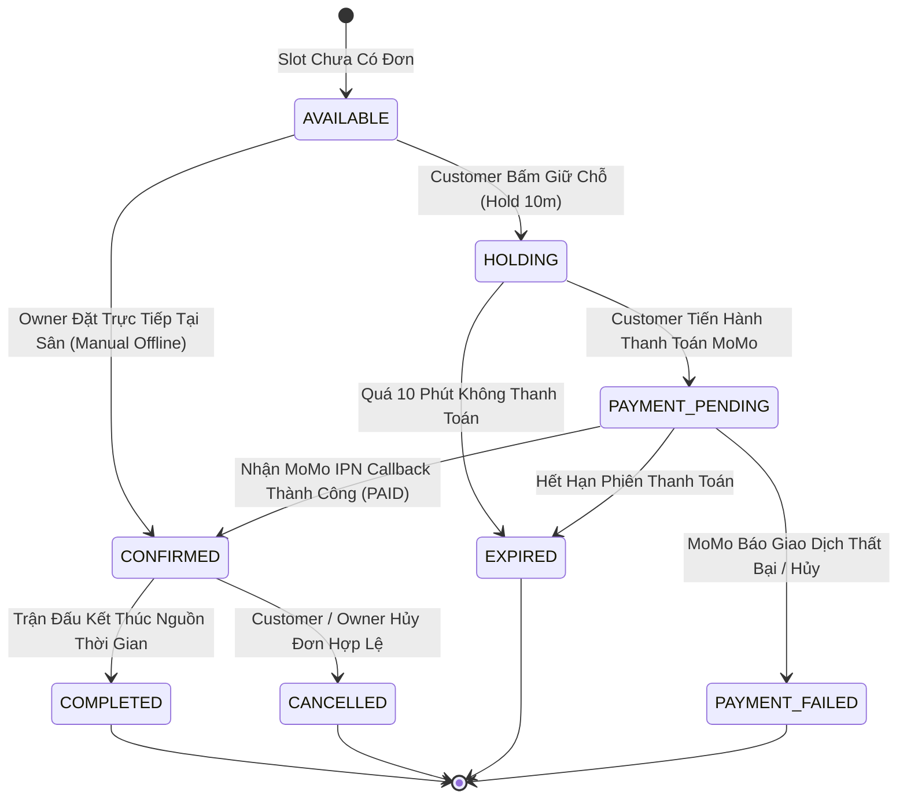
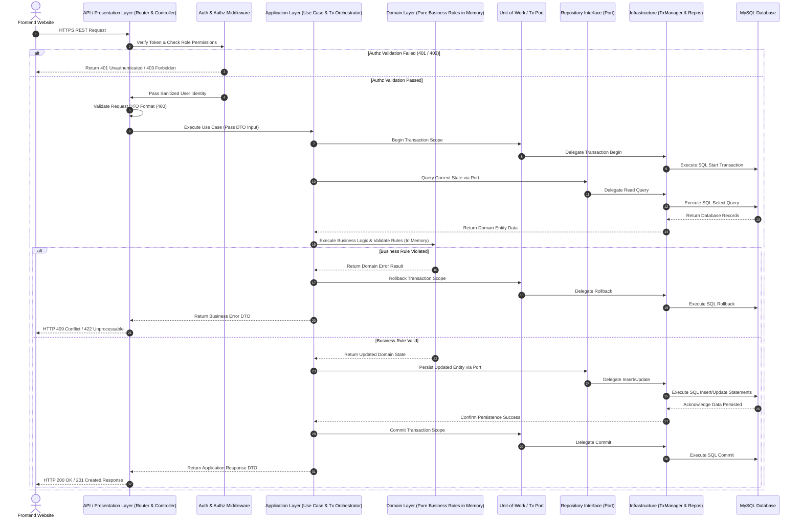
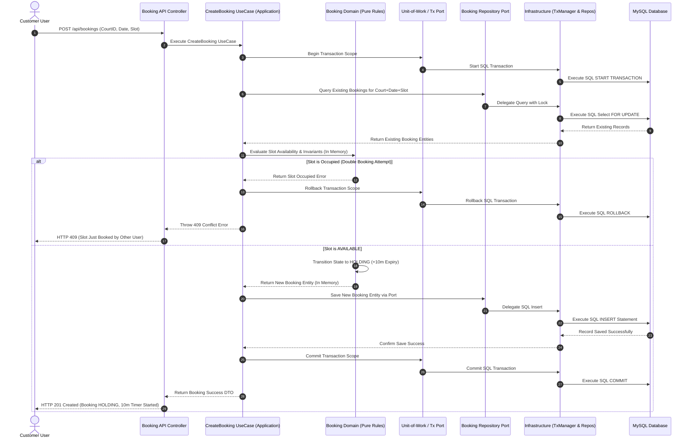
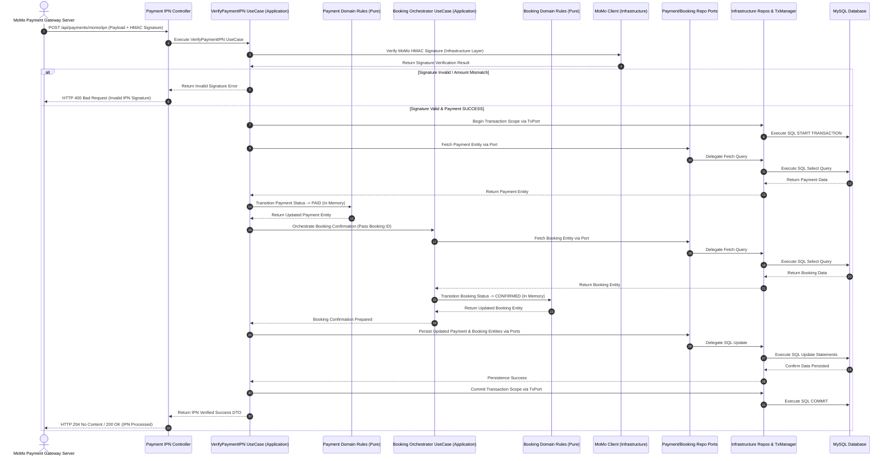
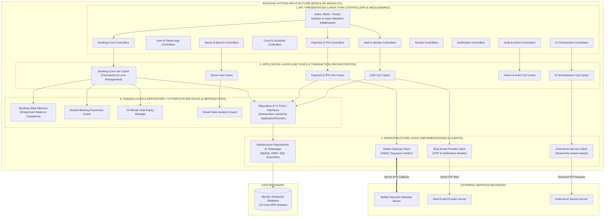

# TÀI LIỆU KIẾN TRÚC PHÂN HỆ BACKEND (BACKEND ARCHITECTURE SPECIFICATION)
**Hệ thống:** Website Đặt Lịch Sân Thể Thao Trực Tuyến (SportHubAI)  
**Mã Task:** 01.06.03 (Final Micro-Corrected Revision)  
**Trạng thái:** Standardized Architecture Specification  
**Tham chiếu nguồn:**  
- [01-actors-and-permissions.md](file:///e:/SportHubAI/docs/requirements/01-actors-and-permissions.md) (APPROVED)  
- [02-use-cases-and-user-flows.md](file:///e:/SportHubAI/docs/requirements/02-use-cases-and-user-flows.md) (APPROVED)  
- [03-functional-requirements.md](file:///e:/SportHubAI/docs/requirements/03-functional-requirements.md) (APPROVED)  
- [04-business-rules.md](file:///e:/SportHubAI/docs/requirements/04-business-rules.md) (APPROVED)  
- [05-data-model.md](file:///e:/SportHubAI/docs/requirements/05-data-model.md) (APPROVED)  
- [06-system-architecture.md](file:///e:/SportHubAI/docs/architecture/06-system-architecture.md) (APPROVED)  
- [07-frontend-architecture.md](file:///e:/SportHubAI/docs/architecture/07-frontend-architecture.md) (APPROVED)  
**Ngày cập nhật:** 2026-08-08  

---

## 1. PURPOSE (MỤC TIÊU TÀI LIỆU)

Tài liệu này đặc tả **Kiến trúc Phân hệ Backend (Backend Architecture)** cho hệ thống Website Đặt Lịch Sân Thể Thao Trực Tuyến SportHubAI. 

Mục tiêu chính:
1. Xác định mô hình kiến trúc, các tầng xử lý và ranh giới module của phân hệ Backend API Core.
2. Khẳng định vai trò Backend là **Source of Truth** độc quyền nắm giữ toàn bộ Quy tắc Nghiệp vụ (Business Rules), Phân quyền An toàn (Authorization), Quản lý Giao dịch Đặt sân (Booking Transaction) và Điều phối Dịch vụ Bên ngoài (External Services Orchestration).
3. Thiết lập cơ chế kiểm soát trạng thái đơn hàng (Booking State Machine), đếm ngược hold 10 phút, chống đặt trùng sân (Double Booking Protection) và xác thực thanh toán qua MoMo Server Callback (IPN).
4. Đảm bảo tính nhất quán hoàn toàn với 13 Core MVP Entities và phong cách kiến trúc **Modular Monolith** đã phê duyệt.

---

## 2. ABSOLUTE CONSTRAINTS & ABSOLUTE GUARANTEES (RÀNG BUỘC CỐT LÕI)

- **Website Only Scope:** Chỉ thiết kế kiến trúc Backend phục vụ 3 phân hệ giao diện Website (Customer Website, Owner Portal, Admin Portal). Tuyệt đối không thiết kế API dành riêng cho ứng dụng di động (Mobile App).
- **Modular Monolith Architecture:** Tuân thủ phong cách Modular Monolith đã phê duyệt tại Task 01.06.01. Không chia tách hệ thống thành Microservices, Event-driven distributed bus hay Serverless function để đảm bảo tính đơn giản, dễ vận hành và tính toàn vẹn giao dịch (ACID) cho giai đoạn MVP.
- **Zero Implementation Code Leakage:** Không viết mã nguồn triển khai Controller, Application Service, ORM Models (Sequelize/Prisma), SQL scripts hay API contract/Swagger code trong tài liệu kiến trúc này.

---

## 3. BACKEND RESPONSIBILITY (MỤC TIÊU VÀ TRÁCH NHIỆM BẮT BUỘC CỦA BACKEND)

Backend là thành phần trung tâm duy nhất làm Nguồn sự thật (Source of Truth) cho các trách nhiệm sau:

```text
┌────────────────────────────────────────────────────────────────────────────────────────┐
│                              BACKEND CORE RESPONSIBILITIES                             │
│                                                                                        │
│ ┌────────────────────────────┐  ┌────────────────────────────┐  ┌────────────────────┐ │
│ │ Authentication & OTP       │  │ Business Rules Enforcement │  │ Transaction Integrity│ │
│ └────────────────────────────┘  └────────────────────────────┘  └────────────────────┘ │
│ ┌────────────────────────────┐  ┌────────────────────────────┐  ┌────────────────────┐ │
│ │ Authorization & Roles      │  │ Double Booking Guard       │  │ Audit Logging      │ │
│ └────────────────────────────┘  └────────────────────────────┘  └────────────────────┘ │
│ ┌────────────────────────────┐  ┌────────────────────────────┐  ┌────────────────────┐ │
│ │ Booking Hold 10m Logic     │  │ MoMo IPN Verification      │  │ Database Access    │ │
│ └────────────────────────────┘  └────────────────────────────┘  └────────────────────┘ │
└────────────────────────────────────────────────────────────────────────────────────────┘
```

Frontend chỉ là phân hệ hiển thị (Client Presentation) và không được phép đưa ra bất kỳ quyết định nghiệp vụ nào.

---

## 4. BACKEND SYSTEM BOUNDARY (RANH GIỚI HỆ THỐNG BACKEND)

Backend đóng vai trò ranh giới trung tâm duy nhất giao tiếp giữa các phân hệ:

```text
                      CUSTOMER / OWNER / ADMIN WEBSITES
                                     │
                              HTTPS / REST API
                                     │
                                     ▼
 ┌──────────────────────────────────────────────────────────────────────────────────────┐
 │                              BACKEND SYSTEM BOUNDARY                                 │
 │                                (Modular Monolith)                                    │
 └───────┬───────────────────────────┬───────────────────────────┬──────────────────────┘
         │                           │                           │
         ▼                           ▼                           ▼
┌───────────────────┐       ┌───────────────────┐       ┌───────────────────────────────┐
│ MySQL DATABASE    │       │ MoMo PAYMENT IPN  │       │ REAL EMAIL / AI SERVICES      │
│ (13 Core Entities)│       │ (External Server) │       │ (External Orchestrated)       │
└───────────────────┘       └───────────────────┘       └───────────────────────────────┘
```

- **Database Access Boundary:** Backend (thông qua Infrastructure Repositories) là thành phần duy nhất có quyền kết nối và thao tác SQL/Data Access với MySQL. Domain Layer và Application Layer hoàn toàn không được truy cập trực tiếp Database.
- **External Integration Boundary:** Toàn bộ tích hợp với MoMo, Email Provider và AI Service phải đi qua ranh giới xử lý của Backend Infrastructure Layer.
- **Presentation Exception:** Google Maps SDK nhúng trên Frontend chỉ phục vụ render giao diện bản đồ và không thuộc trách nhiệm của Backend.

---

## 5. BACKEND MODULE ARCHITECTURE (CẤU TRÚC VÀ DANH MỤC CÁC MODULE)

Backend được phân rã thành **10 Domain Modules** logic độc lập:

1. **Auth & Identity Module:** Quản lý đăng ký, đăng nhập, mã hóa mật khẩu, tạo/xác thực mã OTP Email thực tế và cấp phiên làm việc.
2. **User & Owner Application Module:** Quản lý thông tin tài khoản người dùng và quy trình nộp/xét duyệt đơn đăng ký Owner.
3. **Venue & Branch Module:** Quản lý thông tin Cơ sở thể thao (`Venue`) và Chi nhánh (`Branch`) cùng trạng thái duyệt.
4. **Court & Schedule Module:** Quản lý Sân con (`Court`), lịch vận hành/bảng giá (`OperatingSchedule`) và lịch khóa slot thủ công (`SlotBlocking`).
5. **Booking Core Domain Module:** Miền nghiệp vụ cốt lõi quản lý khả dụng slot, tạo giữ chỗ 10m, chống đặt trùng sân và điều hướng trạng thái đơn.
6. **Payment Module:** Khởi tạo phiên thanh toán MoMo, tiếp nhận và xác thực chữ ký số từ MoMo Server Callback (IPN).
7. **Review Module:** Quản lý gửi đánh giá sau khi hoàn thành trận đấu (`COMPLETED`) và duyệt nội dung đánh giá.
8. **Notification Module:** Khởi tạo thông báo hệ thống và kích hoạt gửi thư qua External Email Provider.
9. **Audit & Governance Module:** Ghi nhận nhật ký vết Audit Log cho các hành vi nhạy cảm của Admin và Owner.
10. **AI Orchestrator Module:** Tiếp nhận yêu cầu gợi ý từ Frontend, điều phối API sang AI Service bên ngoài và chuẩn hóa dữ liệu phản hồi.

---

## 6. MODULE RESPONSIBILITY & ENTITY MAPPING (BẢNG TRÁCH NHIỆM MODULE)

| Module Name | Module Responsibilities | Owns Business Rules | Main Managed Entities | External Service Dependency |
|---|---|---|---|---|
| **Auth & Identity** | Đăng ký, Đăng nhập, Token, OTP Email, Password Reset | `BR-AUTH-001..004` | `User` | Real Email Provider |
| **User & Owner App**| Quản lý Profile, Nộp & Xét duyệt đơn Owner | `BR-USER-001..003` | `OwnerApplication`, `User` | None |
| **Venue & Branch** | Tạo, Duyệt & Quản lý Venue, Chi nhánh | `BR-VENUE-001..002` | `Venue`, `Branch`, `FavoriteVenue` | None |
| **Court & Schedule** | Quản lý Sân con, Bảng giá, Khung giờ, Khóa slot | `BR-COURT-001`, `BR-SCHED-001`, `BR-PRICE-001` | `Court`, `OperatingSchedule`, `SlotBlocking` | None |
| **Booking Core** | Slot availability, Hold 10m, Double booking guard, States | `BR-BOOK-001..014` | `Booking` | None |
| **Payment** | Khởi tạo phiên MoMo, Nhận MoMo IPN Callback, Xác thực tiền | `BR-PAY-001..003` | `Payment` | MoMo Payment Gateway |
| **Review** | Gửi đánh giá sau khi chơi, Moderation | `BR-REVIEW-001..002` | `Review` | None |
| **Notification** | Tạo thông báo hệ thống, Phát Mail sự kiện | `BR-NOTI-001..002` | `Notification` | Real Email Provider |
| **Audit & Governance**| Ghi vết nhật ký thao tác Admin/Owner | `BR-ADMIN-001` | `AuditLog` | None |
| **AI Orchestrator** | Tiếp nhận Search Assist, Gọi AI Service, Transform Data | `TBD Scope` | None (Read-only Orchestration) | AI Service |

---

## 7. AUTH & IDENTITY MODULE (THIẾT KẾ XÁC THỰC VÀ OTP EMAIL THỰC TẾ)

Module chịu trách nhiệm xác thực danh tính người dùng và kiểm soát chu trình sống của mã OTP Email:

```text
[Customer Register / Forgot Pass] ──> [Backend: Auth Module] ──> [Generate Random OTP]
                                                                        │
                                                                        ▼
[User Email Inbox] <── [External Email Provider] <── [Trigger Mail] <── [Persist OTP Securely via Repo]
        │
        │ (Customer nhập OTP gửi lên Backend)
        ▼
[Backend: Verify OTP API] ──(Valid)──> [Update Account ACTIVE / Allow Reset Password]
```

### Quy Tắc An Ninh Bắt Buộc:
- Mã OTP phải được gửi đến **Địa chỉ Email thực tế** của người dùng thông qua External Email Provider.
- Tuyệt đối **không giả lập OTP**, không in OTP ra log hệ thống, không trả OTP về trong kết quả API Client.
- Backend quản lý thời gian hết hạn và vô hiệu hóa mã OTP sau khi sử dụng hoặc quá thời gian hiệu lực.

---

## 8. AUTHORIZATION ARCHITECTURE (KIẾN TRÚC PHÂN QUYỀN VÀ BẢO MẬT BACKEND)

Phân quyền trên Backend là **Security Boundary tuyệt đối**, được thực thi theo 2 tầng:

1. **Role-Based Access Control (RBAC):** Phân định 4 vai trò chính:
   - `GUEST`: Chỉ được phép gọi các API đọc thông tin công khai (`/venues`, `/search`).
   - `CUSTOMER`: Được gọi các API đặt sân, quản lý cá nhân, gửi đánh giá.
   - `OWNER`: Được gọi các API quản lý cơ sở sân do mình sở hữu, cài đặt giá và xem báo cáo.
   - `ADMIN`: Được gọi các API kiểm duyệt đối tác, phê duyệt Venue, quản lý người dùng và xem Audit Log.
2. **Tenant Ownership Isolation (Cô Lập Dữ Liệu Theo Owner):** 
   - Backend bắt buộc kiểm tra xem tài nguyên Venue/Branch/Court/Booking có thuộc quyền sở hữu của Owner đang đăng nhập hay không (`BR-VENUE-002`).
   - Ngăn chặn tuyệt đối tình trạng Owner A truy vấn hoặc sửa đổi dữ liệu của Owner B.

---

## 9. BOOKING CORE DOMAIN & STATE MACHINE (MIỀN ĐẶT SÂN & MÁY TRẠNG THÁI 8 NẤC)

Booking Core Domain là miền nghiệp vụ cốt lõi chịu trách nhiệm quản lý **đúng tập 8 trạng thái đặt sân** đã phê duyệt ở Task 01.05.

### Biểu Đồ Chuyển Trạng Thái Đơn Đặt Sân (Booking State Machine):



### Bảng Quy Định Chuyển Trạng Thái Hợp Lệ (Allowed State Transition Matrix):

| Current State | Target State | Triggering Event / Action | Executed By | Business Rule Reference |
|---|---|---|---|---|
| `AVAILABLE` | `HOLDING` | Customer chọn slot và khởi tạo giữ chỗ | Customer | `BR-BOOK-001`, `BR-BOOK-002` |
| `AVAILABLE` | `CONFIRMED` | Owner đặt trực tiếp tại sân (`MANUAL_OFFLINE`) | Owner | `BR-OWNER-001` |
| `HOLDING` | `PAYMENT_PENDING` | Customer chọn thanh toán qua MoMo | Customer | `BR-PAY-001` |
| `HOLDING` | `EXPIRED` | Hệ thống tự động quét quá 10m đếm ngược | SYSTEM Job | `BR-BOOK-002`, `UC-S-002` |
| `PAYMENT_PENDING` | `CONFIRMED` | Nhận MoMo IPN Callback xác thực `PAID` | MoMo IPN Callback | `BR-PAY-002`, `BR-BOOK-005` |
| `PAYMENT_PENDING` | `PAYMENT_FAILED` | MoMo Server báo giao dịch bị hủy/lỗi | MoMo IPN Callback | `BR-PAY-003` |
| `PAYMENT_PENDING` | `EXPIRED` | Quá thời gian chờ thanh toán cổng MoMo | SYSTEM Job | `BR-BOOK-002` |
| `CONFIRMED` | `COMPLETED` | Khung giờ sử dụng sân kết thúc | SYSTEM Job | `BR-BOOK-008` |
| `CONFIRMED` | `CANCELLED` | Yêu cầu hủy đơn hợp lệ theo chính sách sân | Customer / Owner | `BR-CANCEL-001` |

---

## 10. BOOKING HOLD 10M LOGIC (CƠ CHẾ GIỮ CHỖ ĐẾM NGƯỢC 10 PHÚT)

- **Trách Nhiệm Của Backend:**
  - Khi Customer chọn slot, Backend kiểm tra điều kiện khả dụng và cập nhật `Booking Status = HOLDING`.
  - Thiết lập thuộc tính `Hold Expiry Timestamp = Current Timestamp + 10 Minutes` (`BR-BOOK-002`).
  - Cung cấp cơ chế quét tự động (Background Job) để chuyển đơn hàng từ `HOLDING` sang `EXPIRED` và giải phóng slot khi quá thời hạn 10 phút.
- **Ranh Giới Client:** Frontend chỉ hiển thị đồng hồ đếm ngược giao diện (UI Timer) và không có quyền quyết định khi nào đơn hàng hết hạn.

---

## 11. DOUBLE BOOKING PREVENTION (CƠ CHẾ CHỐNG ĐẶT TRÙNG SÂN)

Backend chịu trách nhiệm ngăn chặn tuyệt đối tình trạng hai người dùng đặt cùng một `Court` trong cùng một khoảng thời gian (`Booking Date` + `Start Time` -> `End Time`):

```text
Request A (Customer 1) ──┐
                         ├──> [Application Transaction Boundary] ──> [Acquire Lock / Unique Guard]
Request B (Customer 2) ──┘                                                   │
                                                                             ├──> Customer 1: Success (HOLDING)
                                                                             └──> Customer 2: Conflict Error (409)
```

### Phương Pháp Bảo Vệ Ở Mức Kiến Trúc:
1. **Transaction Boundary Locking:** Xử lý việc kiểm tra khả dụng và tạo đơn đặt sân trong cùng một Giao dịch Dữ liệu (Application Transaction) điều phối qua Unit of Work / Repository Ports.
2. **Atomic Availability Verification:** Slot chỉ được xem là khả dụng nếu không tồn tại bất kỳ Booking nào ở các trạng thái `HOLDING`, `PAYMENT_PENDING`, hoặc `CONFIRMED` trùng khung giờ.
3. **Database Unique Constraint Guard:** Áp dụng ràng buộc duy nhất ở mức lưu trữ cơ sở dữ liệu (thông qua Infrastructure Repository Implementation) để đảm bảo ngay cả khi có xung đột đồng thời ở mức milisecond, cơ sở dữ liệu sẽ từ chối đơn đặt thứ hai.

---

## 12. TRANSACTION BOUNDARY ARCHITECTURE (KIẾN TRÚC TRANSACTIONS DỮ LIỆU)

Tất cả các thao tác thay đổi dữ liệu đơn hàng bắt buộc phải bọc trong một **Unit of Work / Transaction Boundary** do Application Layer điều phối trừu tượng thông qua Transaction Manager Port (Application Layer không truy cập trực tiếp MySQL):

```text
Application Layer Request Transaction Boundary (via Unit-of-Work Port)
   ├── 1. Verify User & Permission (ACTIVE User) via User Repository Port
   ├── 2. Verify Court Operational Status (ACTIVE) via Court Repository Port
   ├── 3. Verify Slot Availability & Check SlotBlocking via Schedule Repository Port
   ├── 4. Execute Domain Logic: Evaluate Booking Domain Invariants (Set Status = HOLDING, Hold Expiry = +10m)
   ├── 5. Persist State via Booking Repository Port (Delegates to Infrastructure)
   ├── 6. Write Audit Log via Audit Repository Port (If applicable)
Application Layer Commits Transaction via TxPort (Infrastructure TxManager executes MySQL Commit)
```

Nếu có bất kỳ bước kiểm tra hoặc lưu trữ nào thất bại, Application Layer sẽ chỉ đạo `Rollback` thông qua Transaction Port, Infrastructure Manager sẽ thực thi SQL Rollback trên MySQL.

---

## 13. PAYMENT MODULE & MOMO IPN FLOW (RANH GIỚI THANH TOÁN MOMO)

- **Source of Truth:** Tín hiệu **MoMo Server Callback (IPN)** gửi từ máy chủ MoMo về Backend API là nguồn xác thực duy nhất để công nhận thanh toán thành công.
- **Quy Trình Xử Lý Thanh Toán:**

```text
Customer Website ──(1. Pay Request)──> Backend Payment Module ──(2. Init Session)──> MoMo Server
       │                                                                                   │
(5. Redirect UI) <────────────────────── (3. Payment Link URL) <───────────────────────────┘
       │
       ▼
Customer Pay on MoMo ──(4. Server Callback IPN)──> Payment API ──> Payment Application UseCase
                                                                            │
                                                                 (Verify HMAC Signature via Infra)
                                                                            │
                                                                 Payment Domain (Payment = PAID)
                                                                            │
                                                                 Booking Orchestrator (Booking = CONFIRMED)
                                                                            │
                                                                 Persist State via Repo Ports to MySQL
```

- **Ranh Giới Bảo Mật:** Trình duyệt quay về từ MoMo (`Frontend Redirect`) chỉ kích hoạt Backend truy vấn lại trạng thái (Query Status) chứ Backend không bao giờ tin tưởng dữ liệu do Frontend tự gửi lên.

---

## 14. REVIEW MODULE ARCHITECTURE (KIẾN TRÚC ĐÁNH GIÁ)

- **Trách Nhiệm:** Quản lý việc gửi đánh giá sao và bình luận của Customer sau khi trải nghiệm dịch vụ.
- **Ràng Buộc Nghiệp Vụ:** 
  - Backend kiểm tra đơn đặt sân liên kết bắt buộc phải ở trạng thái `COMPLETED` mới cho phép tạo bản ghi `Review` (`BR-REVIEW-001`).
  - Mỗi đơn `COMPLETED` chỉ được gắn với duy nhất 1 bản ghi `Review` (`Booking 1 : 0..1 Review`).

---

## 15. NOTIFICATION MODULE ARCHITECTURE (KIẾN TRÚC THÔNG BÁO)

- **Trách Nhiệm:** Tạo lập thông báo hệ thống và phát thư điện tử thông báo tới người dùng.
- **Tương Tác External Service:** Khi xuất hiện các sự kiện quan trọng (Xác thực OTP Email, Đặt sân thành công, Hủy đơn, Hết hạn hold), Notification Module lưu bản ghi `Notification` qua Notification Repository Port và kích hoạt yêu cầu gửi mail tới External Email Provider (Infrastructure Client).

---

## 16. AUDIT & GOVERNANCE MODULE ARCHITECTURE (KIẾN TRÚC NHẬT KÝ VẾT AUDIT)

- **Phân Biệt:** 
  - **Technical Application Logs:** Ghi lại vết lỗi hệ thống (Stack trace, 500 error) phục vụ lập trình viên.
  - **Audit Logs:** Ghi lại vết hành vi nghiệp vụ nhạy cảm phục vụ công tác kiểm toán (Ai thực hiện, Thao tác gì, Trên tài nguyên nào, Thời gian nào).
- **Phạm Vi Ghi Audit Log:** Toàn bộ các thao tác của Admin (Duyệt/Từ chối Owner, Khóa tài khoản, Khóa Venue) và thao tác của Owner (Cập nhật giá, Khóa slot thủ công, Hủy đơn) bắt buộc phải tạo bản ghi lưu trữ vào thực thể `AuditLog` thông qua Infrastructure Repository Implementation.

---

## 17. AI ORCHESTRATOR MODULE ARCHITECTURE (KIẾN TRÚC ĐIỀU PHỐI AI)

AI Orchestrator Module đóng vai trò là tầng trung gian điều phối giữa Frontend và AI Service bên ngoài:

```text
Customer Website UI ──(1. Search Assist)──> Backend API [AI Orchestrator Module]
                                                     │
                                             (2. Input Sanitization)
                                                     │
                                                     ▼
Customer Website UI <──(4. Format Result)── Backend API <──(3. Recommendation API)── AI Service
```

### Quy Tắc Bảo Mật AI Orchestrator:
- AI Service nằm ngoài ranh giới lưu trữ dữ liệu. AI **không có kết nối trực tiếp với MySQL Database**.
- AI Service **không được phép khởi tạo Booking**, không tự đổi trạng thái đơn và không xác nhận thanh toán.
- Backend chịu trách nhiệm làm sạch dữ liệu đầu vào (Sanitization) và kiểm minh quy tắc nghiệp vụ trước khi trả dữ liệu gợi ý về cho Frontend.

---

## 18. LAYERED BACKEND ARCHITECTURE & DEPENDENCY INVERSION (KIẾN TRÚC PHÂN TẦNG VÀ ĐẢO NGƯỢC PHỤ THUỘC)

Mỗi Domain Module trong Backend Modular Monolith được thiết kế theo 4 tầng kiến trúc tiêu chuẩn tuân thủ Nguyên tắc Đảo ngược Phụ thuộc (Dependency Inversion Principle):

```text
┌────────────────────────────────────────────────────────────────────────────────────────┐
│                        LAYERED BACKEND ARCHITECTURE & PORTS                            │
│                                                                                        │
│ ┌────────────────────────────────────────────────────────────────────────────────────┐ │
│ │ 1. API / PRESENTATION LAYER (Controllers, Routers, Middlewares, Input Validation)   │ │
│ └────────────────────────────────────────┬───────────────────────────────────────────┘ │
│                                          ▼                                             │
│ ┌────────────────────────────────────────────────────────────────────────────────────┐ │
│ │ 2. APPLICATION LAYER (Use Cases / Application Services, Transaction Orchestration) │ │
│ └───────────────────┬────────────────────────────────────────┬───────────────────────┘ │
│                     │                                        │                         │
│                     ▼                                        ▼                         │
│ ┌────────────────────────────────────────┐  ┌──────────────────────────────────────┐ │
│ │ 3. DOMAIN LAYER                        │  │ REPOSITORY & TX PORTS / INTERFACES   │ │
│ │ (Domain Services, State Machine,       │  │ (Pure Abstractions owned by           │ │
│ │  Business Invariants & Pure Rules)     │  │  Application / Domain Layer)         │ │
│ └────────────────────────────────────────┘  └──────────────────┬───────────────────┘ │
│                                                                │                       │
│                                                                ▼                       │
│ ┌────────────────────────────────────────────────────────────────────────────────────┐ │
│ │ 4. INFRASTRUCTURE LAYER (Repository Implementations, TxManager, External Clients)  │ │
│ └────────────────────────────────────────────────────────────────────────────────────┘ │
└────────────────────────────────────────────────────────────────────────────────────────┘
```

1. **API / Presentation Layer:** Chịu trách nhiệm tiếp nhận HTTP Requests, xác thực phiên/token (Middleware), kiểm tra định dạng đầu vào và trả về HTTP Responses. Controllers đóng vai trò **Thin Controllers** (không chứa business logic).
2. **Application Layer:** Điều phối các Use Case nghiệp vụ, quản lý ranh giới Giao dịch Dữ liệu (Transaction Boundaries qua TxPort), kết nối giữa Domain Layer và Repository Ports.
3. **Domain Layer:** Trái tim của hệ thống chứa toàn bộ Business Rules thuần túy, Quy tắc chuyển trạng thái đơn hàng (State Machine) và Ràng buộc nghiệp vụ (Domain Invariants). **Domain Layer hoàn toàn độc lập với HTTP, Infrastructure, ORM, Database và không hề có bất kỳ kết nối trực tiếp nào tới Database.**
4. **Repository Ports / Interfaces:** Các giao diện trừu tượng thuộc về tầng Application/Domain quy định các hợp đồng đọc/ghi dữ liệu.
5. **Infrastructure Layer:** Cài đặt các **Repository Implementations** thực thi thao tác kết nối cơ sở dữ liệu quan hệ (MySQL) và các Client gọi Dịch vụ Bên ngoài (MoMo Gateway, Email Provider, AI Service).

---

## 19. REPOSITORY BOUNDARY & DATABASE ACCESS (RANH GIỚI TRUY CẬP CƠ SỞ DỮ LIỆU)

- **Repository Dependency Inversion:** Toàn bộ thao tác lưu trữ dữ liệu được trừu tượng hóa qua `Repository Interfaces` (Ports). `Infrastructure Repository Implementations` cài đặt các giao diện này để giao tiếp với MySQL.
- **Quy Tắc Ranh Giới Tuyệt Đối:**
  - **Domain Layer:** ❌ Tuyệt đối **KHÔNG** truy cập Database, KHÔNG gọi Sequelize/ORM Models, KHÔNG thực thi SQL. Domain Layer chỉ thực thi logic nghiệp vụ và biến đổi trạng thái trong bộ nhớ.
  - **Application Layer:** ❌ Tuyệt đối **KHÔNG** kết nối hoặc thực thi SQL trực tiếp tới MySQL. Application Layer chỉ điều phối qua Repository/Transaction Ports.
  - **Controllers:** ❌ Tuyệt đối **KHÔNG** truy cập trực tiếp vào Database hoặc ORM Models.
  - **Infrastructure Repositories:** ✅ Là nơi **DUY NHẤT** thực thi kết nối SQL/ORM với MySQL Database.
- **Source of Truth Entity Model:** Giữ nguyên **đúng 13 Core MVP Entities** từ Task 01.05 (`User`, `OwnerApplication`, `Venue`, `Branch`, `Court`, `OperatingSchedule`, `SlotBlocking`, `Booking`, `Payment`, `Review`, `Notification`, `FavoriteVenue`, `AuditLog`). Tuyệt đối không tự thêm hoặc xóa thực thể.

---

## 20. MODULE DEPENDENCY MATRIX & CIRCULAR DEPENDENCY CHECK (MA TRẬN PHỤ THUỘC GIỮA CÁC MODULE)

Ma trận phụ thuộc chỉ quy định quan hệ phụ thuộc giữa **10 Domain Modules** (Module -> Module, tuyệt đối không dùng Entity):

| Calling Module | Allowed Dependent Modules | Forbidden Modules | Business Rationale |
|---|---|---|---|
| **Auth & Identity** | `User & Owner Application`, `Notification` | Booking Core, Payment, Review, Court & Schedule, Venue & Branch | Auth quản lý tài khoản và gửi OTP Email thông báo |
| **User & Owner Application**| `Notification` | Booking Core, Payment, Court & Schedule | Quản lý Profile và Nộp đơn nâng cấp Owner |
| **Venue & Branch** | `User & Owner Application` | Booking Core, Payment, Review | Cần thông tin sở hữu từ User & Owner Application |
| **Court & Schedule**| `Venue & Branch` | Payment, Review, Booking Core | Hạ tầng sân con trực thuộc Chi nhánh/Venue |
| **Booking Core** | `Court & Schedule`, `User & Owner Application` | Direct External Payment Gateway, AI Service Direct | Booking điều phối giữ chỗ, đọc khung giờ & sân |
| **Payment** | None (Tương tác qua App Orchestration) | Direct Booking Domain Write, Venue & Branch, Review | Payment độc lập; việc đổi trạng thái Booking do Application Orchestration đảm nhận |
| **Review** | `Booking Core`, `User & Owner Application` | Payment, Court & Schedule | Review chỉ gửi khi Booking đã COMPLETED |
| **Notification** | `User & Owner Application` | Booking Core Internal, Payment Internal | Notification phát thông báo cho người dùng |
| **Audit & Governance**| Application-level Abstractions (Read Audit) | Modification of Business State in any Module | Audit chỉ ghi vết và đọc nhật ký quản trị |
| **AI Orchestrator** | Infrastructure AI Client | Direct DB Write, Booking Core Modification | AI chỉ đọc và biến đổi dữ liệu gợi ý tìm kiếm |

### Kiểm Tra Phụ Thuộc Vòng Tròn (Circular Dependency Check):
- ✅ **Kết quả:** **0 Circular Dependencies**. Luồng phụ thuộc đi theo duy nhất một chiều (`Booking Core -> Court & Schedule -> Venue & Branch -> User & Owner Application`). Khi Payment hoàn tất, `Payment Application UseCase` điều phối gọi `Booking Application Orchestrator` ở cấp Application Layer chứ `Payment Module` không trực tiếp phụ thuộc vòng vào `Booking Core Domain`.

---

## 21. ERROR HANDLING & SECURITY ARCHITECTURE (RANH GIỚI LỖI VÀ AN NINH BACKEND)

### Error Architecture (Phân Tầng Lỗi System):
- **Domain Errors:** Phát ra từ Domain Layer khi vi phạm Business Rules (Ví dụ: `SlotNotAvailableError`, `HoldExpiredError`, `InvalidStateTransitionError`). Map về HTTP `409 Conflict` hoặc `422 Unprocessable Entity`.
- **Authorization Errors:** Phát ra từ Auth Middleware khi chưa đăng nhập (`401 Unauthenticated`) hoặc không đủ quyền (`403 Forbidden`).
- **Validation Errors:** Phát ra từ API Layer khi định dạng dữ liệu đầu vào sai (`400 Bad Request`).
- **Infrastructure Errors:** Lỗi kết nối Database hoặc lỗi External Service. Map về `500 Internal Server Error` hoặc `502 Bad Gateway`.

### Security Architecture Boundaries:
- Mật khẩu phải được mã hóa bằng thuật toán băm an toàn (Secure Hashing) trước khi lưu DB.
- Trừ mã Token phiên công khai, **tuyệt đối không lưu trữ hoặc in ra Log** các thông tin nhạy cảm: Password, OTP Secret, Payment Secret Signature, JWT Private Key.

---

## 22. LOGGING & OBSERVABILITY ARCHITECTURE (KIẾN TRÚC LOGGING VÀ GIÁM SÁT)

Phân hệ Backend thiết lập 2 luồng Logging biệt lập:

1. **Technical System Logging:** Ghi nhận các sự kiện hệ thống (Request Latency, Exception Stack Traces, External API Failures) phục vụ giám sát kỹ thuật.
2. **Business Audit Logging:** Ghi nhận các sự kiện thay đổi trạng thái nghiệp vụ nhạy cảm vào bảng `AuditLog` phục vụ kiểm toán quản trị:
   - **Cấu trúc bản ghi Audit:** `Actor User ID` + `Action Performed` + `Target Entity Type` + `Target Entity ID` + `Action Details` + `Created Timestamp`.

---

## 23. EXTERNAL SERVICE BOUNDARY MATRIX (MA TRẬN DỊCH VỤ BÊN NGOÀI)

| External Service | Orchestrated By Module | Communication Direction | Integration Purpose | Security & Callback Mechanism |
|---|---|---|---|---|
| **MoMo Payment Gateway** | Payment Module | Bidirectional (`Backend -> MoMo / MoMo -> Backend`) | Thanh toán trực tuyến | MoMo Server IPN Callback ngầm kèm chữ ký số HMAC |
| **Real Email Provider** | Auth & Notification | Outbound (`Backend -> Email Provider`) | Gửi Email OTP & Thông báo | Secret API Key lưu trữ trong Backend Config |
| **AI Recommendation Service** | AI Orchestrator | Bidirectional (`Backend -> AI Service -> Backend`) | Gợi ý tìm kiếm ngữ nghĩa | Read-only API Request, Backend làm sạch Data |
| **Google Maps SDK** | *Frontend UI Only* | *Direct Client Rendering* | Hiển thị hình ảnh bản đồ | *Presentation Exception (Nằm ngoài Backend)* |

---

## 24. CONFIGURATION & ENVIRONMENT BOUNDARY (QUẢN LÝ CẤU HÌNH BẢO MẬT)

Toàn bộ các thông số cấu hình hạ tầng và bí mật kết nối (Secrets) phải được quản lý tập trung qua biến môi trường (Environment Variables):
- **Cấm Hard-code:** Tuyệt đối không hard-code Password Database, JWT Secrets, MoMo Secret Keys, API Keys của Email Provider hay AI Service trong mã nguồn.
- Configuration Module kiểm tra và bắt buộc hệ thống dừng khởi động nếu thiếu các cấu hình bí mật thiết yếu.

---

## 25. BACKEND REQUEST FLOW (SƠ ĐỒ LUỒNG XỬ LÝ REQUEST CHUẨN)

Dưới đây là sơ đồ Mermaid Sequence thể hiện Luồng xử lý một Request API tiêu chuẩn từ Frontend qua các tầng của Backend (Được chuẩn hóa chuẩn ranh giới: Application Layer điều phối qua TxPort và RepoPort, không tầng nào ngoài Infrastructure Repositories truy cập trực tiếp MySQL):



---

## 26. BOOKING TRANSACTION FLOW (SƠ ĐỒ GIAO DỊCH ĐẶT SÂN & CHỐNG ĐẶT TRÙNG)

Dưới đây là sơ đồ Mermaid Sequence đặc tả Luồng xử lý Giao dịch Đặt sân cốt lõi (Tách biệt hoàn toàn giữa Application Transaction Orchestration qua TxPort, Domain Pure Rules và Infrastructure SQL Execution):



---

## 27. MOMO PAYMENT IPN FLOW (SƠ ĐỒ XÁC THỰC THANH TOÁN MOMO SERVER CALLBACK & ORCHESTRATION)

Dưới đây là sơ đồ Mermaid Sequence đặc tả Luồng xử lý Thanh toán qua MoMo Server Callback (IPN) ngầm (Xác minh HMAC thực thi tại Infrastructure Layer; MoMo Payment xác nhận `PAID` và chuyển điều phối qua Application Layer để chuyển Booking sang `CONFIRMED`):



---

## 28. ARCHITECTURE DIAGRAM (SƠ ĐỒ KIẾN TRÚC NỘI BỘ BACKEND VÀ NGUYÊN TẮC PORTS)

Dưới đây là sơ đồ Mermaid chi tiết mô tả Kiến trúc Phân tầng, Phân rã Modules Nội bộ và Ranh giới Repository & Transaction Ports trong Phân hệ Backend:



---

## 29. RESPONSIBILITY MATRIX (MA TRẬN PHÂN CHIA TRÁCH NHIỆM TRONG BACKEND)

| Trách Nhiệm Kỹ Thuật / Nghiệp Vụ | Controller Layer | Application Layer | Domain Layer | Repository Ports | Infrastructure Layer | Nguồn Tham Chiếu |
|---|---|---|---|---|---|---|
| **HTTP Request Parsing & Route** | **YES** | NO | NO | NO | NO | `Section 18` |
| **Input Format Validation DTO** | **YES** | Support | NO | NO | NO | `FR-AUTH-001` |
| **Authentication & Authz Enforcement**| **YES** (Middleware)| Support | Support | NO | NO | `BR-USER-003` |
| **Use Case Orchestration** | NO | **YES** | NO | NO | NO | `Section 18` |
| **Database Transaction Control** | NO | **YES** (Orchestrate)| NO | Interface Only (TxPort)| **YES** (TxManager) | `Section 12` |
| **Business Rules Enforcement** | NO | Support | **YES** | NO | NO | `Task 01.04` |
| **Booking 8 States Transition** | NO | Orchestrate | **YES** (Pure Rules)| NO | NO | `Section 9` |
| **Double Booking Guard** | NO | Orchestrate | **YES** (Logic) | NO | Support (Unique Constraint) | `BR-BOOK-003` |
| **Hold 10m Expiry Management** | NO | Orchestrate | **YES** | NO | Support | `BR-BOOK-002` |
| **MoMo IPN Signature Verification** | NO | Orchestrate | NO | NO | **YES** (MoMo Client)| `BR-PAY-002` |
| **Database Access & SQL Execution**| NO | NO | **NO** | Interface Only | **YES** (MySQL Repos) | `Section 19` |
| **External Email / AI Calling** | NO | Orchestrate | NO | NO | **YES** (Clients)| `Section 23` |

---

## 30. LOGICAL FOLDER STRUCTURE (CẤU TRÚC THƯ MỤC NGUỒN LOGICAL BACKEND - CHÍNH XÁC 10 MODULES)

Dưới đây là cấu trúc thư mục mã nguồn Backend tiêu chuẩn được thiết lập theo kiến trúc Modular Monolith Phân Tầng cho **đúng 10 Domain Modules**:

```text
backend/
└── src/
    ├── config/                   # Quản lý cấu hình biến môi trường (Database, Secrets, Email, MoMo)
    ├── common/                   # Thành phần dùng chung (Errors, Loggers, Middlewares, Utils)
    │   ├── errors/               # DomainError, AuthError, ValidationError, SystemError
    │   ├── middleware/           # AuthMiddleware, RBACMiddleware, TenantIsolationMiddleware
    │   ├── logging/              # TechnicalLogger, AuditLogger
    │   └── utils/                # CryptoHelpers, DateHelpers
    │
    ├── modules/                  # ĐÚNG 10 DOMAIN MODULES ĐÓNG GÓI ĐỘC LẬP
    │   ├── auth/                 # Auth & Identity Module
    │   ├── users/                # User & Owner Application Module (Chứa profile & sub-feature owner-application)
    │   ├── venues/               # Venue & Branch Module
    │   ├── courts/               # Court & Schedule Module (Sân con, Bảng giá & Slot Blocking)
    │   ├── bookings/             # Booking Core Domain Module (State Machine, Hold Manager)
    │   ├── payments/             # Payment Module (MoMo IPN Handling)
    │   ├── reviews/              # Review Module
    │   ├── notifications/        # Notification Module
    │   ├── audit/                # Audit & Governance Module
    │   └── ai/                   # AI Orchestrator Module
    │
    ├── infrastructure/           # Tầng hạ tầng kỹ thuật (Implementations)
    │   ├── database/             # Relational Database Context, Migrations, TxManager
    │   ├── repositories/         # MySQL Repository Implementations cho 13 Core Entities
    │   ├── payment/              # MoMo Gateway Client & HMAC Signature Verifier
    │   ├── email/                # Real Email Provider Client (OTP Mailer)
    │   └── ai/                   # External AI Service Client
    │
    └── app/                      # Điểm khởi tạo ứng dụng
        ├── routes/               # Tổng hợp API Routes
        └── server.ts             # Khởi tạo Server & Middleware Stack
```

---

## 31. ARCHITECTURAL GUARDRAILS (16 QUY TẮC RÀNG BUỘC KIẾN TRÚC TỐI CAO)

Mọi lập trình viên Backend bắt buộc phải tuân thủ 16 Quy tắc Ràng buộc Kiến trúc sau:

1. **Guardrail 1:** Controllers phải duy trì vai trò **Thin Controllers**, tuyệt đối không chứa Business Logic.
2. **Guardrail 2:** 100% Business Rules thuộc về trách nhiệm thực thi độc quyền của Backend Domain Layer.
3. **Guardrail 3:** Domain Layer phải hoàn toàn độc lập, không phụ thuộc trực tiếp vào HTTP Request/Response hay Framework.
4. **Guardrail 4:** Domain Layer tuyệt đối không truy cập trực tiếp vào Database, không gọi ORM/Sequelize Models và không thực thi SQL.
5. **Guardrail 5:** Repository Implementations thuộc Infrastructure Layer là nơi duy nhất thực thi kết nối và thao tác SQL/ORM với cơ sở dữ liệu.
6. **Guardrail 6:** Frontend và External Services tuyệt đối không được truy cập trực tiếp vào Database.
7. **Guardrail 7:** Frontend không được tự gán hoặc xác nhận trạng thái `Payment = PAID` hoặc `Booking = CONFIRMED`.
8. **Guardrail 8:** Frontend không được tự xác nhận mã OTP Email; Backend sở hữu độc quyền quy trình tạo và xác thực OTP.
9. **Guardrail 9:** Giao dịch đặt sân (Booking Transaction) phải do Backend kiểm soát hoàn toàn thông qua Unit of Work / Transaction Boundary do Application Layer điều phối qua Ports.
10. **Guardrail 10:** Cơ chế chống đặt trùng sân (Double Booking Protection) phải được Backend bảo vệ ở mức giao dịch nguyên tử.
11. **Guardrail 11:** Xác minh thanh toán thành công bắt buộc dựa vào MoMo Server Callback (IPN) ngầm gửi tới Backend; xác thực HMAC thuộc trách nhiệm Infrastructure Client.
12. **Guardrail 12:** Kết nối các Dịch vụ Bên ngoài (MoMo, Email Provider, AI Service) phải được cách ly phía sau Infrastructure Layer của Backend.
13. **Guardrail 13:** Thông số cấu hình bí mật (Passwords, Private Keys, Secret Signatures) tuyệt đối không được hard-code trong mã nguồn.
14. **Guardrail 14:** Thông tin nhạy cảm (Passwords, OTP Secrets, Payment Signatures) tuyệt đối không được in ra Log hệ thống.
15. **Guardrail 15:** Các Domain Modules phải giữ phụ thuộc một chiều, tuyệt đối không tạo phụ thuộc vòng tròn (Zero Circular Dependencies).
16. **Guardrail 16:** Kiến trúc Backend duy trì cấu trúc **Modular Monolith** nhất quán cho toàn bộ giai đoạn MVP.

---

## 32. TRACEABILITY MATRIX (MA TRẬN TRUY VẾT BACKEND ARCHITECTURE)

| Backend Module | Functional Requirement | Business Rule | Use Case | Managed Data Entity |
|---|---|---|---|---|
| **auth** | FR-AUTH-001..006 | BR-AUTH-001..004, BR-USER-001..003 | UC-C-001..003, UC-C-007 | `User` |
| **users** | FR-CUST-001, FR-CUST-006 | BR-USER-002 | UC-C-004, UC-O-001 | `User`, `OwnerApplication` |
| **venues** | FR-VENUE-001..005 | BR-VENUE-001..002 | UC-O-003..004, UC-A-003 | `Venue`, `Branch`, `FavoriteVenue` |
| **courts** | FR-COURT-001..003, FR-SCHED-001..003 | BR-COURT-001, BR-SCHED-001, BR-PRICE-001 | UC-O-005..009 | `Court`, `OperatingSchedule`, `SlotBlocking` |
| **bookings** | FR-BOOK-001..009, FR-SYS-001 | BR-BOOK-001..014 | UC-C-014..017, UC-O-011, UC-S-001..006 | `Booking` |
| **payments** | FR-PAY-001..002 | BR-PAY-001..003 | UC-C-015, UC-S-003..004 | `Payment` |
| **reviews** | FR-REVIEW-001 | BR-REVIEW-001..002 | UC-C-019 | `Review` |
| **notifications** | FR-NOTI-001 | BR-NOTI-001..002 | UC-S-005 | `Notification` |
| **audit** | FR-ADMIN-001..009 | BR-ADMIN-001 | UC-A-001..010, UC-O-010 | `AuditLog` |
| **ai** | TBD Search Assist | TBD Scope | TBD AI Use Cases | None (Read-only Orchestration) |

---

## 33. OPEN QUESTIONS / TBD PRESERVATION (BẢO LƯU CÁC MỤC CHƯA CHỐT)

Hệ thống kiến trúc Backend tôn trọng và giữ nguyên 100% các mục chưa chốt (`TBD`) từ các tài liệu trước:

1. **BACK-TBD-001: Token Storage & Refresh Strategy:** Chiến lược lưu vết Token phiên (JWT Expiration, Refresh Token Mechanism) giữ nguyên `TBD — Pending Security Architecture Approval`.
2. **BACK-TBD-002: Notification Delivery Channels Backend:** Kênh phát thông báo chi tiết (Email vs SMS vs Push Notification) giữ nguyên `TBD — Refer to OQ-006`.
3. **BACK-TBD-003: Cancellation Refund Representation:** Cơ chế xử lý hoàn tiền tự động hay thủ công khi hủy đơn giữ nguyên `TBD — Refer to OQ-001`.
4. **BACK-TBD-004: Review Target Scope Backend:** Cấu trúc gắn đánh giá (Venue vs Court) giữ nguyên `TBD — Refer to OQ-003`.
5. **BACK-TBD-005: Operating Schedule Scope Backend:** Phạm vi gắn lịch vận hành (Venue vs Branch vs Court) giữ nguyên `TBD — Refer to TBD-DM-006`.
6. **BACK-TBD-006: AI Search Assistance Backend:** Mức độ tích hợp dịch vụ AI giữ ranh giới hỗ trợ đọc `Read-Only` qua AI Orchestrator Module và giữ nguyên `TBD`.

---

## 34. VALIDATION CHECKLIST (KIỂM TRA TÍNH HỢP LỆ)

- [x] Backend duy trì phong cách **Modular Monolith** chuẩn hóa **Website Only**.
- [x] Định nghĩa **đúng 10 Domain Modules** độc lập và bảng phân chia trách nhiệm Module Responsibility.
- [x] Phụ thuộc module 1 chiều quy định ở cấp MODULE -> MODULE, **0 Circular Dependencies**.
- [x] Định nghĩa Kiến trúc Phân tầng 4 Tầng (API Layer, Application Layer, Domain Layer, Infrastructure Layer) tuân thủ Dependency Inversion.
- [x] Application Layer không truy cập trực tiếp MySQL; transaction được Application điều phối qua TxPort và Infrastructure TxManager thực thi SQL.
- [x] Loại bỏ hoàn toàn các kết nối trực tiếp `Domain -> Database` khỏi toàn bộ các luồng Sequence Diagrams và văn bản.
- [x] Khẳng định Repository Ports/Interfaces thuộc về Application/Domain Layer và Infrastructure Repositories cài đặt các Ports này để truy cập MySQL.
- [x] Xác thực HMAC Signature của MoMo thuộc trách nhiệm của Infrastructure MoMo Client; Domain chỉ kiểm minh Business Rules.
- [x] Điều phối chuyển trạng thái đơn hàng khi thanh toán thực hiện qua Application Layer (`Payment Application UseCase -> Booking Application Orchestrator -> Booking Domain`).
- [x] Khẳng định Backend sở hữu 100% Business Rules, Phân quyền An toàn (RBAC, Tenant Isolation).
- [x] OTP được tạo/xác thực bởi Backend và phát qua Real Email Provider tới địa chỉ Email thực tế của User.
- [x] Bảo lưu chính xác **tập 8 trạng thái đặt sân chuẩn** và xây dựng Bảng quy định chuyển trạng thái (Allowed State Transition Matrix).
- [x] Quản lý cơ chế đếm ngược 10 phút hold và chống đặt trùng sân (Double Booking Protection) ở mức Giao dịch Dữ liệu.
- [x] Định nghĩa Ranh giới Giao dịch Dữ liệu (Database Transaction Boundary) do Application Layer điều phối qua TxPort.
- [x] MoMo Server IPN Callback ngầm là Nguồn xác thực duy nhất (Source of Truth) cho trạng thái thanh toán và đơn hàng.
- [x] AI Orchestrator Module làm tầng trung gian điều phối AI, không cho phép AI kết nối trực tiếp DB hay thao tác đơn hàng.
- [x] Duy trì ranh giới lưu trữ **đúng 13 Core MVP Entities** từ Task 01.05.
- [x] Phân rã 2 luồng Technical Logging và Business Audit Logging (`AuditLog` Entity).
- [x] Thiết lập Sơ đồ Luồng xử lý Request (Sequence Diagram), Sơ đồ Đặt sân, Sơ đồ MoMo IPN và Sơ đồ Kiến trúc Backend (Mermaid Diagram có Repository & Tx Ports).
- [x] Thiết lập 16 Quy tắc Ràng buộc Kiến trúc Backend (Architectural Guardrails).
- [x] Cấu trúc thư mục nguồn `src/modules/` chứa **chính xác 10 thư mục module**.
- [x] Tuyệt đối không chứa mã triển khai Controller/Service/ORM code/SQL/Swagger code.
- [x] Bảo lưu tuyệt đối các tài liệu `01.01` đến `01.06.02`.

---

## 35. DEFINITION OF DONE (DoD) - TASK 01.06.03

```text
Backend Style          = PASS (Modular Monolith - Website Only Scope)
Backend Boundary       = Defined (Core Source of Truth for Business Rules & Data Access)
Module Architecture    = Defined (Exact 10 Domain Modules with 0 Circular Dependencies)
Layer Architecture     = Defined (4 Layers: API, Application, Domain, Infrastructure Layer with Dependency Inversion)
Application DB Access  = PASS (Application Layer orchestrates via TxPort/RepoPort; ZERO direct MySQL access)
Domain DB Boundary     = PASS (Domain Layer has ZERO direct Database/ORM access)
Repository Ports       = Defined (Repository Interfaces owned by Application/Domain, implemented by Infrastructure)
HMAC Verification      = PASS (Infrastructure MoMo Client owns HMAC Verification; Domain owns Business Rules)
Payment Orchestration  = PASS (Payment App UseCase -> Booking App Orchestrator -> Booking Domain)
Authentication         = Defined (Backend-enforced Login, Token & Password Hashing)
Authorization          = Defined (RBAC & Tenant Ownership Isolation Security Boundary)
Booking Core           = Defined (Slot Availability, 8 Approved States, Hold 10m Timer)
Booking State Machine  = Defined (Allowed State Transition Matrix for 8 States)
10-minute Hold         = Defined (Backend Expiry Manager & Release Job)
Double Booking Guard   = Defined (Atomic Transaction & Database Unique Constraint Guard)
Transaction Boundary   = Defined (Database Transaction Boundaries orchestrated via TxPort)
Payment                = Defined (MoMo Server IPN Callback Verification as Source of Truth)
OTP                    = Defined (Generated & Verified by Backend, Sent via Real Email Provider)
Email                  = Defined (External Email Provider Integration Boundary)
Review                 = Defined (Eligibility Verification for COMPLETED Bookings)
Notification           = Defined (System Event Notifications & Email Dispatch)
Audit                  = Defined (Business Action Audit Logging into AuditLog Entity)
AI Orchestrator        = Defined (Backend Relay, Input Sanitization & Read-Only AI Response)
Database Boundary      = Defined (Exclusive MySQL Access via Infrastructure Repositories, Exact 13 Core MVP Entities)
External Boundary      = Defined (MoMo Gateway IPN, Real Email Provider, AI Service)
Security               = Defined (Secret Config Management & Sensitive Data Masking)
Error Handling         = Defined (Domain, Authz, Validation & Infrastructure Error Mapping)
Logging                = Defined (Technical System Logs vs Business Audit Logs)
Configuration          = Defined (Environment Secrets & Zero Hard-coded Credentials)
Folder Structure       = Defined (Logical Src Folder Tree with EXACTLY 10 Module Folders)
Architecture Diagram   = Complete (Sơ đồ Mermaid Backend Internal Architecture Chi Tiết)
Responsibility Matrix  = Complete (Bảng Phân Chia Trách Nhiệm Chi Tiết 12 Tiêu Chí)
Traceability           = Complete (Ma Trận Truy Vết Backend 5 Tầng)
TBD Preservation       = PASS (Bảo Lưu 100% Open Questions & TBDs)
No Implementation      = PASS (Không SQL, Không Code, Không ORM Models, Không Swagger)

TASK 01.06.03 = PASS
```

---
*Tài liệu Kiến trúc Phân hệ Backend được cập nhật bởi Antigravity AI Assistant cho dự án SportHubAI.*
