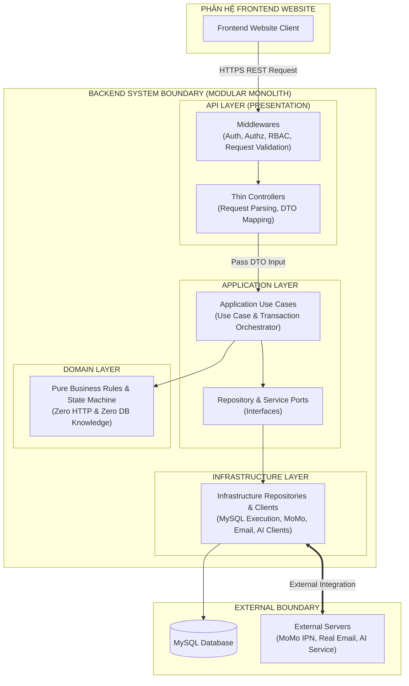

# TÀI LIỆU NGUYÊN TẮC KIẾN TRÚC API (API ARCHITECTURAL PRINCIPLES SPECIFICATION)
**Hệ thống:** Website Đặt Lịch Sân Thể Thao Trực Tuyến (SportHubAI)  
**Mã Task:** 01.06.04.01 (Final Micro-Corrected Revision)  
**Trạng thái:** Standardized Architecture Specification  
**Tham chiếu nguồn:**  
- [01-actors-and-permissions.md](file:///e:/SportHubAI/docs/requirements/01-actors-and-permissions.md) (APPROVED)  
- [02-use-cases-and-user-flows.md](file:///e:/SportHubAI/docs/requirements/02-use-cases-and-user-flows.md) (APPROVED)  
- [03-functional-requirements.md](file:///e:/SportHubAI/docs/requirements/03-functional-requirements.md) (APPROVED)  
- [04-business-rules.md](file:///e:/SportHubAI/docs/requirements/04-business-rules.md) (APPROVED)  
- [05-data-model.md](file:///e:/SportHubAI/docs/requirements/05-data-model.md) (APPROVED)  
- [06-system-architecture.md](file:///e:/SportHubAI/docs/architecture/06-system-architecture.md) (APPROVED)  
- [07-frontend-architecture.md](file:///e:/SportHubAI/docs/architecture/07-frontend-architecture.md) (APPROVED)  
- [08-backend-architecture.md](file:///e:/SportHubAI/docs/architecture/08-backend-architecture.md) (APPROVED)  
**Ngày cập nhật:** 2026-08-08  

---

## 1. PURPOSE (MỤC TIÊU TÀI LIỆU)

Tài liệu này xác định các **Nguyên tắc Kiến trúc API (API Architectural Principles)** cấp cao cho giao diện lập trình ứng dụng (Backend API) của hệ thống SportHubAI.

Mục tiêu chính:
1. Đóng vai trò là tài liệu kiến trúc nền tảng cho toàn bộ chuỗi task về hợp đồng API (`01.06.04`).
2. Khóa phong cách kiến trúc **RESTful HTTP API**, ranh giới giao tiếp giữa Frontend Website và Backend API qua HTTPS.
3. Phân định rõ ràng trách nhiệm của API Layer, Thin Controllers và ranh giới với Application Layer, Domain Layer, Repository Ports và Infrastructure Adapters.
4. Đảm bảo API tuân thủ nghiêm ngặt các quyết định kiến trúc đã phê duyệt: Nguồn sự thật (Source of Truth) cho Business Rules thuộc về Backend, bảo lưu đúng 13 Core MVP Entities, 10 Domain Modules, 8 Booking States, và kiến trúc **Modular Monolith**.

---

## 2. SCOPE (PHẠM VI KIẾN TRÚC API)

- **Phạm vi Hệ thống:** Giao diện API phục vụ hệ thống Website (**WEBSITE ONLY**), bao gồm các yêu cầu từ Customer Website, Owner Portal và Admin Portal.
- **Giới hạn Ranh giới:**
  - Tuyệt đối **KHÔNG thiết kế API dành riêng cho ứng dụng di động (Mobile App)**.
  - **KHÔNG định nghĩa chi tiết danh sách API Endpoint cụ thể** trong task này (Sẽ được đặc tả chi tiết ở các sub-task tiếp theo thuộc 01.06.04).
  - **KHÔNG viết mã nguồn triển khai Controller, Middleware, Route handlers, OpenAPI/Swagger spec, hay code Database**.

---

## 3. SOURCE OF TRUTH (NGUỒN SỰ THẬT VÀ TÍNH KẾ THỪA)

Tài liệu này kế thừa và bảo lưu 100% các quyết định đã `APPROVED` từ các task trước:

| Thành Phần Kiến Trúc | Quyết Định Đã APPROVED | Giới Hạn Tương Tác API |
|---|---|---|
| **Architecture Style** | Modular Monolith (Website Scope Only) | API là cổng tiếp nhận giao tiếp ngoài duy nhất |
| **Domain Modules** | ĐÚNG 10 Domain Modules | Không giao tiếp nội bộ giữa các module bằng HTTP |
| **Data Entities** | ĐÚNG 13 Core MVP Entities | API DTO không expose trực tiếp ORM/DB Entity |
| **Booking States** | ĐÚNG 8 Trạng Thái Đặt Sân | API không tự ý tạo thêm hoặc thay đổi trạng thái |
| **Booking Hold & Guard** | Giữ chỗ 10 phút & Double Booking Guard | API Layer chuyển giao điều phối cho Application Layer |
| **Payment Verification** | MoMo IPN Server Callback ngầm | IPN Endpoint tiếp nhận và xác thực chữ ký qua Infra |
| **OTP Verification** | Tạo & Xác thực bởi Backend, phát qua Real Email | API không trả OTP về Client, không log OTP |
| **Security Boundary** | RBAC + Owner Ownership Isolation | Enforce tại API / Application boundary |

---

## 4. API ARCHITECTURAL STYLE (PHONG CÁCH KIẾN TRÚC API)

Hệ thống khóa phong cách kiến trúc API ở mức: **RESTful HTTP API over HTTPS**.

```text
Frontend Website (Customer / Owner / Admin)
        │
     HTTPS (Secure RESTful Request / Response)
        │
        ▼
┌────────────────────────────────────────────────────────────────────────────────────────┐
│                                 BACKEND API LAYER                                      │
│                           (Routers, Thin Controllers, Middlewares)                     │
└───────────────────────────────────────┬────────────────────────────────────────────────┘
                                        │
                                        ▼
┌────────────────────────────────────────────────────────────────────────────────────────┐
│                                 APPLICATION LAYER                                      │
│                     (Use Cases, Transaction & Port Orchestration)                      │
└───────────────────────────────────────┬────────────────────────────────────────────────┘
                                        │
                                        ▼
┌───────────────────────────────────────┴────────────────────────────────────────────────┐
│                                   DOMAIN LAYER                                         │
│                      (Pure Business Rules, Invariants & State Machine)                 │
└───────────────────────────────────────┬────────────────────────────────────────────────┘
                                        │
                                        ▼
┌───────────────────────────────────────┴────────────────────────────────────────────────┐
│                      REPOSITORY PORTS & INFRASTRUCTURE ADAPTERS                        │
│                           (MySQL Database & External Services)                         │
└────────────────────────────────────────────────────────────────────────────────────────┘
```

### Quy Tắc Luồng Tương Tác Cấm Bỏ Qua (No Bypass Rule):
- ❌ **Cấm:** `Frontend -> Controller -> Database` (Bypass Application & Domain Layer).
- ❌ **Cấm:** `Controller -> Repository -> Database` (Bypass Application Use Case).
- ✅ **Chuẩn:** Request từ API Layer bắt buộc phải chuyển sang **Application Use Case** để điều phối xử lý.

---

## 5. API LAYER RESPONSIBILITY (TRÁCH NHIỆM PHÂN TẦNG API LAYER)

Tầng API (API Layer) đóng vai trò là điểm tiếp nhận và chuẩn hóa đầu giao tiếp HTTP của phân hệ Backend API Core.

### API Layer CHỊU Trách Nhiệm:
- Xử lý các yêu cầu HTTP/HTTPS (HTTP Request Handling).
- Thực thi ranh giới xác thực danh tính (Authentication Boundary).
- Thực thi ranh giới phân quyền truy cập ban đầu (Authorization Boundary).
- Phân tích và bóc tách dữ liệu yêu cầu (Request Parsing & DTO Deserialization).
- Kiểm tra định dạng dữ liệu đầu vào cơ bản (Transport / Format Validation).
- Ánh xạ DTO yêu cầu sang định dạng đầu vào của Application Use Case.
- Kích hoạt thực thi Application Use Case tương ứng.
- Ánh xạ kết quả nghiệp vụ thành định dạng chuẩn HTTP Response DTO.
- Phân loại lỗi và ánh xạ thành định dạng lỗi chuẩn API Error DTO kèm Mã trạng thái HTTP (HTTP Status Code).
- Truyền dẫn và gắn Request ID / Correlation ID cho luồng truy vết.

### API Layer KHÔNG CHỊU Trách Nhiệm:
- ❌ Không sở hữu hoặc thực thi Quy tắc Nghiệp vụ (Business Rules).
- ❌ Không thực thi Chuyển trạng thái đơn hàng (Booking State Machine).
- ❌ Không thực thi Trạng thái thanh toán (Payment State Machine).
- ❌ Không quản lý hoặc khởi tạo Database Transactions.
- ❌ Không chứa mã thực thi SQL hoặc ORM Models.
- ❌ Không trực tiếp gọi các SDK/Client của dịch vụ bên ngoài (MoMo SDK, Real Email SDK, AI SDK).

---

## 6. CONTROLLER RESPONSIBILITY (TRÁCH NHIỆM CỦA THIN CONTROLLER)

Mọi Controller trong phân hệ Backend bắt buộc phải tuân thủ nguyên tắc **Thin Controller (Controller Mỏng)**.

### Chu Trình Xử Lý Tiêu Chuẩn Của Thin Controller:
```text
1. Receive HTTP Request
        ↓
2. Authenticate Request Identity via Middleware (If required by Use Case)
        ↓
3. Validate Request DTO Structure & Format
        ↓
4. Map Request DTO ──> Application Use Case Input
        ↓
5. Execute Application Use Case
        ↓
6. Map Application Result / Error ──> HTTP Response DTO & Status Code
```

### Giới Hạn Cấm Đối Với Controller:
- ❌ Controller **KHÔNG ĐƯỢC** kiểm tra điều kiện nghiệp vụ (ví dụ: Không tự kiểm tra slot trùng, không tự kiểm tra giá tiền).
- ❌ Controller **KHÔNG ĐƯỢC** truy cập trực tiếp Database hoặc ORM Models (Ví dụ cấm: `BookingModel.update(...)`).
- ❌ Controller **KHÔNG ĐƯỢC** tự thay đổi Booking State hoặc Payment State.
- ❌ Controller **KHÔNG ĐƯỢC** gọi trực tiếp các SDK bên ngoài (Ví dụ cấm: Gọi trực tiếp `MoMoSDK`, `EmailSDK`, `AISDK`).

---

## 7. APPLICATION BOUNDARY (RANH GIỚI PHÂN TẦNG APPLICATION)

API Layer chỉ được phép giao tiếp duy nhất với **Application Layer**.

```text
Controller ──> Application Use Case ──> Domain Layer ──> Repository / External Ports ──> Infrastructure
```

- **Ranh giới điều phối:** Application Layer là miền chứa các Use Case nghiệp vụ, chịu trách nhiệm điều phối Giao dịch Dữ liệu (Transactions via TxPort), gọi các Repository Ports để nạp Entity, chuyển dữ liệu cho Domain Layer kiểm minh rules, và lưu trữ kết quả thông qua Infrastructure Adapters.
- API Layer tuyệt đối **không được gọi trực tiếp Domain Services hoặc Domain Entities** nếu hành động đó bỏ qua Application Use Case.

---

## 8. DOMAIN BOUNDARY (RANH GIỚI PHÂN TẦNG DOMAIN)

Domain Layer là trái tim thuần túy của hệ thống Backend, hoàn toàn độc lập với các công nghệ giao tiếp bên ngoài:

### Domain Layer KHÔNG BIẾT Đến:
- ❌ HTTP, REST, Headers, Query Parameters, Response Envelopes.
- ❌ Thư viện Web Framework (Express, Fastify, NestJS, etc.).
- ❌ Session, Cookie, JWT Tokens, Bearer Headers.
- ❌ Cơ sở dữ liệu, SQL, ORM, Sequelize, MySQL.
- ❌ MoMo SDK, Real Email Provider SDK, AI Provider SDK.

### Domain Layer CHỈ XỬ LÝ:
- ✅ Các Quy tắc Nghiệp vụ thuần túy (Pure Business Rules).
- ✅ Ràng buộc bất biến nghiệp vụ (Domain Invariants).
- ✅ Máy trạng thái đơn hàng (Booking State Machine).
- ✅ Kiểm minh nghiệp vụ bộ nhớ (Pure In-Memory Validation & Results).

---

## 9. DATABASE ACCESS BOUNDARY (RANH GIỚI TRUY CẬP CƠ SỞ DỮ LIỆU CỦA API)

- **Cấm Tuyệt Đối:** API Layer, Controller và Application Layer **tuyệt đối không có kết nối trực tiếp hoặc thực thi SQL/ORM** tới MySQL Database.
- **Ranh Giới Truy Cập:**
  ```text
  API / Controller Layer ──(Request)──> Application Use Case
                                             │
                                             ▼
                                  Repository Ports (Interfaces)
                                             │
                                             ▼
                                  Infrastructure Repositories ──> MySQL Database
  ```
- **Quản Lý Transaction:** Quản lý giao dịch dữ liệu do Application Layer điều phối trừu tượng qua `Transaction / Unit-of-Work Port`, việc thực thi SQL Transaction thực tế do Infrastructure TxManager đảm nhận (Kế thừa 100% nguyên tắc đã phê duyệt tại Task 01.06.03).

---

## 10. STATELESS API PRINCIPLE (NGUYÊN TẮC API KHÔNG LƯU TRẠNG THÁI)

- **Thiết Kế Stateless:** Tất cả các endpoint API của Backend phải được thiết kế theo hướng **Stateless (Không lưu trạng thái phiên làm việc nghiệp vụ trong bộ nhớ server API instance)**.
- **Yêu Cầu Request Duy Trì Context:** Authenticated requests phải mang đầy đủ authentication context cần thiết để Backend xác định identity và xử lý request một cách độc lập.
- **Phân Biệt API Public / Guest:** 
  - Các request công khai (Public / Guest APIs như tìm kiếm sân, xem thông tin Venue) **không bắt buộc** chứa authentication context.
  - Authentication context chỉ bắt buộc khi Use Case yêu cầu xác thực người dùng.
- **Cấm Server Memory Source of Truth:** 
  - API instance không giữ session state nghiệp vụ trong memory. không dùng in-memory session làm Source of Truth.
  - Business state của `Booking`, `Payment`, `User Authorization`, và `Court Availability` phải được truy vấn từ Nguồn sự thật phù hợp (**MySQL Database**).
- *Trạng Thái Token Header Name:* Tên Header vận chuyển Token xác thực giữ nguyên `TBD — Refer to API-TBD-004`.

---

## 11. AUTHENTICATION BOUNDARY (RANH GIỚI XÁC THỰC DANH TÍNH)

- **Xử Lý Ranh Giới:** Xác thực danh tính người dùng (Authentication) được thực thi tại ranh giới API/Application Middleware trước khi request tiếp cận Use Case (đối với các Use Case yêu cầu xác thực).
- **Trách Nhiệm Của API Layer:**
  - Nhận và kiểm tra tính hợp lệ của authentication context từ Client gửi lên.
  - Phân tích thông tin định danh (`Authenticated User Identity`) và truyền xuống cho Application Layer.
  - Phản hồi ngay lỗi `401 Unauthenticated` nếu xác thực thất bại đối với các API bảo vệ.
- **Quy Tắc An Ninh OTP Email:**
  - Mã OTP do Backend tạo ra và gửi tới **Địa chỉ Email thực tế** của người dùng thông qua External Email Provider.
  - Tuyệt đối **không trả OTP trong API Response**, không log mã OTP, không gửi OTP về Client.

---

## 12. AUTHORIZATION BOUNDARY (RANH GIỚI PHÂN QUYỀN TRUY CẬP)

- **Thời Điểm Kiểm Tra:** Phân quyền truy cập (Authorization) phải được kiểm tra và áp dụng bắt buộc trước khi thực thi Use Case được bảo vệ.
- **Cơ Chế Phân Quyền Giữ Nguyên:**
  - **Role-Based Access Control (RBAC):** Phân định 4 vai trò `GUEST`, `CUSTOMER`, `OWNER`, `ADMIN`.
  - **Owner Tenant Isolation:** Kiểm tra quyền sở hữu tài nguyên (`Owner Ownership Scope`).
- **Phân Biệt Rõ Ràng:** `Authentication ≠ Authorization`.
  - Authentication trả lời câu hỏi: *"Người dùng này là ai?"*
  - Authorization trả lời câu hỏi: *"Người dùng này có quyền thực hiện Use Case này trên tài nguyên này hay không?"*

---

## 13. VALIDATION PRINCIPLES (PHÂN TẦNG KIỂM TRA DỮ LIỆU)

Hệ thống phân định rạch ròi 2 tầng kiểm tra dữ liệu:

```text
┌────────────────────────────────────────────────────────────────────────────────────────┐
│                                 API VALIDATION LAYERS                                  │
│                                                                                        │
│ ┌────────────────────────────────────────────────────────────────────────────────────┐ │
│ │ A. TRANSPORT / REQUEST VALIDATION (API Layer)                                      │ │
│ │ - Kiểm tra trường bắt buộc (Required fields)                                       │ │
│ │ - Kiểm tra kiểu dữ liệu (Data types: string, number, boolean)                      │ │
│ │ - Kiểm tra định dạng (Email format, Date ISO format, Enum values)                  │ │
│ │ - Phản hồi ngay HTTP 400 Bad Request nếu Request malformed                         │ │
│ └────────────────────────────────────────┬───────────────────────────────────────────┘ │
│                                          ▼                                             │
│ ┌────────────────────────────────────────────────────────────────────────────────────┐ │
│ │ B. BUSINESS VALIDATION (Application & Domain Layer)                                │ │
│ │ - Kiểm tra quy tắc nghiệp vụ (Business Rules)                                      │ │
│ │ - Kiểm tra quyền sở hữu tài nguyên (Ownership & Tenant Isolation)                  │ │
│ │ - Kiểm tra slot trùng, đếm ngược 10 phút, trạng thái đơn hợp lệ                    │ │
│ │ ──> Ánh xạ sang HTTP Status Code 4xx phù hợp tại API Layer                         │ │
│ └────────────────────────────────────────────────────────────────────────────────────┘ │
└────────────────────────────────────────────────────────────────────────────────────────┘
```

*Ghi chú ánh xạ:* Ánh xạ mã lỗi cụ thể (Conflict, Business Rule Violation, Resource State Conflict) sẽ được quy định chi tiết ở `TASK 01.06.04.04 — API Error Contract`.

---

## 14. API ERROR PRINCIPLES (NGUYÊN TẮC XỬ LÝ LỖI API)

- **Thống Nhất Chuẩn Phản Hồi Lỗi:** Tất cả các lỗi phản hồi từ API phải tuân theo một Cấu trúc Hợp đồng Lỗi tập trung (Unified Error Contract).
- **Phân Loại Nhóm Lỗi:** API Layer phân loại và ánh xạ rõ các nhóm lỗi:
  - *Request Validation Error / Malformed Request* (`400 Bad Request`)
  - *Authentication Failure* (`401 Unauthenticated`)
  - *Authorization Failure* (`403 Forbidden`)
  - *Resource Not Found* (`404 Not Found`)
  - *Business Rule / State Conflict Error* (`Ánh xạ 4xx phù hợp — Refer to TASK 01.06.04.04`)
  - *Internal Infrastructure Error* (`500 Internal Server Error`)
- **Bảo Mật Thông Tin Lỗi:** Tuyệt đối **không trả về lỗi thô từ Database**, không trả về Stack Trace, mã SQL, chi tiết ORM hay thông tin cấu hình hạ tầng bảo mật cho Client.

---

## 15. HTTP STATUS CODE PRINCIPLE (NGUYÊN TẮC MÃ TRẠNG THÁI HTTP)

API phải sử dụng Mã trạng thái HTTP (HTTP Status Codes) theo đúng ý nghĩa ngữ nghĩa tiêu chuẩn (Semantic Meaning):

- **Group 2xx (Success):** Biểu thị yêu cầu thành công (`200 OK`, `201 Created`, `204 No Content`).
- **Group 4xx (Client / Business Error):** Biểu thị lỗi do phía Client gửi yêu cầu sai, không đủ quyền hoặc vi phạm quy tắc nghiệp vụ (`400`, `401`, `403`, `404`, `4xx Business Errors`).
- **Group 5xx (Server Error):** Biểu thị sự cố nội bộ hệ thống hoặc hạ tầng Backend (`500 Internal Server Error`, `502 Bad Gateway`).

*Quy tắc Ràng buộc:* Không sử dụng mã `HTTP 200` cho tất cả các phản hồi lỗi. Không đồng nhất Mã trạng thái HTTP với Trạng thái Nghiệp vụ (`Booking Status`).

---

## 16. API RESPONSE PRINCIPLE (NGUYÊN TẮC CẤU TRÚC PHẢN HỒI API)

- **Tính Nhất Quán:** Tất cả các Endpoint API phải tuân thủ chuẩn định dạng phản hồi thống nhất (Consistent Response Contract) toàn hệ thống, không tự ý thay đổi cấu trúc giữa các module.
- **Tính Dự Đoán Được:** Phản hồi API phải có cấu trúc dự đoán được, máy có thể đọc được (Machine-readable) và thân thiện với Frontend.
- **Che Thấu Hạ Tầng:** API Response DTO đóng vai trò là hợp đồng công khai (Public Contract) và không bao giờ bộc lộ cấu trúc bảng hay thông tin hạ tầng nội bộ.

---

## 17. JSON CONVENTION (QUY CHUẨN ĐỊNH DẠNG JSON)

- **Định Dạng Chuẩn:** Giao tiếp dữ liệu hai chiều giữa Frontend Website và Backend API sử dụng chuẩn **JSON (JavaScript Object Notation)** băm mã UTF-8.
- **Ánh Xạ DTO Bắt Buộc:** API Layer không bao giờ trả trực tiếp thực thể Database Entity hay ORM Model ra kết quả API:
  ```text
  Domain Result / Application Output ──> API Response DTO ──> JSON Output
  ```

---

## 18. API VERSIONING PRINCIPLE (NGUYÊN TẮC ĐỊNH PHIÊN BẢN API)

- **Chiến Lược Quản Lý Version:** Tất cả các Endpoint API phải có chiến lược định phiên bản (Versioning Strategy) rõ ràng nhằm quản lý sự tiến hóa của hệ thống.
- **Bảo Vệ Hợp Đồng:** Thay đổi có tính phá vỡ (Breaking Changes) không được phép âm thầm thay đổi trên các contract API đang vận hành.
- **Trạng Thái TBD:** Định dạng URI Versioning cụ thể (Ví dụ: `/api/v1` hay Header-based Versioning) giữ trạng thái `TBD — Refer to TASK 01.06.04.02`.

---

## 19. IDEMPOTENCY PRINCIPLE (NGUYÊN TẮC TÍNH ĐẲNG THỨC API)

- **Hỗ Trợ Tính Đẳng Thức:** Kiến trúc API phải hỗ trợ tính năng Idempotency cho các thao tác quan trọng để tránh xử lý lặp khi có sự cố mạng.
- **Các Thao Tác Trọng Yếu:**
  - Khởi tạo đơn đặt sân (`Booking Creation`).
  - Các giao dịch liên quan đến thanh toán (`Payment Operations`).
  - Tiếp nhận Callback ngầm từ cổng thanh toán (`MoMo IPN Server Callback`).
- **Ranh Giới Xử Lý:** Idempotency là nỗi bận tâm cấp kiến trúc (Architectural Concern) và phải được xử lý ở tầng Application / Infrastructure Boundary, tuyệt đối không viết mã xử lý thủ công trong Controller Business Logic.
- *Trạng thái:* Định dạng Idempotency Key cụ thể giữ trạng thái `TBD — Refer to TASK 01.06.04.09`.

---

## 20. REQUEST / CORRELATION ID (NGUYÊN TẮC MÃ TRUY VẾT YÊU CẦU)

- **Truy Vết Yêu Cầu:** API hỗ trợ cơ chế đính kèm `Request ID / Correlation ID` xuyên suốt từ Client tới Backend để phục vụ công tác giám sát, phân tích log và gỡ lỗi (Debugging / Observability).
- **Ranh Giới Sử Dụng:**
  - ✅ **Chỉ dùng cho:** Log correlation, Distributed tracing, Debugging.
  - ❌ **Cấm dùng làm:** User ID, Booking ID, Payment ID hoặc Credential xác thực.

---

## 21. SECURITY PRINCIPLES (CÁC NGUYÊN TẮC BẢO MẬT API)

Tất cả các Endpoint API Backend bắt buộc phải tuân thủ các nguyên tắc an ninh tối cao:

1. **HTTPS Enforcement:** Chỉ cho phép giao tiếp qua giao thức mã hóa HTTPS trên môi trường Production.
2. **Zero Secret Exposure:** Tuyệt đối không bộc lộ Secret Keys, Passwords, hay Private Credentials trong API Response.
3. **Zero Raw Error Leakage:** Không trả về chi tiết lỗi hệ thống nội bộ hoặc lỗi thô từ cơ sở dữ liệu.
4. **Input Sanitization & Validation:** Kiểm tra và làm sạch toàn bộ dữ liệu đầu vào chống các hiểm họa tấn công (XSS, Injection).
5. **Backend is Source of Truth:** Frontend KHÔNG PHẢI là Nguồn sự thật. Frontend không được tự quyết định slot trống, đặt sân thành công, giá tiền hay xác nhận thanh toán.

---

## 22. FRONTEND ↔ BACKEND CONTRACT (HỢP ĐỒNG GIAO TIẾP VỚI FRONTEND)

- **Tính Độc Lập Hợp Đồng:** Frontend Website và Backend API giao tiếp hoàn toàn dựa trên **API Contract (Request DTO / Response DTO)** đã được cam kết.
- **Không Phụ Thuộc Hạ Tầng:** Frontend không cần biết và không được phụ thuộc vào Database Schema, tên bảng MySQL hay cấu trúc ORM Models nội bộ của Backend.

---

## 23. EXTERNAL SERVICE BOUNDARY (RANH GIỚI TÍCH HỢP DỊCH VỤ BÊN NGOÀI)

Controller tuyệt đối **không được gọi trực tiếp các SDK của Dịch vụ Bên ngoài**. 

```text
Application Layer Use Case ──> External Service Port (Interface)
                                       │
                                       ▼
                     Infrastructure Adapter (MoMo / Email / AI Client)
                                       │
                                       ▼
                     External Service Server (MoMo / Email / AI)
```

Tích hợp với MoMo Gateway, Real Email Provider và AI Service giữ nguyên ranh giới kiến trúc đã phê duyệt tại Task 01.06.03.

---

## 24. CROSS-MODULE COMMUNICATION RULE (QUY TẮC GIAO TIẾP GIỮA CÁC MODULE)

- **Cấm Giao Tiếp HTTP Nội Bộ:** Tuyệt đối **không sử dụng HTTP API nội bộ** để các Domain Module gọi nhau trong cùng một Backend Modular Monolith (Ví dụ cấm: `Booking Module -> HTTP -> Payment Module`).
- **Điều Coordination Chuẩn:** Giao tiếp cross-module giữa 10 Domain Modules phải được điều phối trực tiếp thông qua tầng **Application Layer Use Cases** trong cùng một ứng dụng (In-Process Orchestration). Không biến giao tiếp module nội bộ thành giao tiếp Microservices.

---

## 25. OBSERVABILITY PRINCIPLE (NGUYÊN TẮC GIÁM SÁT VÀ LOGGING API)

- **Thông Tin Giám Sát:** API Layer tạo đủ ngữ cảnh để truy vết luồng request (Request ID, Timestamp, User Identity khi phù hợp, HTTP Status Code).
- **Danh Mục CẤM Logging:**
  - ❌ Mã OTP Email.
  - ❌ Mật khẩu (Passwords).
  - ❌ Secret Signatures / Private Keys.
  - ❌ Bearer Access Tokens.
  - ❌ Thông tin cá nhân nhạy cảm không cần thiết.

---

## 26. ARCHITECTURE DIAGRAM (SƠ ĐỒ KIẾN TRÚC TỔNG THỂ LỚP API)

Dưới đây là sơ đồ Mermaid biểu diễn Kiến trúc Phân tầng tiêu chuẩn của API Layer trong Hệ thống Backend:



---

## 27. NON-GOALS (CÁC NỘI DUNG KHÔNG THỰC HIỆN TRONG TASK NÀY)

Task 01.06.04.01 đóng vai trò định hình nguyên tắc kiến trúc và **TUYỆT ĐỐI KHÔNG** thực hiện các công việc sau:

- ❌ Không kê khai danh sách API Endpoint chi tiết.
- ❌ Không định nghĩa thuộc tính chi tiết của các DTOs.
- ❌ Không định nghĩa Schema chi tiết cho phản hồi lỗi.
- ❌ Không định nghĩa cơ chế Pagination/Sorting cụ thể.
- ❌ Không đặc tả chi tiết API Đặt sân hay Thanh toán.
- ❌ Không viết mã OpenAPI / Swagger spec.
- ❌ Không viết mã nguồn Controller, Middleware hay Use Case code.
- ❌ Không thiết kế lại Schema Database hay viết mã SQL.

---

## 28. OPEN QUESTIONS / TBD PRESERVATION (BẢO LƯU CÁC MỤC CHƯA CHỐT)

Hệ thống kiến trúc API tôn trọng và giữ nguyên 100% các mục chưa chốt (`TBD`) từ các tài liệu trước:

1. **API-TBD-001: URI Versioning Format:** Định dạng URI phiên bản cụ thể giữ trạng thái `TBD — Refer to TASK 01.06.04.02`.
2. **API-TBD-002: Exact Response Envelope Schema:** Cấu trúc chi tiết của Vỏ phản hồi DTO giữ trạng thái `TBD — Refer to TASK 01.06.04.03`.
3. **API-TBD-003: Exact Error Contract Schema:** Cấu trúc chi tiết của Đối tượng lỗi API giữ trạng thái `TBD — Refer to TASK 01.06.04.04`.
4. **API-TBD-004: Token Transport Header Name:** Tên Header vận chuyển Token xác thực giữ trạng thái `TBD — Refer to Security Architecture`.
5. **API-TBD-005: Idempotency Header & Storage:** Tên Header Idempotency và cơ chế lưu trữ Key giữ trạng thái `TBD — Refer to TASK 01.06.04.09`.
6. **API-TBD-006: Correlation ID Header Name:** Tên Header Correlation ID giữ trạng thái `TBD — Refer to Observability Architecture`.

---

## 29. DEFINITION OF DONE (DoD) - TASK 01.06.04.01

```text
API Architectural Style  = PASS (RESTful HTTP API over HTTPS)
Frontend-Backend Boundary= Defined (Client ↔ HTTPS ↔ API Layer)
API Layer Responsibility = Defined (Thin Controllers, Zero Business Rules, Zero DB Access)
Controller Boundaries    = Defined (Thin Controllers, DTO Mapping Only, Zero SDK Calling)
Application Boundary     = Defined (Orchestrates Use Cases, Tx & Ports)
Domain Boundary          = Defined (Pure Rules, Zero HTTP & Zero DB Knowledge)
Database Access Boundary = Defined (Exclusive Access via Infrastructure Repositories)
Stateless Principle      = Defined (Stateless API, Public/Guest Unauthenticated, Authenticated Has Context)
Authentication Boundary  = Defined (Enforced at API/App Boundary, Zero OTP Exposure)
Authorization Boundary   = Defined (RBAC + Tenant Ownership Isolation Enforced)
Validation Principles    = Defined (Transport Validation vs Business Validation mapped to 4xx)
Error Principles         = Defined (Unified Error Contract, Exact Mapping TBD for 01.06.04.04)
HTTP Status Principles   = Defined (Semantic HTTP Status Codes 2xx/4xx/5xx)
Response Principles      = Defined (Predictable, Machine-Readable DTOs)
JSON Convention          = Defined (UTF-8 JSON, DTOs != Database Entities)
API Versioning Principle = Defined (Consistent Versioning Strategy, Format TBD)
Idempotency Principle    = Defined (Application/Infrastructure Boundary Concern, Spec TBD)
Request / Correlation ID = Defined (Tracing Concern Only, Spec TBD)
Security Principles      = Defined (HTTPS, Zero Secret Leakage, Backend is Source of Truth)
Frontend Contract        = Defined (Decoupled DTO Contract)
External Service Boundary= Defined (Orchestrated via Infrastructure Adapters)
Cross-Module Communication= Defined (In-Process Application Orchestration, Zero Internal HTTP)
Modular Monolith         = PASS (Preserved Exact 10 Modules & 13 Core Entities)
Architecture Diagram     = Complete (Sơ đồ Mermaid API Architectural Flow)
No Implementation Code   = PASS (Zero SQL, Zero Code, Zero OpenAPI, Zero Endpoint List)
TBD Preservation         = PASS (Preserved All TBD Items for Subsequent Sub-tasks)

TASK 01.06.04.01 = PASS
```

---
*Tài liệu Nguyên tắc Kiến trúc API được thiết lập bởi Antigravity AI Assistant cho dự án SportHubAI.*
