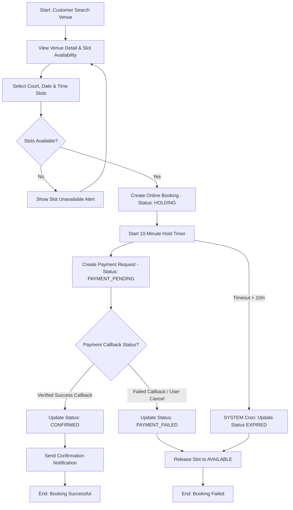
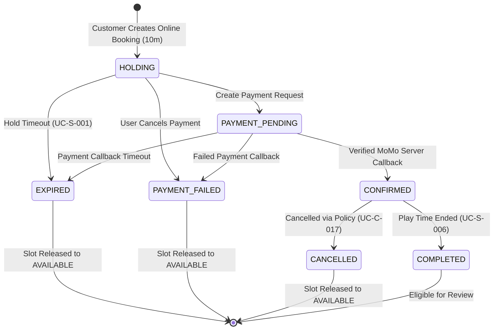
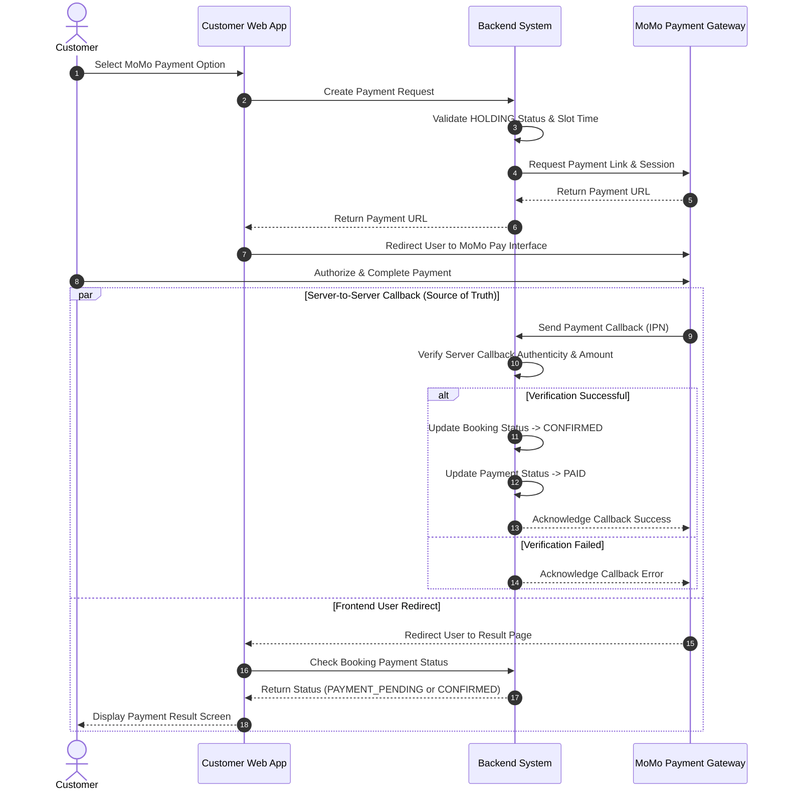
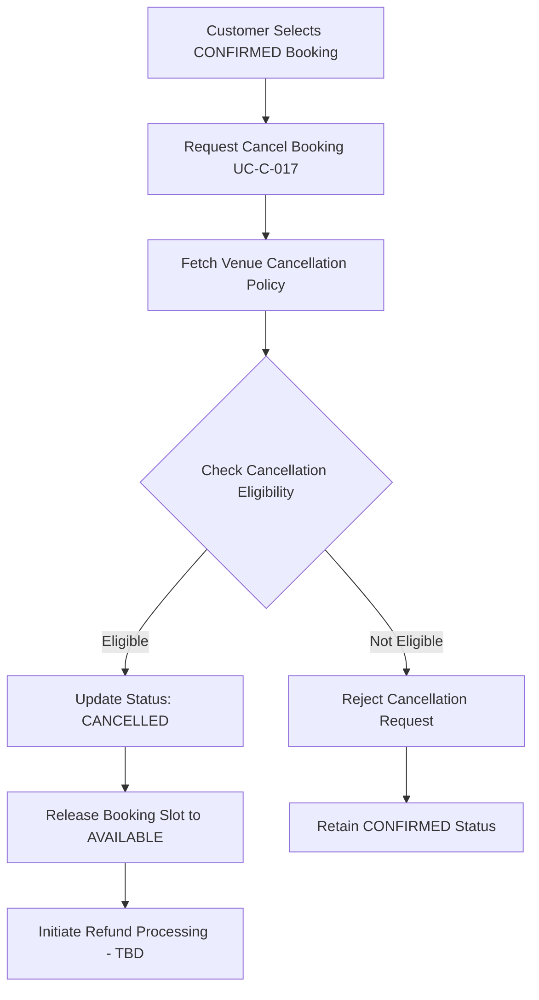
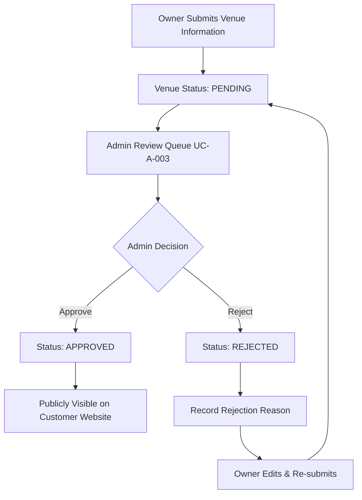

# TÀI LIỆU PHÂN TÍCH USE CASE & USER FLOWS
**Hệ thống:** Website Đặt Lịch Sân Thể Thao Trực Tuyến (SportHubAI)  
**Mã Task:** 01.02 (Refined)  
**Trạng thái:** Standardized / MVP Specification  
**Tham chiếu:** [01-actors-and-permissions.md](file:///e:/SportHubAI/docs/requirements/01-actors-and-permissions.md)  
**Ngày cập nhật:** 2026-08-08  

---

## 1. Actor Model (Kế thừa từ Task 01.01)

### Human Actors
- **GUEST:** Người dùng chưa đăng nhập. Chỉ xem các thông tin công khai.
- **CUSTOMER:** Người dùng đã xác thực, thực hiện tìm kiếm, tạo Online Booking, thanh toán và quản lý booking cá nhân.
- **OWNER:** Đối tác kinh doanh sở hữu sân, quản lý Venue, Branch, Court, khung giờ, bảng giá, tạo Manual Offline Booking và quản lý các booking thuộc cơ sở của mình.
- **ADMIN:** Quản trị viên hệ thống có quyền kiểm duyệt Owner/Venue, quản lý người dùng và giám sát toàn hệ thống.

### System Actor
- **SYSTEM:** Tác vụ nền tự động (Background Worker / Scheduled Job / Cron Job). Không phải là một Human Role. Thực hiện hết hạn hold slot (`EXPIRED`), giải phóng slot, gửi notification và xử lý callback thanh toán ngầm.

---

## 2. Quy Ước Đặt Mã Use Case (ID Convention)

- `UC-G-xxx`: Use Case dành cho GUEST
- `UC-C-xxx`: Use Case dành cho CUSTOMER
- `UC-O-xxx`: Use Case dành cho OWNER
- `UC-A-xxx`: Use Case dành cho ADMIN
- `UC-S-xxx`: Use Case dành cho SYSTEM

---

## 3. Danh Sách Use Cases & Phân Loại MVP / FUTURE / OPTIONAL / TBD

| Use Case ID | Tên Use Case | Actor | Phân loại | Mô tả tóm tắt |
|---|---|---|---|---|
| **UC-G-001** | Browse Homepage | GUEST | **MVP** | Xem trang chủ, sân nổi bật, khuyến mãi banner. |
| **UC-G-002** | Browse Sports Categories | GUEST | **MVP** | Xem danh mục môn thể thao (Bóng đá, Cầu lông, Pickleball,...). |
| **UC-G-003** | Search Venue | GUEST | **MVP** | Tìm kiếm sân theo từ khóa, vị trí. |
| **UC-G-004** | Filter Venue | GUEST | **MVP** | Lọc sân theo giá, môn thể thao, tiện ích, vị trí. |
| **UC-G-005** | View Venue List | GUEST | **MVP** | Xem danh sách sân kết quả dạng thẻ/lưới. |
| **UC-G-006** | View Venue Detail | GUEST | **MVP** | Xem chi tiết sân: hình ảnh, bảng giá, tiện ích, quy định. |
| **UC-G-007** | View Venue Map | GUEST | **MVP** | Xem vị trí sân trên bản đồ. |
| **UC-G-008** | View Public Information | GUEST | **MVP** | Xem các trang thông tin công khai (Chính sách, điều khoản, liên hệ). |
| **UC-C-001** | Register Account | CUSTOMER | **MVP** | Đăng ký tài khoản người dùng mới. |
| **UC-C-002** | Verify Email OTP | CUSTOMER | **MVP** | Xác thực Email bằng mã OTP 6 chữ số. |
| **UC-C-003** | Login | CUSTOMER | **MVP** | Đăng nhập tài khoản bằng Email/Password. |
| **UC-C-004** | Logout | CUSTOMER | **MVP** | Đăng xuất khỏi hệ thống. |
| **UC-C-005** | Forgot Password | CUSTOMER | **MVP** | Yêu cầu mã OTP đặt lại mật khẩu khi quên. |
| **UC-C-006** | Reset Password | CUSTOMER | **MVP** | Nhập OTP và đặt mật khẩu mới. |
| **UC-C-007** | Change Password | CUSTOMER | **MVP** | Đổi mật khẩu trong cài đặt tài khoản. |
| **UC-C-008** | Search & Filter Venues | CUSTOMER | **MVP** | Tìm kiếm & Lọc sân nâng cao cho user đã đăng nhập. |
| **UC-C-009** | View Court Availability | CUSTOMER | **MVP** | Xem lịch các slot trống/đã đặt của từng sân con theo ngày. |
| **UC-C-010** | Add / Remove Favorite | CUSTOMER | **MVP** | Thêm hoặc xóa Venue khỏi danh sách yêu thích. |
| **UC-C-011** | Select Court & Slot | CUSTOMER | **MVP** | Chọn sân con, chọn ngày và slot giờ chơi trống. |
| **UC-C-012** | Select Extra Services | CUSTOMER | **MVP** | Chọn thêm các dịch vụ đi kèm (nước uống, thuê vợt,...). |
| **UC-C-013** | Apply Promotion Coupon | CUSTOMER | **MVP** | Nhập mã giảm giá/khuyến mãi hợp lệ. |
| **UC-C-014** | Create Booking Hold | CUSTOMER | **MVP** | Khởi tạo Online Booking ở trạng thái `HOLDING` (10 phút). |
| **UC-C-015** | Make Payment via MoMo | CUSTOMER | **MVP** | Chuyển hướng thanh toán qua MoMo Payment Gateway. |
| **UC-C-016** | View Own Bookings | CUSTOMER | **MVP** | Xem danh sách lịch sử & chi tiết đơn đặt sân của mình. |
| **UC-C-017** | Cancel Booking Action | CUSTOMER | **MVP** | Hủy đơn đặt sân theo chính sách hủy của Venue. |
| **UC-C-018** | Request Reschedule Action | CUSTOMER | **FUTURE** | Gửi yêu cầu dời lịch / đổi khung giờ chơi. |
| **UC-C-019** | Review Completed Booking | CUSTOMER | **MVP** | Gửi đánh giá sao & bình luận cho đơn đã `COMPLETED`. |
| **UC-C-020** | View Notifications | CUSTOMER | **MVP** | Xem thông báo hệ thống và nhắc lịch chơi. |
| **UC-C-021** | Manage Personal Profile | CUSTOMER | **MVP** | Cập nhật thông tin cá nhân (Họ tên, SĐT, Avatar). |
| **UC-O-001** | Submit Owner Application | CUSTOMER | **MVP** | Gửi đơn đăng ký nâng cấp tài khoản thành Owner. |
| **UC-O-002** | View Owner Application Status | CUSTOMER | **MVP** | Xem trạng thái duyệt đơn làm Owner. |
| **UC-O-003** | Create Venue | OWNER | **MVP** | Tạo thông tin Venue mới (Trạng thái `PENDING`). |
| **UC-O-004** | Update Own Venue | OWNER | **MVP** | Cập nhật thông tin Venue thuộc sở hữu. |
| **UC-O-005** | Manage Venue Images & Facilities | OWNER | **MVP** | Upload bộ sưu tập ảnh và cấu hình tiện ích sân. |
| **UC-O-006** | Manage Branches & Courts | OWNER | **MVP** | Tạo, sửa thông tin chi nhánh và danh sách sân con. |
| **UC-O-007** | Configure Operating Hours & Pricing | OWNER | **MVP** | Thiết lập giờ mở/đóng cửa, giá giờ thường/giờ vàng. |
| **UC-O-008** | Block / Unblock Court Slot | OWNER | **MVP** | Khóa slot thủ công cho việc bảo trì hoặc giữ chỗ nội bộ. |
| **UC-O-009** | Set Court Maintenance | OWNER | **MVP** | Chuyển trạng thái sân con sang `MAINTENANCE`. |
| **UC-O-010** | View Own Venue Bookings | OWNER | **MVP** | Xem danh sách & chi tiết các booking tại các sân của mình. |
| **UC-O-011** | Create Manual Offline Booking | OWNER | **MVP** | Nhập Manual/Offline Booking cho khách đặt tại sân/qua SĐT. |
| **UC-O-012** | Check-in / Operational Action | OWNER | **OPTIONAL / MVP Candidate** | Xác nhận khách đã đến sân chơi trực tiếp tại cơ sở. |
| **UC-O-013** | Cancel Booking per Policy | OWNER | **MVP** | Hủy booking do sự cố sân khẩn cấp / đền bù vận hành. |
| **UC-O-014** | Manage Services & Promotions | OWNER | **MVP** | Quản lý danh mục dịch vụ đi kèm và voucher sân. |
| **UC-O-015** | View Revenue & Utilization Report | OWNER | **MVP** | Xem báo cáo doanh thu & tỷ lệ lấp đầy sân thuộc sở hữu. |
| **UC-A-001** | View All Users & Manage Status | ADMIN | **MVP** | Xem danh sách user, tạm khóa (`Suspend`) / Kích hoạt user. |
| **UC-A-002** | Review & Approve Owner Application | ADMIN | **MVP** | Duyệt (`Approve`) hoặc Từ chối (`Reject`) đơn đăng ký Owner. |
| **UC-A-003** | Review & Approve Venue | ADMIN | **MVP** | Duyệt (`Approve`) hoặc Từ chối (`Reject`) Venue mới tạo. |
| **UC-A-004** | Suspend / Activate Venue | ADMIN | **MVP** | Đình chỉ hoạt động của Venue vi phạm quy định. |
| **UC-A-005** | View All System Bookings | ADMIN | **MVP** | Tra cứu toàn bộ các đơn đặt sân trên toàn sàn. |
| **UC-A-006** | Handle Exceptional Booking Cases | ADMIN | **MVP** | Can thiệp hủy/điều chỉnh booking trong trường hợp tranh chấp. |
| **UC-A-007** | View All Payment Logs | ADMIN | **MVP** | Giám sát lịch sử tất cả các giao dịch MoMo trên hệ thống. |
| **UC-A-008** | Moderate Reported Reviews | ADMIN | **MVP** | Duyệt và ẩn/xóa các review bị báo cáo vi phạm. |
| **UC-A-009** | View System Dashboard & Reports | ADMIN | **MVP** | Xem tổng quan doanh thu toàn sàn, số lượng booking. |
| **UC-A-010** | View System Audit Logs | ADMIN | **MVP** | Tra cứu nhật ký thao tác nhạy cảm của Admin và Owner. |
| **UC-S-001** | Expire Booking Hold | SYSTEM | **MVP** | Tự động quét và chuyển đơn quá 10 phút hold sang `EXPIRED`. |
| **UC-S-002** | Release Expired Slot | SYSTEM | **MVP** | Tự động nhả slot bị `EXPIRED` / `PAYMENT_FAILED` về `AVAILABLE`. |
| **UC-S-003** | Process Payment Callback (IPN) | SYSTEM | **MVP** | Nhận phản hồi IPN ngầm từ MoMo để xác minh giao dịch. |
| **UC-S-004** | Update Booking Status Automatically| SYSTEM | **MVP** | Chuyển booking sang `CONFIRMED` sau khi MoMo IPN hợp lệ. |
| **UC-S-005** | Send Notifications & OTP Emails | SYSTEM | **MVP** | Gửi email OTP xác thực, email xác nhận đơn đặt sân. |
| **UC-S-006** | Mark Booking Completed | SYSTEM | **MVP** | Tự động chuyển booking sang `COMPLETED` sau khi hết khung giờ chơi. |

---

## 4. Phân Tích Chi Tiết Các Core Use Cases

### 4.1. UC-C-014: Create Booking Hold (Khởi Tạo Online Booking)

- **Use Case ID:** UC-C-014
- **Use Case Name:** Create Booking Hold (Online Booking)
- **Actor:** CUSTOMER
- **Supporting Actor:** SYSTEM
- **Goal:** Giữ tạm thời một hoặc nhiều slot giờ chơi trống trong thời gian đếm ngược 10 phút để người dùng thanh toán qua Customer Website.
- **Priority:** High (Core MVP)
- **Scope:** Customer Website / Booking Engine
- **Preconditions:** Customer đã đăng nhập thành công. Sân con (`Court`) ở trạng thái `ACTIVE` thuộc Venue `APPROVED`.
- **Trigger:** Customer chọn ngày, chọn khung giờ trống và nhấn "Tiến hành thanh toán".

#### Main Success Flow:
1. Customer xem thông tin các slot khả dụng của Court trong ngày đã chọn.
2. Customer chọn slot giờ chơi chưa ai đặt và chọn dịch vụ đi kèm (nếu có).
3. Customer nhấn "Đặt sân".
4. Hệ thống kiểm tra tính atomic của slot khả dụng. Slot hiện tại đang `AVAILABLE`.
5. Hệ thống khóa slot thành công, tạo bản ghi `Booking` với trạng thái `HOLDING`, khởi tạo đếm ngược `10 phút` (Business Configuration).
6. Hệ thống chuyển sang bước Thanh toán (Checkout).

#### Alternative Flows:
- **A1. Đặt sân trả sau tại sân (Pay at venue):**
  - Tại bước 5: Nếu Customer chọn hình thức thanh toán tại sân (và Venue cho phép), hệ thống tạo đơn với trạng thái `CONFIRMED` (hoặc `PENDING_OWNER_ACCEPT` - theo `OQ-002`), bỏ qua bước cổng MoMo.

#### Exception Flows:
- **E1. Slot đã bị giữ bởi người khác (Double Booking Conflict):**
  - Tại bước 4: Hệ thống phát hiện slot đã bị giữ hoặc đặt bởi người khác.
  - Hệ thống hủy thao tác, thông báo lỗi: *"Khung giờ này vừa có người giữ chỗ. Vui lòng chọn khung giờ khác."*

#### Postconditions:
- **Success:** Slot bị giữ tạm thời. Booking có trạng thái `HOLDING`. Timer 10 phút bắt đầu đếm ngược.
- **Failure:** Không có booking nào được tạo, slot giữ nguyên trạng thái cũ.

#### Business Rules:
- **BR-001:** Chỉ `CUSTOMER` đã xác thực mới được tạo Online Booking qua Customer Website.
- **BR-005:** Slot đặt được khóa tạm thời trong 10 phút trong khi chờ thanh toán.
- **BR-010:** Backend phải đảm bảo tính atomic của việc kiểm tra và giữ slot để tuyệt đối không xảy ra double booking.

---

### 4.2. UC-O-011: Create Manual Offline Booking (Tạo Booking Thủ Công Tại Sân)

- **Use Case ID:** UC-O-011
- **Use Case Name:** Create Manual Offline Booking
- **Actor:** OWNER
- **Supporting Actor:** SYSTEM
- **Goal:** Owner nhập đơn đặt sân thủ công cho khách đặt trực tiếp tại sân, qua điện thoại hoặc hình thức offline.
- **Priority:** High (Core MVP)
- **Scope:** Owner Portal / Booking Management
- **Preconditions:** Owner đã đăng nhập và truy cập trang quản lý của Venue thuộc quyền sở hữu của mình. Sân con (`Court`) ở trạng thái `ACTIVE`.
- **Trigger:** Owner chọn slot và nhấn "Tạo đơn đặt tại sân".

#### Main Success Flow:
1. Owner chọn sân con, chọn ngày và chọn khung giờ khách muốn đặt offline.
2. Owner điền thông tin khách hàng (Họ tên, SĐT liên hệ) và ghi chú/dịch vụ thêm.
3. Owner nhấn "Xác nhận đặt sân thủ công".
4. Backend kiểm tra tình trạng slot. Slot hiện tại đang `AVAILABLE`.
5. Backend khóa slot thành công, tạo bản ghi `Booking` với nguồn ghi nhận là `MANUAL_OFFLINE` và trạng thái `CONFIRMED`.
6. Hệ thống cập nhật bảng lịch sân của Owner.

#### Exception Flows:
- **E1. Slot đang bị giữ online hoặc đã được đặt (HOLDING / CONFIRMED):**
  - Tại bước 4: Backend phát hiện slot đang bị Customer giữ online (`HOLDING`) hoặc đã có đơn online `CONFIRMED`.
  - Hệ thống từ chối tạo đơn thủ công và thông báo: *"Khung giờ này đang được giữ chỗ hoặc đã được đặt online."*

#### Postconditions:
- **Success:** Slot được khóa chính thức, booking thủ công được tạo với trạng thái `CONFIRMED`, nguồn `MANUAL_OFFLINE`.
- **Failure:** Đơn thủ công không được tạo, thông báo nguyên nhân xung đột slot cho Owner.

#### Business Rules:
- **BR-001:** OWNER tạo Manual/Offline Booking qua Owner Portal theo quyền hạn của Owner.
- **BR-010:** Đơn thủ công vẫn phải tuân thủ nguyên tắc atomic kiểm tra slot availability, không được ghi đè lên slot đang `HOLDING` hoặc `CONFIRMED`.

---

### 4.3. UC-C-017: Cancel Booking Action (Hủy Đơn Đặt Sân)

- **Use Case ID:** UC-C-017
- **Use Case Name:** Cancel Booking Action
- **Actor:** CUSTOMER
- **Supporting Actor:** SYSTEM
- **Goal:** Khách hàng yêu cầu hủy đơn đặt sân đã được xác nhận (`CONFIRMED`) dựa trên chính sách hủy áp dụng của Venue.
- **Priority:** High (Core MVP)
- **Scope:** Customer Website / Booking Engine
- **Preconditions:** Booking thuộc sở hữu của Customer (`customer_id == currentUserId`) và đang ở trạng thái `CONFIRMED`.
- **Trigger:** Customer nhấn "Hủy đặt sân".

#### Main Success Flow:
1. Customer gửi yêu cầu hủy đơn đặt sân `CONFIRMED`.
2. Hệ thống nạp Chính sách hủy sân (Venue Cancellation Policy) tương ứng với Venue đó.
3. Hệ thống kiểm tra điều kiện khả thi cho phép hủy (`Cancellation Eligibility`).
4. Đơn đặt sân đáp ứng đủ điều kiện hủy hợp lệ.
5. Backend cập nhật trạng thái Booking từ `CONFIRMED` sang `CANCELLED`.
6. Backend thực hiện hậu xử lý: Nhả slot đặt sân quay về trạng thái `AVAILABLE` (`Release Booking Slot`).
7. Hệ thống khởi tạo quy trình xử lý hoàn tiền (Refund Processing - `TBD — Business Decision Required`) và gửi thông báo xác nhận hủy đơn.

#### Alternative / Exception Flows:
- **A1. Đơn không đủ điều kiện hủy:**
  - Tại bước 4: Đơn không đáp ứng chính sách hủy của Venue (vd: quá sát giờ chơi hoặc đơn không cho phép hủy).
  - Hệ thống từ chối yêu cầu hủy và thông báo lý do không hợp lệ. Đơn hàng giữ nguyên trạng thái `CONFIRMED`.

#### Postconditions:
- **Success:** Booking chuyển trạng thái `CANCELLED`, slot được giải phóng thành `AVAILABLE`.
- **Failure:** Yêu cầu hủy bị từ chối, đơn hàng giữ nguyên `CONFIRMED`.

#### Business Rules:
- **BR-002:** Customer chỉ được phép hủy đơn đặt sân thuộc sở hữu của chính mình.
- **BR-011:** Hủy đơn phải tuân thủ điều kiện trong chính sách hủy của Venue. Quy định hoàn tiền là `TBD — Business Decision Required`.

---

## 5. Phân Tích Các Booking Flows Cốt Lõi

### 5.1. End-to-End Booking Flow Analysis

Quá trình End-to-End từ lúc tìm kiếm đến khi hoàn tất đặt sân diễn ra theo các bước:

1. **Khám phá (Discovery):** Customer tìm kiếm Venue (`UC-C-008`), xem thông tin lịch trống theo ngày (`UC-C-009`).
2. **Chọn Slot (Slot Selection):** Customer chọn sân con và các khung giờ trống (`UC-C-011`).
3. **Giữ chỗ tạm thời (Hold Slot):** Customer nhấn đặt sân. Backend kiểm tra atomic slot availability. Nếu khả dụng, khởi tạo đơn ở trạng thái `HOLDING` và giữ slot trong **10 phút**.
4. **Tạo yêu cầu thanh toán (Payment Pending):** Customer tiến hành thanh toán MoMo. Hệ thống tạo yêu cầu thanh toán và chuyển trạng thái đơn sang `PAYMENT_PENDING`.
5. **Xác nhận tự động qua Webhook:**
   - Cổng MoMo gửi phản hồi callback ngầm (IPN Server-to-Server) tới Backend (`UC-S-003`).
   - Backend xác minh tính hợp lệ của giao dịch -> Đổi trạng thái booking thành `CONFIRMED` (`UC-S-004`).
   - Tự động gửi Email xác nhận và Notification cho Customer.

---

### 5.2. Booking State Machine Analysis (Máy Trạng Thái Đơn Đặt Sân)

Hệ thống sử dụng tập 7 trạng thái chuẩn hóa với các chuyển đổi quy định như sau:

```text
               ┌──────────────┐
               │  AVAILABLE   │ (Slot trống ban đầu)
               └──────┬───────┘
                      │ (Customer Creates Hold)
                      ▼
               ┌──────────────┐
               │   HOLDING    │ (Giữ slot tạm thời - 10 phút)
               └──────┬───────┘
                      │ (Create Payment Request)
                      ▼
               ┌──────────────┐
               │PAYMENT_PENDING│ (Chờ MoMo Server Callback)
               └──────┬───────┘
                      │
        ┌─────────────┼─────────────┐
        ▼             ▼             ▼
 (Success Callback) (Failed Callback) (Timeout > 10m)
┌──────────────┐┌──────────────┐┌───────────┐
│  CONFIRMED   ││PAYMENT_FAILED││  EXPIRED  │
└──────┬───────┘└──────┬───────┘└─────┬─────┘
       │               │              │
 ┌─────┴─────┐         ▼              ▼
 ▼           ▼   (Release Slot)(Release Slot)
┌─────────┐┌─────────┐
│COMPLETED││CANCELLED│
└─────────┘└────┬────┘
                ▼
         (Release Slot)
```

| Trạng thái | Định nghĩa & Mô tả |
|---|---|
| **HOLDING** | Slot đã được hệ thống giữ tạm thời cho Customer trong thời gian đếm ngược (mặc định 10 phút). |
| **PAYMENT_PENDING** | Yêu cầu thanh toán đã được tạo và hệ thống đang chờ phản hồi kết quả từ cổng thanh toán MoMo. |
| **CONFIRMED** | Thanh toán đã được Backend xác minh thành công ngầm qua MoMo Callback (hoặc đơn trả sau/thủ công hợp lệ). Booking chính thức được xác nhận tự động. |
| **COMPLETED** | Khung giờ sử dụng sân đã kết thúc thành công. Đơn hàng đủ điều kiện để đánh giá (`Review`). |
| **CANCELLED** | Đơn hàng bị hủy theo chính sách bởi Customer hoặc do thao tác nghiệp vụ của Admin/Owner. Slot được giải phóng. |
| **EXPIRED** | Thời gian hold hoặc đợt chờ thanh toán vượt quá thời hạn đếm ngược mà không có xác nhận thanh toán thành công. Slot được giải phóng. |
| **PAYMENT_FAILED** | Giao dịch thanh toán bị từ chối hoặc Customer bấm hủy thanh toán. Slot lập tức được giải phóng. |

---

### 5.3. Customer Cancellation Flow Analysis

```text
Customer requests cancellation (UC-C-017)
        │
        ▼
System loads applicable Venue Cancellation Policy
        │
        ▼
Check cancellation eligibility
        │
        ├─────────────────────────────────────────┐
        ▼ (Eligible)                              ▼ (Not Eligible)
Status: CANCELLED                         Reject Cancellation Request
Release Booking Slot -> AVAILABLE         Retain Status: CONFIRMED
Initiate Refund Processing (TBD)
```

- **Refund policy:** `TBD — Business Decision Required` (Giữ nguyên `OQ-001`). Không hard-code các mốc thời gian cụ thể thành rule cố định.

---

### 5.4. Double Booking Requirement (Atomic Reservation)

Tình huống hai khách hàng đồng thời gửi yêu cầu đặt cùng một slot tại cùng một thời điểm:

```text
Customer A ──┐
             ├──► Concurrent Booking Requests to Backend
Customer B ──┘
                   │
                   ▼
      [ Atomic Availability Validation ]
                   │
        ┌──────────┴──────────┐
        ▼                     ▼
  Request 1 Wins       Request 2 Fails
   Customer A             Customer B
        │                     │
        ▼                     ▼
Status: HOLDING       Status: REJECTED
Proceed to Checkout   Show: "Slot unavailable"
```

- **Requirement:** Backend phải đảm bảo tính **atomic** của việc kiểm tra và giữ slot để tuyệt đối không xảy ra double booking.

---

### 5.5. Payment Verification Flow (Source of Truth)

- **Source of Truth Principle:** MoMo Server Callback (IPN) gửi trực tiếp tới Backend mới là nguồn xác thực tính hợp lệ duy nhất của giao dịch thanh toán.
- Frontend Redirect chỉ đóng vai trò chuyển hướng giao diện người dùng và không bao giờ được sử dụng để tự ý chuyển trạng thái đơn hàng sang `CONFIRMED`.

---

## 6. Sơ Đồ Quy Trình Nghiệp Vụ (User Flow Diagrams)

### Diagram 1: Overall Customer Booking Flow


---

### Diagram 2: Booking State Machine Diagram


---

### Diagram 3: Payment Verification Flow (Business Level Sequence)


---

### Diagram 4: Customer Cancellation Policy Flow


---

### Diagram 5: Owner Venue Approval Flow


---

## 7. Use Case Dependencies (Ma Trận Phụ Thuộc)

```text
UC-C-008 (Search Venue)
   └──► UC-C-009 (View Court Availability)
           └──► UC-C-011 (Select Court & Slot)
                   └──► UC-C-014 (Create Booking Hold)
                           └──► UC-C-015 (Make Payment via MoMo)
                                   └──► UC-S-003 (Process Payment Callback IPN)
                                           └──► UC-S-004 (Update Status to CONFIRMED)
                                                   └──► UC-C-019 (Review Completed Booking)

UC-O-003 (Create Venue)
   └──► UC-A-003 (Review & Approve Venue by Admin)
           └──► UC-O-006 (Manage Branches & Courts)
                   └──► UC-O-007 (Configure Operating Hours & Pricing)

UC-C-017 (Cancel Booking)
   ├──► Release Booking Slot (Post-cancellation action)
   └──► Refund Processing (TBD — Business Decision Required)
```

---

## 8. Business Rules (Quy Tắc Nghiệp Vụ Liên Quan)

- **BR-001:** Chỉ `CUSTOMER` đã xác thực mới được phép tạo ONLINE BOOKING thông qua Customer Website. `OWNER` được phép tạo MANUAL / OFFLINE BOOKING thông qua Owner Portal theo quyền của Owner.
- **BR-002:** `CUSTOMER` chỉ được phép truy cập, xem và gửi yêu cầu hủy đối với các đơn đặt sân thuộc sở hữu của chính mình.
- **BR-003:** `OWNER` chỉ được truy cập, thao tác và xem báo cáo trên các Venue, Branch, Court và Booking thuộc cơ sở do mình sở hữu.
- **BR-004:** Chỉ những Venue ở trạng thái `APPROVED` bởi Admin mới xuất hiện công khai trên Customer Website.
- **BR-005:** Slot đặt được khóa tạm thời trong khoảng thời gian đếm ngược (mặc định 10 phút) trong khi chờ hoàn tất thanh toán.
- **BR-006:** Nếu quá thời gian hold hoặc giao dịch thanh toán thất bại mà không có xác thực thành công, hệ thống (`SYSTEM`) tự động chuyển trạng thái thành `EXPIRED` hoặc `PAYMENT_FAILED` và giải phóng slot về `AVAILABLE`.
- **BR-007:** Booking chuyển sang trạng thái `CONFIRMED` chỉ sau khi Backend xác minh giao dịch thanh toán thành công ngầm qua MoMo Server Callback.
- **BR-008:** Frontend Redirect không phải là Source of Truth. Nguồn xác thực duy nhất là MoMo Server Callback (IPN) gửi về Backend.
- **BR-009:** Quyền Đánh giá (`Review`) chỉ kích hoạt cho Customer khi đơn đặt sân có trạng thái `COMPLETED`. Quy tắc `1 booking = 1 review` áp dụng như một MVP Candidate / Business Rule. Phạm vi đối tượng review (Venue, Court, Service) giữ trạng thái `TBD` (`OQ-003`).
- **BR-010:** Backend phải đảm bảo tính atomic của việc kiểm tra và giữ slot để tuyệt đối không xảy ra double booking.
- **BR-011:** Khách hàng hủy đơn phải tuân thủ điều kiện khả thi trong chính sách hủy của từng Venue. Quy định và cơ chế hoàn tiền được xác định là `TBD — Business Decision Required`.
- **BR-012:** Owner không cần và không được yêu cầu duyệt (Confirm) thủ công đối với các đơn hàng online đã thanh toán thành công.

---

## 9. Open Questions (Các Vấn Đề Nghiệp Vụ Chưa Quyết Định)

- **OQ-001: Cancellation Refund Policy Implementation:** Chi tiết tỷ lệ hoàn tiền khi Customer hủy đơn hợp lệ (hoàn tự động qua MoMo hay xử lý thủ công) được xác định là `TBD — Business Decision Required`.
- **OQ-002: Pay-at-venue Flow Confirmation:** Đơn đặt trả sau tại sân có cần Owner bấm nhận đơn trên ứng dụng không hay tự động `CONFIRMED` kèm phạt bùng hàng (No-show)?
- **OQ-003: Review Target Scope:** Đánh giá của khách hàng sẽ gắn theo cấp độ Venue chung hay chi tiết tới từng Sân con (`Court`)?
- **OQ-004: Tự động chuyển COMPLETED:** Tần suất Cron Job quét để đổi trạng thái booking từ `CONFIRMED` sang `COMPLETED` sau khi hết khung giờ chơi.

---

## 10. Definition of Done (DoD) - Task 01.02 Refinement

- [x] Cancellation policy không bị hard-code mốc thời gian cụ thể; Refund policy đánh dấu `TBD — Business Decision Required`.
- [x] Sửa dependency của Cancel Booking: không gọi `UC-S-002 Release Expired Slot`, thay bằng hậu xử lý nhả slot sau khi hủy đơn.
- [x] Booking State Machine được định nghĩa chuẩn xác với 7 trạng thái (`HOLDING`, `PAYMENT_PENDING`, `CONFIRMED`, `COMPLETED`, `CANCELLED`, `EXPIRED`, `PAYMENT_FAILED`).
- [x] Phân biệt rõ ràng giữa Online Booking (Customer) và Manual/Offline Booking (Owner) trong `BR-001` và các Use Cases.
- [x] Review rule được giữ chuẩn: chỉ đơn `COMPLETED` mới được review; `1 booking = 1 review` là MVP Candidate; target scope giữ `TBD`.
- [x] `UC-O-012 Check-in` được chuyển phân loại thành `OPTIONAL / MVP Candidate`.
- [x] Loại bỏ toàn bộ REST API endpoints (HTTP methods, URLs, status codes) khỏi Mermaid diagrams và text Use Case.
- [x] Double booking được mô tả ở mức business requirement (Atomic reservation), không sa đà vào thiết kế DB/lock implementation.
- [x] Không thay đổi file `01-actors-and-permissions.md`.
- [x] Không tạo code, không thiết kế Database, không thiết kế REST API, không tạo UI.
- [x] Dừng lại sau khi hoàn thành refinement của Task 01.02.

---
*Tài liệu được cập nhật bởi Antigravity AI Assistant cho dự án SportHubAI.*
